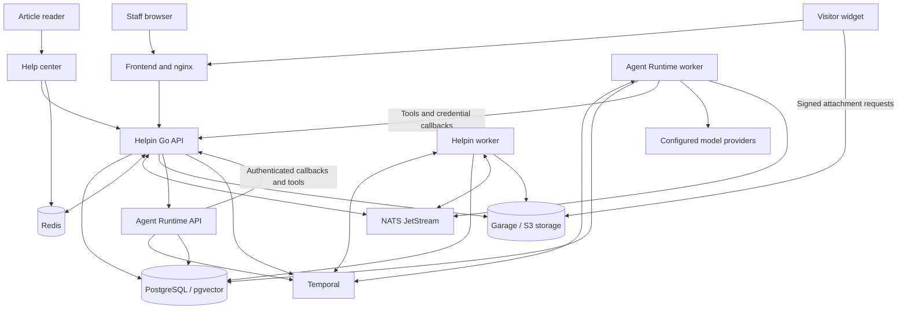
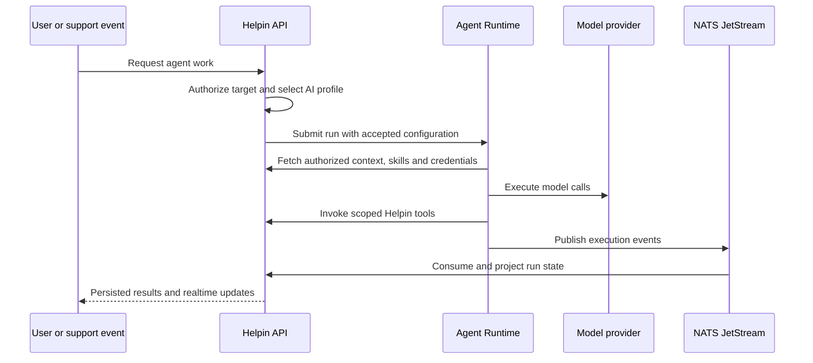

# Helpin architecture

Helpin is a Go application backend with a React frontend, background workers,
public support clients, and a separate Agent Runtime service. This guide is a
starting map for developers: where requests go, which component owns state, and
where to make changes. Paths are relative to the repository root.

The Community 0.1 deployment focuses on support, knowledge, and agents. The
monorepo also contains CRM, project management, automation, analytics, and native
apps. Read [Community scope](ROADMAP.md) before treating a source module as a
supported beta feature.

**Source review:** 2026-09-18, against the checked-in Community Compose, API and
worker entry points, frontend build configuration, and Runtime integration. This
map describes repository wiring, not the state of any particular deployment.

## System overview

The diagram follows [Community Compose](community/compose.yaml). Arrows show
communication or dependency, not every network request.

The API and Helpin worker share application code and the Helpin database. Agent
Runtime is a [separate repository](https://github.com/helpin-ai/agent-runtime) and
owns execution state. In the Community bundle, one PostgreSQL server hosts
separate Helpin, Runtime, and Temporal databases with separate credentials.

## Processes and storage

| Component | Responsibility | Starting point |
| --- | --- | --- |
| Frontend | Staff application, routing, query cache, workspace UI | [frontend/src](frontend/src/) |
| Go API | Authentication, authorization, product APIs, WebSockets, agent admission and event projection | [server/cmd/api/main.go](server/cmd/api/main.go) |
| Helpin worker | Temporal-backed product work, knowledge indexing, background integrations | [server/cmd/temporal-worker/main.go](server/cmd/temporal-worker/main.go) |
| Migration job | Versioned application schema changes before API startup | [server/cmd/migrate](server/cmd/migrate/) |
| Agent Runtime API and worker | Durable agent execution, model calls, tool execution, execution events | [Runtime integration guide](docs/agent-runtime-local-setup.md) |
| PostgreSQL / pgvector | Product records, knowledge vectors, separate Runtime and Temporal persistence | [Database initialization](community/postgres/init.sh) |
| NATS JetStream | Durable event transport, including Runtime events projected into Helpin | [Realtime implementation](server/internal/websocket/) |
| Redis | Cross-instance WebSocket relay, presence, and help-center caching | [API wiring](server/cmd/api/main.go) |
| Temporal | Durable workflow scheduling and activity execution | [server/internal/temporalapp](server/internal/temporalapp/) |
| Garage | Private S3-compatible attachment and document object storage | [server/internal/storage](server/internal/storage/) |
| Help center | Public article application backed by the Helpin API | [help-center](help-center/) |
| Embedded SDK | Website loader, visitor client, and shared chat widget | [packages/sdk-js](packages/sdk-js/) and [packages/widget-core](packages/widget-core/) |

PostgreSQL is the application source of truth. Redis and NATS have different
roles: transient relay/cache/presence versus durable event delivery. Temporal
coordinates workflows; it does not replace the product database. Attachments live
in object storage with application records and authorization in Helpin.

## Repository map

The process table above covers the running Community stack. These additional
paths help orient work elsewhere in the monorepo:

| Path | Purpose |
| --- | --- |
| `packages/react/`, `packages/vue/`, `packages/nextjs/` | Framework integrations for the public SDK |
| `packages/shared/`, `packages/support-core/` | Shared library and support code |
| `apps/` | Desktop/mobile support clients, admin, and email notice applications |
| `events-pipeline/` | Separate event capture and analytics pipeline |
| `website/` | Marketing site |
| `community/` | Self-hosted bundle, images, installer, and acceptance tests |
| `docker/`, `k8s/`, `ops/` | Other development and deployment infrastructure |
| `.github/workflows/` | Checks, build jobs, and release/deployment workflows |
| `docs/` | Engineering guides and separately indexed design history |

## Following a staff request

1. A route under [frontend/src/routes](frontend/src/routes/) renders the UI.
   TanStack Router owns routing, TanStack Query owns server-data caching, and
   Zustand stores hold client-side state. Shared UI lives in
   [frontend/src/components](frontend/src/components/).
2. Query hooks and [service adapters](frontend/src/lib/services/) call the shared
   [API client](frontend/src/lib/api.ts), which handles access tokens and refresh.
3. The [Chi router](server/internal/router/) applies authentication, workspace
   access, and permissions before calling a handler.
4. A [handler](server/internal/handler/) decodes HTTP input; a
   [service](server/internal/service/) implements business rules; a
   [repository](server/internal/repository/) reads or writes GORM
   [models](server/internal/model/) in PostgreSQL.
5. The response updates the caller's query cache. WebSocket events also notify
   subscribed clients; frontend realtime handling updates or invalidates relevant
   cached data.

Dependencies are assembled explicitly in the API and worker entry points. Follow
an existing feature across these layers when adding an endpoint. UI permission
checks improve the interface, but the backend remains the authorization boundary.

## Following a visitor conversation

The embedded path starts at [packages/sdk-js/src/loader.ts](packages/sdk-js/src/loader.ts).
The loader fetches the SDK bundle, which mounts `@helpin-ai/widget-core`.
Community serves SDK assets from the API through nginx at `/sdk/`.

Visitor endpoints use workspace origins, visitor sessions, and identity checks;
they do not inherit staff JWT access. An empty website-origin allowlist rejects
visitor requests. Keep workspace, origin, session, and identity checks intact
when changing public handlers. Start with the
[widget security guide](docs/widget-messenger-security-integration-guide.md).

A visitor message is persisted through the support backend, then delivered to
subscribed clients. Staff replies use authenticated support APIs. Configured AI
handling consumes visitor-message events in the **API process**, where support
chat orchestration and Runtime event projection live. The Helpin worker handles
background work such as knowledge indexing; it is not the agent executor.

The app's widget preview, the embedded SDK, and the legacy standalone `widget/`
bundle have different build paths. Updating shared widget source is not sufficient
to update every artifact. See [widget architecture](docs/widget-architecture.md).
The Community image builds the SDK path; it does not ship the legacy standalone
widget distributions.

## Following an agent run

Helpin owns workspace tenancy, authorization, agent definitions, launch triggers,
AI connections/profiles, product run records, and product finalization. Runtime
owns durable execution and its worker performs model/tool work. System and custom
agents share this execution path; their defaults, skills, and allowed tools vary.
There is no in-process fallback executor when Runtime is unavailable.

The API starts [AgentRuntimeProjectionService](server/internal/service/agent_runtime_projection.go)
to consume execution events and reconcile Helpin's run state. Projection leadership
is coordinated through PostgreSQL. Diagnose stale runs across Runtime, NATS, and
the API projection consumer before assuming a frontend cache problem.

Connections contain encrypted credentials; profiles select a connection, provider,
model, and controls. Accepted runs persist their selected route and policy.
[Restoring an accepted selection](server/internal/service/ai_profile_resolver.go)
reauthorizes the connection without consulting editable profiles or choosing a
fallback; revoked membership, disconnected credentials, or incompatible route
changes can still prevent execution.
The Community [Runtime app configuration](community/apps.example.json) declares
context, MCP tools, skills, and credential-refresh callbacks. These use internal
service authentication. Keep credentials out of browser-visible metadata and logs.

Agent profiles do not configure every AI feature. Knowledge embeddings and some
support AI features use separate server configuration. See
[AI profiles](docs/ai-connections.md), [Community configuration](docs/community/configuration.md),
and [agents and automation](docs/agents-and-automation.md) for the detailed contracts.

## Editions and module availability

Community is the default backend and frontend build. Go selects Enterprise code
with `-tags ee`; the frontend provides explicit `dev:ee` and `build:ee` commands.
API, migration job, worker, and frontend must use compatible edition builds.

Backend extension points live in [server/internal/edition](server/internal/edition/)
and [router edition hooks](server/internal/router/edition.go). Enterprise
implementations live under `server/ee/` and `frontend/src/ee/`. Community excludes
subscription billing, payment UI, and commercial charging policy.

The Community Compose default `HELPIN_ENABLED_MODULES=support,docs,agents` selects
the beta product surface. Module configuration is separate from compilation and
licensing: enabling a module is not a promise that its wider feature set is part
of the supported Community release. Refer to [LICENSE](LICENSE) for licensing
scopes, and [build editions](docs/ai-connections.md#build-editions) for commands.

## Schema changes and persistent data

Versioned SQL migrations live in [server/internal/dbmigrate](server/internal/dbmigrate/).
Community runs `helpin-migrate` to completion before starting the API and sets
`RUN_AUTO_MIGRATE=false`. Consequently, Community schema changes need a migration;
an updated GORM model alone will not update a bundled installation.

Other development configurations can enable GORM AutoMigrate. Do not rely on that
to prove fresh-install schema correctness. Keep applied migration files immutable,
add a new migration, and verify it against PostgreSQL. See the
[migration guide](docs/ops/database-migrations.md) and Community schema checks in
[contribution validation](docs/community/development.md#ci-ownership).

Backups must preserve databases, object storage, and encryption keys. Changing an
encryption key without migrating encrypted records makes stored credentials
unreadable. Contact deletion anonymizes linked identity but retains conversation
content; it is not full erasure. See [backup and restore](docs/community/backups.md)
and [known limitations](ROADMAP.md).

## Deployment boundaries

In the local Community bundle, nginx serves the staff app on `localhost:8085`,
proxies `/api/`, `/widget/`, and `/sdk/`, and blocks `/api/internal/` and `/api/admin/`.
The help center is on `localhost:8086`; the storage endpoint is on `localhost:9005`.
API, Runtime, databases, Redis, NATS, and Temporal stay on the Compose network.
Runtime callbacks reach the API internally, bypassing the public nginx boundary.

Public hosting needs a configured HTTPS reverse proxy, public origins, and a
browser-reachable storage URL for signed object requests. Follow the
[deployment guide](docs/community/deployment.md); the Compose bundle does not
provision public DNS or certificates. The
[bundle packager](community/package-release.py) pins image digests; checked-in
Compose still uses tags for application images.
Release validation steps are recorded in the
[publication checklist](community/PUBLICATION.md).

The root development Compose files, Community Compose, and Kubernetes manifests
serve different environments. Do not substitute one set of ports, secrets, or
startup assumptions for another. The analytics pipeline and ClickHouse are not
part of the Community bundle; see [events-pipeline](events-pipeline/README.md)
when working on the broader platform.

## Where to start a change

| Change | Read or edit first | Relevant validation |
| --- | --- | --- |
| Staff UI | `frontend/src/routes/`, components, query hooks, service adapters | Frontend tests and build; screenshots for UI changes |
| Product API | Router → handler → service → repository/model | Focused Go tests, authorization cases, API build |
| Schema | GORM model and new versioned SQL migration | PostgreSQL migration and Community schema checks |
| Visitor chat | `packages/sdk-js/`, `packages/widget-core/`, support handlers/services | SDK tests and Community outside-origin chat acceptance |
| Agent behavior | Agent services, Runtime integration, prompts/skills, projection | Run lifecycle, scoped tools, credential and event tests |
| Public articles | `help-center/`, docs handlers/services | Help-center tests/build and publish/read acceptance |
| Community packaging | `community/compose.yaml`, images, installer | Installer contracts, native build, smoke/full acceptance |

Use [local development](docs/development.md) for host processes or
[Community source builds](docs/community/development.md) for the complete stack.
[CONTRIBUTING.md](CONTRIBUTING.md) defines contribution terms and checks.
The [documentation index](docs/README.md) links deeper module guides; dated plans
and specifications describe intent at their writing date, not proof of shipped behavior.
