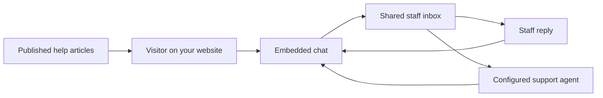

# Helpin

Helpin Community is a self-hosted customer support platform: website chat, a
shared staff inbox, a public help center, and AI support agents that run on
your own model credentials. Conversations and knowledge stay in one
installation you control, with no Helpin account and no telemetry by default.

**Status: Community 0.1 beta.** Published install bundles are listed on the
[releases page](https://github.com/helpin-ai/helpin/releases). Until the first
bundle is published, evaluate from a
[source build](docs/community/development.md#source-builds-and-acceptance).
Read the [scope and known limitations](ROADMAP.md) before serving production traffic.

[Install](community/README.md) · [Documentation](docs/README.md) ·
[Architecture](ARCHITECTURE.md) · [Contribute](CONTRIBUTING.md) ·
[Get help](SUPPORT.md) · [Report a vulnerability](SECURITY.md)

## What you can do

- **Chat with visitors:** embed the support widget on your website and identify
  visitors within your workspace.
- **Reply as a team:** manage support conversations from the shared staff inbox.
- **Publish answers:** write articles and serve them through your public help center.
- **Use AI assistance:** connect your own provider credentials or an approved local
  model endpoint, then select a workspace AI profile for support agents.
- **Self-host the stack:** run the Community services with Docker Compose.

A typical support workflow:



AI connections are optional for human chat and published articles. Provider usage
may incur charges from your provider. Knowledge embeddings and some non-agent AI
features have [separate configuration](docs/community/configuration.md).

## Why self-host Community

- **Your data stays with you.** Conversations, articles, attachments, and AI
  credentials live in your own databases and object storage.
- **Bring your own AI.** Model calls use the provider credentials or local
  endpoints you configure. Community has no managed AI route and no usage billing.
- **Nothing phones home.** There is no telemetry endpoint and no Helpin account
  requirement by default, and the support SDK does not collect analytics events.
- **Open source.** The Community application is AGPL-3.0-only, and the public
  SDK and widget packages are Apache-2.0. See the License section below.

## Get started

### Requirements

Docker Engine, Docker Compose v2, Bash, OpenSSL, and an amd64 or arm64 host.
Allow at least **8 GiB RAM and 20 GiB free disk** for evaluation; source builds
need more. These are starting points, not measured production capacity limits.

### Guided installation

Once a Community release with CLI assets and the website installer are published:

```sh
curl -fsSL https://helpin.ai/install.sh | bash
"$HOME/.local/bin/helpin" install
```

The wizard checks Docker and resources, downloads and verifies the bundle,
generates secrets, and starts Helpin. Choose local evaluation or a public server.
Public hosting additionally requires DNS and an HTTPS proxy. The
[CLI guide](docs/community/cli.md) covers configuration and commands such as
`helpin status`, `helpin logs`, and `helpin doctor`. Add `~/.local/bin` to PATH
as shown by the installer to use the short command.

### Install a published bundle manually

Download the bundle and its checksum from the
[releases page](https://github.com/helpin-ai/helpin/releases), verify and
extract the archive, then run from its `community/` directory:

```sh
./setup.sh install
# Edit .env for your public URLs and optional mail/AI settings.
./setup.sh start
./setup.sh status
```

The [installation guide](community/README.md) covers each step, the operator
commands, and what the installer generates.

### Build from source

Contributors, and evaluators without a published bundle, can build the complete
Compose stack in Docker; host Go and Node toolchains are not required. Source
builds need this repository and the separate
[Agent Runtime](https://github.com/helpin-ai/agent-runtime) repository at the
revision pinned in `community/runtime-revision.txt`. Follow the
[source-build guide](docs/community/development.md#source-builds-and-acceptance).
Access to the Runtime repository is required while it remains private.

To edit the application with local Go and frontend processes, use the
[local development guide](docs/development.md).

### Send your first message

Open **http://localhost:8085**, sign up, and create an organization and workspace.
Then:

1. In workspace settings, allow your website's origin, including scheme and port.
   The widget rejects visitor requests while the origin list is empty.
2. Copy the generated support installation snippet into that website.
3. Open the website, send a visitor message, and reply from the staff inbox.
4. Optionally publish a help-center article, or add an AI connection and a
   workspace default under **Settings → AI**.

Before exposing the installation publicly, follow the
[DNS and HTTPS guide](docs/community/deployment.md) and configure
[backups](docs/community/backups.md). The default local setup binds to loopback.

## Editions

Helpin is built from this monorepo in three editions. The website at
[helpin.ai](https://helpin.ai) describes the hosted product; this repository's
guides and support scope describe Community.

| Edition | What it is | License |
| --- | --- | --- |
| **Community** | The default build of this repository, self-hosted with Docker Compose. Enables the support, docs, and agents modules and uses your own AI credentials. No billing service or Helpin account. | AGPL-3.0-only |
| **Cloud** | The hosted service at app.helpin.ai, operated by Helpin. Includes project management, CRM, and sales modules that are outside the Community beta surface. | Helpin terms of service |
| **Enterprise** | Code in `ee/` directories that adds subscription billing, managed AI routes, and commercial policies to a self-hosted deployment. | Helpin Enterprise License |

The monorepo also contains the broader CRM, project management, automation,
analytics, and native application code. Presence in source does not mean a
capability is part of the supported Community beta:

| Capability | Community 0.1 beta | Broader repository / Enterprise |
| --- | --- | --- |
| Visitor chat, staff inbox, published help center | Included | Shared application capabilities |
| Agent AI connections | Your credentials or approved local endpoints | Enterprise adds managed routes and commercial billing policies |
| CRM and PM navigation, automation builders, coding | Outside the default beta surface | Code exists; availability is separate from Community beta support |
| Subscription billing and payment UI | Excluded | Explicit Enterprise builds |
| Analytics collector and ClickHouse | Not bundled; the support SDK does not collect analytics events | Separate event pipeline |
| Desktop, mobile, admin, and email notice apps | Not shipped in the Community Compose bundle | Separate build and deployment paths |

Application SMTP is optional. Support email replies and inbound delivery require
the optional Postmark integration. Tested cross-version upgrades are planned for
0.2; see the [scope and known limitations](ROADMAP.md).

## Architecture at a glance

Helpin is a Go API and worker, a React and TypeScript frontend, a public help
center, and an embedded support SDK, backed by PostgreSQL with pgvector, Redis,
NATS JetStream, Temporal, and Garage object storage. Agent execution runs in the
separate Agent Runtime service. [ARCHITECTURE.md](ARCHITECTURE.md) has the
service diagram, request and agent flows, data ownership, edition boundaries,
and a guide to where changes belong.

- [Local development](docs/development.md): toolchain, infrastructure, app startup, checks.
- [Community development](docs/community/development.md): complete source builds and acceptance tests.
- [AI connections and profiles](docs/ai-connections.md): configuration and edition selection.
- [Widget architecture](docs/widget-architecture.md): SDK, shared widget, and standalone build paths.
- [Documentation index](docs/README.md): every engineering and product reference.

## Documentation and support

Technical guides are versioned in this repository and indexed in
[docs/README.md](docs/README.md). Operators should start with the
[installation guide](community/README.md), then
[configuration](docs/community/configuration.md),
[deployment](docs/community/deployment.md), [backups](docs/community/backups.md),
and [troubleshooting](docs/community/troubleshooting.md). A hosted product help
center is planned; until it is live, these guides are the reference.

[SUPPORT.md](SUPPORT.md) explains where to ask questions and what to include.
[Report a bug](https://github.com/helpin-ai/helpin/issues/new?template=community-bug.yml)
or [request a feature](https://github.com/helpin-ai/helpin/issues/new?template=community-feature.yml)
with a concrete example. Community support is best effort, with no response
deadline.

## Contributing

Bug reports with reproductions, documentation fixes, and small focused changes
are all welcome. For larger changes, open an issue to agree on scope first.
Read [CONTRIBUTING.md](CONTRIBUTING.md) for setup, checks, and pull request
expectations, and follow the [code of conduct](CODE_OF_CONDUCT.md).

Contributions to AGPL or enterprise code require acceptance of the
[Contributor License Agreement](CLA.md) in the pull request. Contributions solely
to Apache-2.0 packages do not.

Report vulnerabilities privately through [SECURITY.md](SECURITY.md), never in
public issues.

## License

- The Community application is **AGPL-3.0-only** ([LICENSE-AGPL-3.0](LICENSE-AGPL-3.0)).
- The public SDK and widget packages listed in [LICENSE](LICENSE) are
  **Apache-2.0** ([LICENSE-APACHE-2.0](LICENSE-APACHE-2.0)).
- Code in any directory named `ee`, including `server/ee/` and `frontend/src/ee/`,
  uses the [Helpin Enterprise License](ee/LICENSE): internal development,
  testing, and evaluation are permitted; production use requires a commercial
  agreement.

[LICENSE](LICENSE) records the exact directory scopes and third-party exceptions,
and the [upstream images guide](docs/community/upstream-images.md) covers the
third-party container images the Community bundle pulls. No rights to the Helpin
name or logo are granted.
