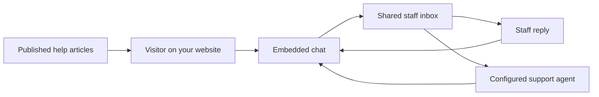

# Helpin

Helpin Community is a self-hosted customer support platform with website chat,
a shared staff inbox, a public help center, and AI agents using your own AI
connections. Keep support conversations and knowledge in one installation,
without requiring a Helpin account.

**Status: Community 0.1 beta, pre-release.** The repository release record as of
2026-09-18 describes a local, unpublished candidate with open
[release gates](community/PUBLICATION.md). Use the source-build path below while
those gates remain open; a Compose image tag alone does not establish that a
public installation bundle is available.

[Help docs — coming soon](https://helpin.ai/docs) · [Get started](#get-started) · [Architecture](ARCHITECTURE.md) ·
[Contribute](CONTRIBUTING.md) · [Known limitations](ROADMAP.md)

## What you can do

- **Chat with visitors:** embed the support widget on your website and identify
  visitors within your workspace.
- **Reply as a team:** manage support conversations from the shared staff inbox.
- **Publish answers:** create articles and serve them through your public help center.
- **Use AI assistance:** connect your own provider credentials or an approved local
  model endpoint, then select a workspace AI profile for support agents.
- **Self-host the stack:** run the Community services with Docker Compose. The
  default bundle does not configure an external telemetry destination or require
  a Helpin account.

A typical support workflow:



AI connections are optional for human chat and published articles. Provider usage
may incur charges from your provider. Knowledge embeddings and some non-agent AI
features have [separate configuration](docs/community/configuration.md).

## Get started

### Evaluate from source today

Follow the [Community source-build guide](docs/community/development.md#source-builds-and-acceptance).
It includes cloning Helpin and the separate Agent Runtime repository, selecting
the pinned Runtime revision, and building the complete Compose stack. Access to
Runtime is required while that repository remains private.

For editing the application with local Go and frontend processes, use the
[local development guide](docs/development.md).

### Install a published bundle when available

The [Community installation guide](community/README.md) describes downloading and
verifying a release bundle. Requirements are Docker Engine, Docker Compose v2,
Bash, OpenSSL, and an amd64 or arm64 host. Allow at least **8 GiB RAM and 20 GiB
free disk** for evaluation; source builds need more. These are starting points,
not measured production capacity limits.

After verifying and extracting a published bundle, run from its `community/` directory:

```sh
./setup.sh install
# Edit .env for your public URLs and optional mail/AI settings.
./setup.sh start
./setup.sh status
```

Open **http://localhost:8085**, sign up, and create an organization and workspace.
To complete your first conversation:

1. In workspace settings, allow your website's origin, including scheme and port.
   The widget rejects visitor requests if the origin list is empty.
2. Copy the generated support installation snippet into that website.
3. Open the website, send a visitor message, and reply from the staff inbox.
4. Optionally publish a help-center article or configure a shared connection and
   workspace default under **Settings → AI**.

Before exposing the installation publicly, follow the
[DNS and HTTPS guide](docs/community/deployment.md) and configure
[backups](docs/community/backups.md). The default local setup binds to loopback.

## Community scope and editions

This monorepo also contains Helpin's broader CRM, project management, automation,
and native applications. Their presence in source does not mean they are included
in the default Community beta experience.

| Capability | Community 0.1 beta | Broader repository / EE |
| --- | --- | --- |
| Visitor chat, staff inbox, published help center | Included | Shared application capabilities |
| Agent AI connections | Your credentials or approved local endpoints | EE adds managed routes and commercial billing policies |
| CRM and PM navigation, automation builders, coding | Outside the default beta surface | Code exists; availability is separate from Community beta support |
| Subscription billing and payment UI | Excluded | Explicit EE builds |
| Analytics collector and ClickHouse | Not bundled; support SDK does not collect analytics events | Separate event pipeline |
| Desktop, mobile, admin, and email notice apps | Not shipped in the Community Compose bundle | Separate build and deployment paths |

Application SMTP is optional. Support email replies and inbound delivery require
the optional Postmark integration. Tested cross-version upgrades are planned for
0.2; see the [roadmap and known limitations](ROADMAP.md).

## For developers

Start with [ARCHITECTURE.md](ARCHITECTURE.md) for the service diagram, request and
agent flows, data ownership, edition boundaries, and a guide to where changes belong.

- [Local development](docs/development.md): toolchain, infrastructure, app startup, checks.
- [Community development](docs/community/development.md): complete source builds and acceptance tests.
- [AI connections and profiles](docs/ai-connections.md): configuration and edition selection.
- [Widget architecture](docs/widget-architecture.md): SDK, shared widget, and standalone build paths.
- [Documentation index](docs/README.md): deeper engineering and product references.

## Contributing and support

Product guides will be hosted in the [Helpin docs](https://helpin.ai/docs) (coming soon).
For now, use the repository guides above and [SUPPORT.md](SUPPORT.md) for setup
questions, bug reports, and support expectations.
Self-hosters can start with [troubleshooting](docs/community/troubleshooting.md).

[Report a bug](https://github.com/helpin-ai/helpin/issues/new?template=community-bug.yml)
or [request a feature](https://github.com/helpin-ai/helpin/issues/new?template=community-feature.yml)
with a concrete example. For larger contributions, open an issue to agree on scope
before implementation. Documentation improvements and reproducible bug reports
are useful contributions too.

Read [CONTRIBUTING.md](CONTRIBUTING.md) for development checks and PR expectations.
Application and enterprise contributions require acceptance of the [CLA](CLA.md);
contributions solely to Apache-2.0 components do not require the additional CLA.
Please follow the [code of conduct](CODE_OF_CONDUCT.md).

Report vulnerabilities through [SECURITY.md](SECURITY.md), not public issues.
Public issue and security-reporting access depends on repository publication;
maintainers must verify these entry points before launch.

## License

The Community application is **AGPL-3.0-only**. Public SDKs and embedded widget
packages are **Apache-2.0**. Code in any directory named `ee`, including
`server/ee/` and `frontend/src/ee/`, uses the [Helpin Enterprise License](ee/LICENSE):
internal development, testing, and evaluation are permitted; production use
requires a commercial agreement.

See [LICENSE](LICENSE) for exact directory scopes and third-party exceptions.
