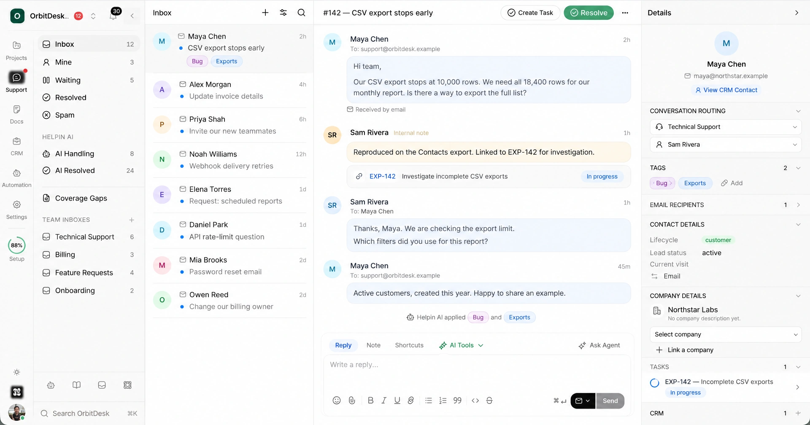

# Helpin

**An open-source alternative to Intercom and Linear.**

### AI agents that do more than answer.

Helpin brings support, projects, CRM, meetings, and docs into one connected
workspace. Your team and AI agents use a shared customer history to answer
questions, plan work, and follow up—with approvals where you need them.

[Website](https://helpin.ai) · [Open Helpin Cloud](https://app.helpin.ai) ·
[Get started](#get-started) · [Contribute](CONTRIBUTING.md)



*Illustrative product preview with fictional data. The conversation, existing
task, and customer record stay in view. Available modules depend on your deployment.*

## Get started

### Use Helpin Cloud

[Open a managed workspace](https://app.helpin.ai) and explore the product without
operating the infrastructure. See [Cloud plans](https://helpin.ai/pricing) for
capacity, agent capabilities, and AI usage.

### Run Helpin yourself

**Community 0.1 beta** includes support chat, the shared inbox, help-center
articles, Projects, CRM, and AI agents. Bring customer conversations, tasks, and
relationships together in a workspace your team runs. See the
[release scope and known limitations](ROADMAP.md) for module configuration and
deployment details.

Use the [installation guide](community/README.md) for a published bundle, or the
[source-build guide](docs/community/development.md#source-builds-and-acceptance)
when evaluating from source. Source builds also require access to the separate
Agent Runtime repository at the revision pinned by Helpin.

You need Docker Engine, Compose v2, Bash, OpenSSL, and an amd64 or arm64 host.
Start with **8 GiB RAM and 20 GiB free disk** for evaluation; source builds need
more. These are starting points, not production capacity limits.

After downloading, verifying, and extracting a
[Community release bundle](https://github.com/helpin-ai/helpin/releases), run
these commands from its `community/` directory:

```sh
./setup.sh install
# Review the generated .env for your URLs and optional mail/AI settings.
./setup.sh start
./setup.sh status
```

Open **http://localhost:8085**, sign up, and create an organization and workspace.
The [CLI guide](docs/community/cli.md) also covers guided installation when CLI
release assets are available.

### Send your first message

1. In workspace settings, allow your website’s origin, including its scheme and
   port. The widget refuses visitor requests while the origin list is empty.
2. Copy the generated support installation snippet into that website.
3. Send a visitor message, then reply from the staff inbox. Seeing that reply in
   the widget confirms the conversation works in both directions.
4. Optionally publish a help-center article or configure a shared connection and
   workspace default under **Settings → AI**.

AI is optional for human chat and published articles. Your team operates a
self-hosted installation; connected AI, email, and meeting services may still
process data outside it and charge for usage. Before public hosting, configure
[DNS and HTTPS](docs/community/deployment.md) and
[backups](docs/community/backups.md).

## Why Helpin?

A customer asks a question. Support investigates. Product decides what to build.
Engineering delivers the change. Someone still needs to tell the customer what
happened.

That is one piece of work, even when several teams take part.

Helpin keeps the conversations, decisions, and related work connected. The next
teammate or agent can see what was asked, what was tried, and what still needs
attention.

**The earlier conversation should change the next action—not disappear at the handoff.**

## What you can do

Community includes Support, Projects, CRM, Knowledge, and AI agents. Available
capabilities depend on your enabled modules, connected services, and deployment.
Cloud plans define hosted capacity and advanced features.

| Product | What it gives your team |
| --- | --- |
| **Support** | Chat and email in a shared inbox, with customer history, agent assistance, and linked work. Email delivery needs a configured provider. |
| **Projects** | Tasks, epics, sprints, roadmaps, dependencies, and objectives for product development and internal work. |
| **CRM** | Contacts, companies, and deals alongside the conversations and work behind the relationship. |
| **Meetings** | Meeting records, decisions, and next steps connected to the relevant work. |
| **Knowledge** | Customer-facing guides and internal docs, with selected sources available to agents. |
| **AI agents** | Help with investigation, planning, code changes, documentation, and follow-up through configured tools. |

Projects also supports maintenance, infrastructure, and internal initiatives.
Link customer context when it is relevant.

## See the difference in one request

*An illustrative workflow; available actions depend on your configuration.*

A customer writes:

> “The smaller export worked, but I still need the full contact list.”

The history matters. Recommending the same workaround again will not resolve
the request.

The team and agents can review the earlier attempt, attach findings to the
existing export task, and prepare the next step without creating duplicate work.
Once the team has reviewed the change and confirmed its release, the customer
update can explain what changed and what to try next.

```text
Customer question
  → Earlier conversation and existing task
  → Investigation and proposed work
  → Team review and release confirmation
  → Customer follow-up
```

A task marked complete is not the same as a confirmed release. A drafted reply
is not a sent message.

## Ask Agent and the specialists

Ask Agent is where your team starts: ask about an account, investigate a request,
or prepare a plan. Specialist agents handle focused work when needed.

> “What is blocking this customer’s rollout, and what have we already tried?”

> “Review the linked task and propose the next steps.”

> “Prepare an update using the latest confirmed release status.”

Choose the tools an agent can use and the actions that require review. Your team
still decides priorities, scope, and customer commitments. See
[agents and automation](docs/agents-and-automation.md) for how the pieces connect.

## Helpin and Agent Runtime

Helpin is the product your team works in: customer records, conversations,
projects, and the interface for doing the work.

[Agent Runtime](https://github.com/helpin-ai/agent-runtime) is the separate
execution project for developers adding agent runs to their own applications.
Helpin owns its customer history and product workflows; the runtime executes
agents through configured interfaces. Repository access is required to build
the runtime from source.

## Build with Helpin

Embed support in your application, connect customer data, and extend your team’s
workflows. Start with the [JavaScript SDK](packages/sdk-js/README.md),
[React integration](packages/react/README.md), or
[MCP integration](integrations/helpin-mcp/README.md).

Keep identity verification, account authorization, and agent tool permissions
separate. Identifying a customer does not grant access to every record or
connected system.

For development and operations, use the [documentation index](docs/README.md),
[architecture overview](ARCHITECTURE.md), and
[local development guide](docs/development.md). See [support](SUPPORT.md) for
questions and reproducible bug reports.

## Contributing

Start with a reproducible bug report, a documentation correction, or a small
improvement to an everyday workflow. For larger changes, open an issue describing
the problem and proposed approach before implementation.

Read the [contributor guide](CONTRIBUTING.md) for setup, checks, and the
contribution agreement that applies to your changes. Follow the
[code of conduct](CODE_OF_CONDUCT.md).

## Security

Do not post credentials, private customer data, or sensitive vulnerability
details in public issues. Use the private reporting channel in the
[security policy](SECURITY.md).

## License

The Community application is **AGPL-3.0-only**. The public SDK and widget
packages listed in [LICENSE](LICENSE) are **Apache-2.0**. Code in `ee/`
directories uses the [Helpin Enterprise License](ee/LICENSE); production use
requires a commercial agreement.

[Read the license](LICENSE) for exact scopes, third-party exceptions, and
trademark terms.

---

**One customer history. A shared workspace for your team and AI agents.**
