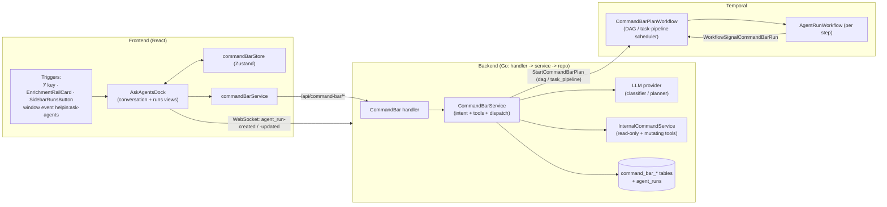
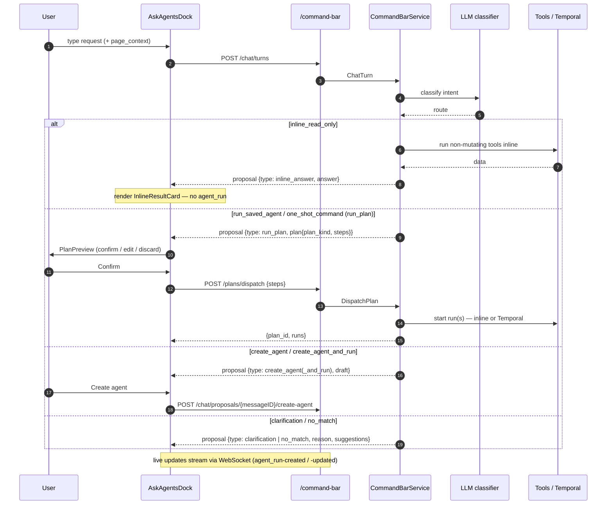
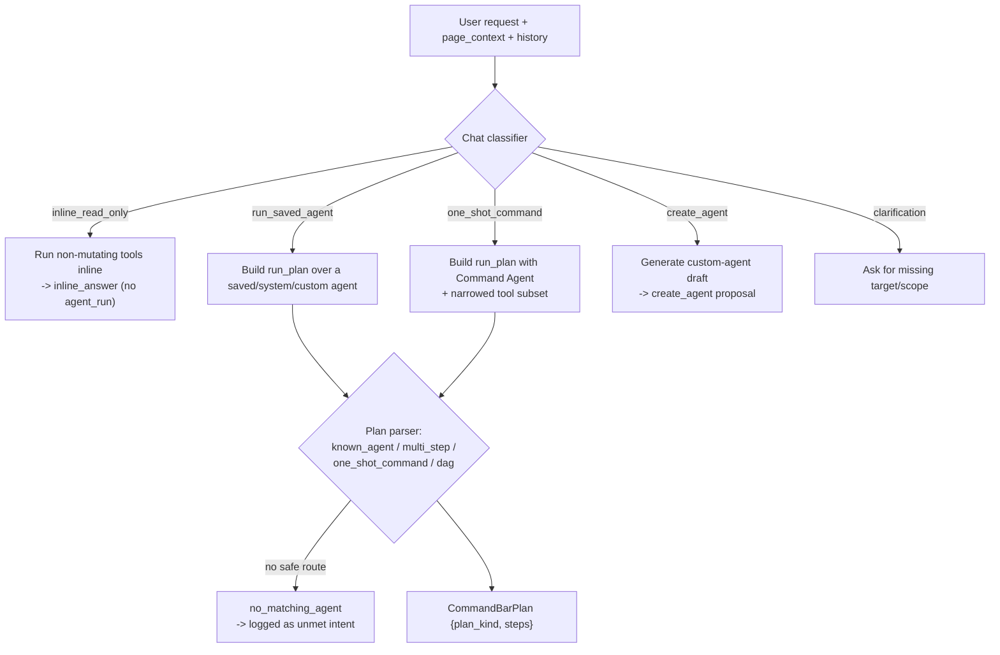
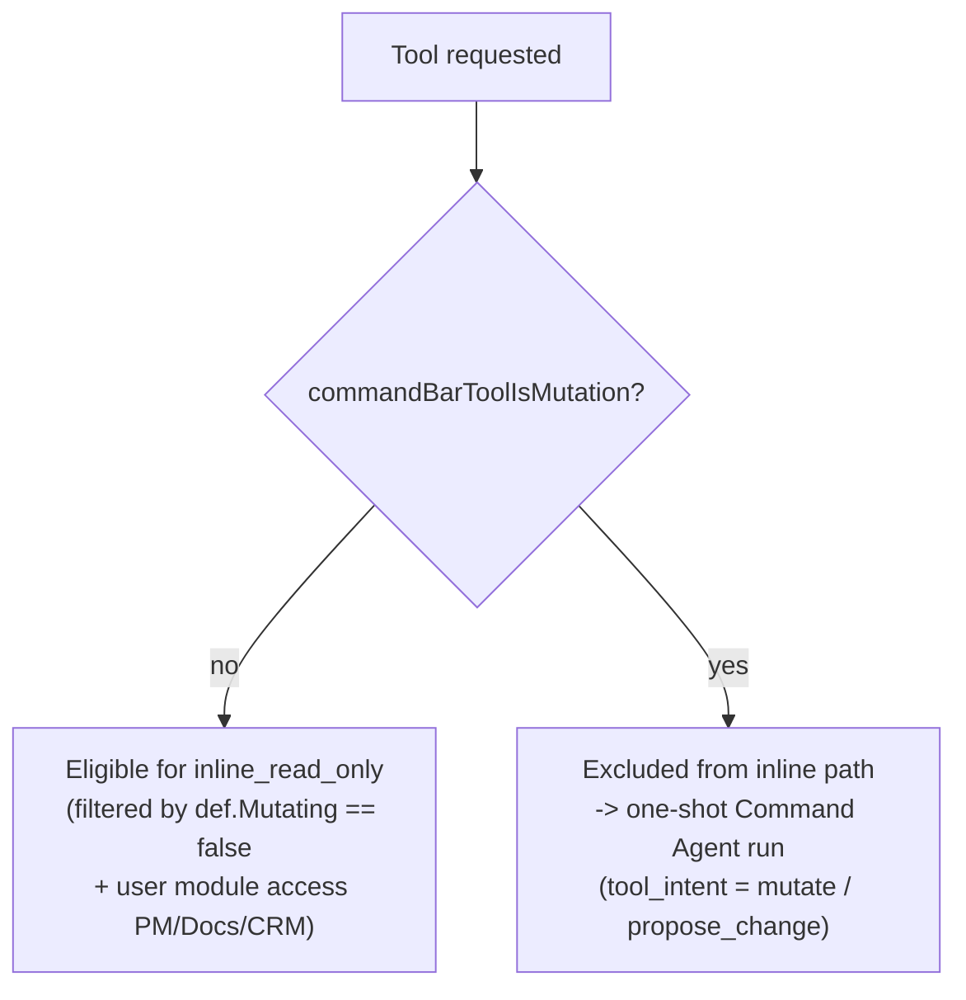
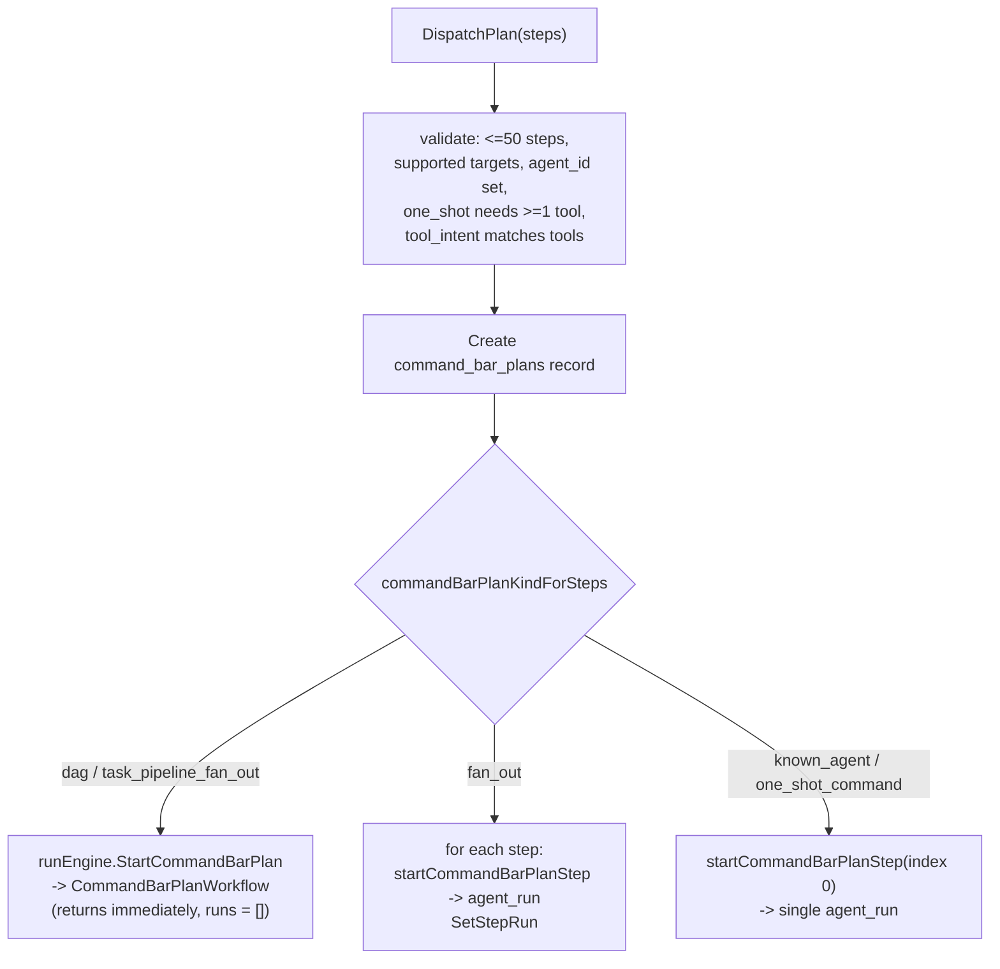
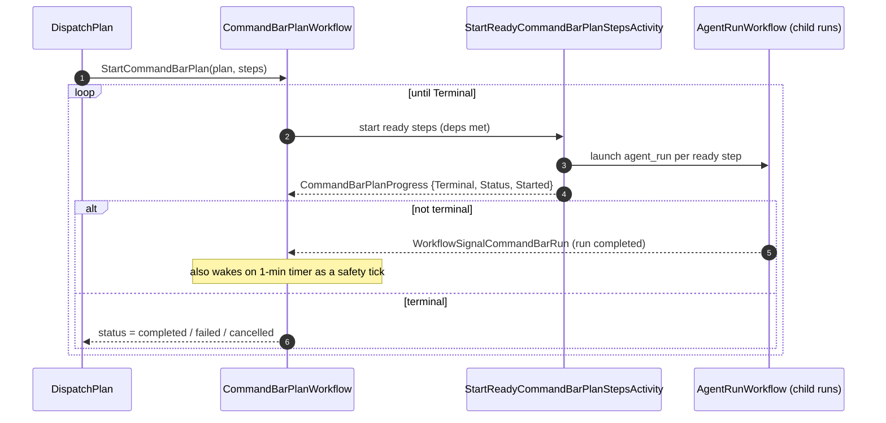
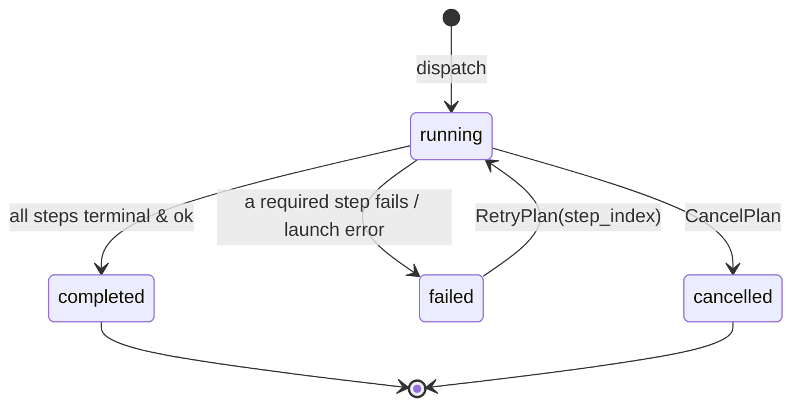
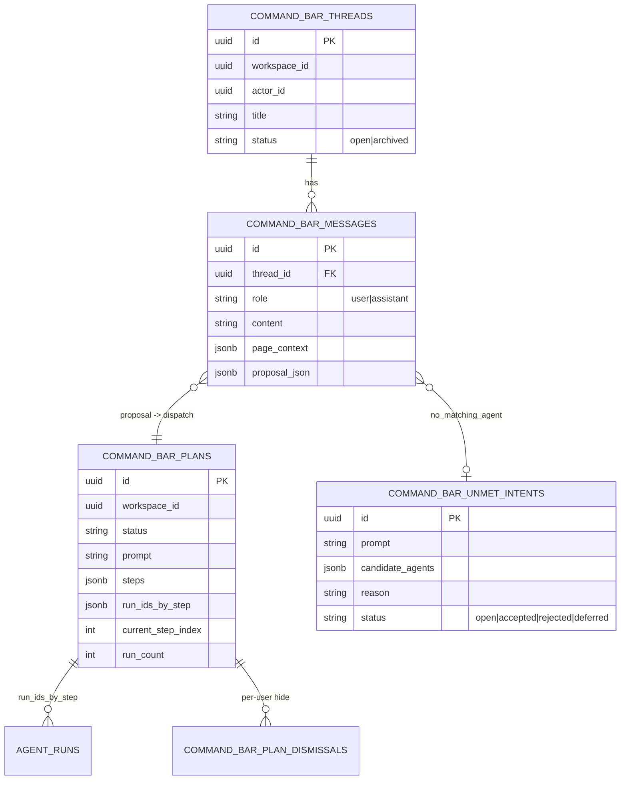
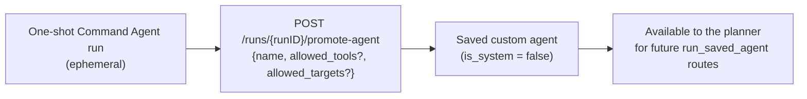

# Ask Agents Bar

The **Ask Agents bar** (a.k.a. the *command bar* / *AskAgentsDock*) is the floating
chat surface that lets a user type a request in natural language and get one of:

- an **inline read-only answer** (no `agent_run` created), or
- a **one-shot Command Agent run** for ad hoc durable / mutating work, or
- a run of an existing **saved agent**, or
- a **chained / fan-out / DAG plan** of multiple agent runs orchestrated by Temporal, or
- a **draft for a reusable custom agent**, created only after explicit approval.

This doc is the grounded runtime reference for that surface. For the broader agent /
automation model see [AGENTS_AND_AUTOMATION.md](./AGENTS_AND_AUTOMATION.md); for the
original design rationale and earlier diagrams see
[plans/2026-04-28-command-bar-agent-architecture.md](./plans/2026-04-28-command-bar-agent-architecture.md),
[plans/2026-04-30-command-dag-orchestration-plan.md](./plans/2026-04-30-command-dag-orchestration-plan.md),
and [plans/2026-05-14-ask-agents-orchestration-chat-plan.md](./plans/2026-05-14-ask-agents-orchestration-chat-plan.md).

> Backend names use the `command_bar` / `CommandBar` prefix; the product name is
> "Ask Agents". They refer to the same system.

---

## Where the code lives

| Layer | Path | Role |
|-------|------|------|
| Floating UI | `frontend/src/components/agents/AskAgentsDock.tsx` | Portal'd dock, conversation + runs views, listens for `helpin:ask-agents` |
| Dock parts | `frontend/src/components/agents/dock/*` | `DockInput`, `DockHeader`, `ExecutionStrip`, `PlanPreview`, `FanOutRail`, `TaskPipelineRail`, `PipelineRail`, `DagRail`, `InlineResultCard`, `PendingInteractionCard` |
| Dock guard | `frontend/src/lib/agentsDockGuard.ts` | Keeps Radix dialogs open when interacting with the dock (`data-helpin-dock="true"`) |
| FE service | `frontend/src/lib/services/commandBarService.ts` | Thin fetch wrappers over `/api/command-bar/*` |
| FE store | `frontend/src/stores/commandBarStore.ts` | Zustand state for runs/plans + rail mode |
| FE types | `frontend/src/lib/pm-types/agents.ts` (barrel `@/lib/pmTypes`) | `CommandBar*` request/response/plan types |
| Mount | `frontend/src/routes/_authenticated/w/$slug.tsx` | `<AskAgentsDock />` inside `PageContextProvider` |
| Routes | `server/internal/router/router.go` (`/command-bar` group) | Read vs edit permission wiring |
| Handler | `server/internal/handler/command_bar.go` | HTTP decode/encode |
| Service | `server/internal/service/command_bar.go` | Intent classification, tool gating, plan validation, dispatch |
| Model | `server/internal/model/command_bar.go` | DTOs + GORM tables |
| Temporal | `server/internal/temporalapp/command_bar_workflow.go` | `CommandBarPlanWorkflow` DAG scheduler |
| Activity | `server/internal/temporalapp/activities.go` | `StartReadyCommandBarPlanStepsActivity` |

---

## Component map

---

## HTTP surface

All routes are under `/api/command-bar` and require workspace access. Two permission
gates apply (`router.go`):

- `requireCommandBarRead()` = `PermPMRead` **or** `PermDocsRead` **or** `PermCRMRead`
- `requireCommandBarEdit()` = `PermPMEdit` **or** `PermDocsEdit` **or** `PermCRMEdit`

| Method | Path | Handler | Gate | Purpose |
|--------|------|---------|------|---------|
| POST | `/intents/parse` | `ParseIntent` | read | One-shot parse → plan or `no_matching_agent` |
| POST | `/chat/turns` | `ChatTurn` | read | Conversational turn → assistant message + proposal |
| GET | `/chat/threads` | `ListChatThreads` | read | Restore prior conversation(s) |
| POST | `/chat/proposals/{messageID}/create-agent` | `ConfirmChatCreateAgent` | `PermPMEdit` | Persist a reusable custom agent from a proposal |
| POST | `/plans/dispatch` | `DispatchPlan` | edit | Execute a confirmed plan |
| GET | `/plans` | `ListPlans` | read | Recent plans for the runs rail |
| GET | `/plans/{planID}` | `GetPlan` | read | Plan detail + child runs |
| POST | `/plans/{planID}/cancel` | `CancelPlan` | edit | Cancel plan + running children |
| POST | `/plans/{planID}/retry` | `RetryPlan` | edit | Retry from a step index |
| GET | `/agents/{agentID}/tools` | `ListAgentToolCatalog` | read | Tool catalog (allowed/selected/disabled) |
| POST | `/plans/dismiss`, `/plans/{planID}/dismiss` | `DismissPlans` / `DismissPlan` | read | Per-user rail dismissal |
| POST | `/runs/{runID}/promote-agent` | `PromoteRunToAgent` | `PermSettingsManage` | Promote a one-shot run to a saved agent |
| GET/POST | `/unmet-intents`, `/unmet-intents/{id}/review` | `ListUnmetIntents` / `ReviewUnmetIntent` | `PermSettingsManage` | Review prompts that found no safe route |

`page_context` (`CommandBarPageContext`: `entity_type`, `entity_id`, `display_title`,
`related_ids`, `metadata`) is captured by `PageContextProvider` and sent on every turn
so the bar knows which task / epic / document / contact / deal the user is looking at.

---

## End-to-end flow (chat turn → dispatch)

The chat turn never executes durable work by itself — it returns a **proposal**.
Execution only happens when the user confirms and the dock calls
`POST /plans/dispatch` (the `requireCommandBarEdit` boundary).

---

## Intent routing

The conversational classifier (`ChatTurn` path, `command_bar.go`) routes each turn to
one of five intents. The plan parser (`ParseIntent` path) routes to plan shapes.

Routing rules encoded in the system prompts:

- **inline_read_only** — factual / status / count / list / search / summary / follow-up
  questions answerable from history or **non-mutating** tools. Web/search/fetch are only
  inline if such a tool is listed; otherwise the user is routed to a one-shot Command Agent.
- **run_saved_agent** — named-agent invocations (e.g. Forge, Lens, Atlas, or a custom agent).
- **one_shot_command** — ad hoc durable work: changes, writes, long-running execution,
  chaining, DAGs, fan-out, or anything needing mutating tools.
- **create_agent** — user wants to save/define a reusable agent.
- **clarification** — missing target/scope, or an ambiguous target for a target-specific run.

---

## Read-only vs mutation gating

The bar's core safety property: **inline answers stay read-only and never create an
`agent_run`**. Any mutating work is funneled into an explicit, confirmable run.

- Mutation tools are an explicit allowlist in `commandBarToolIsMutation()`
  (`command_bar.go`): `add_deal_note`, `add_task_comment`, `create_document`,
  `create_task`, `enrich_crm_company`, `enrich_crm_contact`,
  `ensure_crm_contact_company`, `ensure_task_label`,
  `publish_document_change_proposal`, `update_deal_stage`, `update_task_state`,
  `update_document_block`, `link_document_to_object`, `write_document_content`.
  Everything else is treated as read-only.
- Inline tool cards are additionally filtered by the user's module access, so a user
  without CRM access is never offered CRM read tools.
- Each one-shot step carries a `tool_intent` of `read_only`, `propose_change`, or
  `mutate`; the planner validates that selected tools match the declared intent (e.g.
  a `read_only` step may not carry mutation tools; `propose_change` requires
  `publish_document_change_proposal`).

---

## Plan kinds & dispatch branching

`CommandBarPlan.plan_kind` (constants in `model/command_bar.go`) determines how
`DispatchPlan` executes the steps:

| `plan_kind` | Shape | Execution | Persistent agent? |
|-------------|-------|-----------|-------------------|
| `known_agent` | 1 step, saved agent | single `startCommandBarPlanStep` (inline) | yes (existing) |
| `one_shot_command` | 1 step, Command Agent + narrowed tools | single `startCommandBarPlanStep` (inline) | no (ephemeral) |
| `fan_out` | N steps, same/related targets, no deps | loop, one run per step (inline, sequential start) | mixed |
| `task_pipeline_fan_out` | per-target serial pipelines | Temporal `CommandBarPlanWorkflow` | mixed |
| `dag` | steps with `depends_on_step_indexes` | Temporal `CommandBarPlanWorkflow` | mixed |

Guardrails: plans are capped at `maxCommandBarPlanSteps` (50) total; DAG/pipeline
scheduling enforces a bound on simultaneously-runnable steps; dependency cycles are
rejected at validation time. If Temporal is not configured, dag/pipeline dispatch
marks the plan failed instead of silently degrading.

---

## Temporal DAG orchestration

For `dag` and `task_pipeline_fan_out`, the parent `CommandBarPlanWorkflow` drives a
scheduler loop. It starts every step whose dependencies are satisfied, then waits for
a completion signal (or a 1-minute timer tick) and re-evaluates — until the activity
reports `Terminal`.

Key types (`command_bar_workflow.go`):

- `CommandBarPlanWorkflowInput` — `WorkspaceID`, `ActorID`, `PlanID`, `Prompt`,
  `PageContext`, `Steps`.
- `CommandBarRunCompletedSignal` — `{run_id}`, sent when a child run reaches a terminal state.
- `CommandBarPlanProgress` — `{Terminal, Status, Started[]}` returned by the activity.

Each step still runs as a normal `agent_run` via the standard `AgentRunWorkflow`, so
DAG children behave like any other run (approvals, messages, artifacts) and surface in
the **Runs** and **Activity** surfaces. The plan only adds dependency-ordered scheduling.

---

## Plan & run lifecycle

Plan status lives on `command_bar_plans.status`
(`running` / `completed` / `failed` / `cancelled`). Child `agent_run` rows have their
own status (`queued`/`running`/`paused`/`completed`/`failed`/`cancelled`) and may pause
for `human_approval`, `human_input`, or `authentication` — the dock renders these as
`PendingInteractionCard`s with approve / reply / auth actions.

---

## Persistence model

`proposal_json` on the assistant message stores the full `CommandBarProposal`
(`type` ∈ `inline_answer` / `run_plan` / `create_agent` / `create_agent_and_run` /
`clarification` / `no_match`), so reopening the dock reconstructs prior turns including
their plans and inline answers.

---

## Promotion: one-shot → saved agent

A one-shot Command Agent run is ephemeral by default. After a useful run, a user with
`PermSettingsManage` can promote it into a reusable custom agent.

The sibling path is `create_agent` from a chat proposal
(`POST /chat/proposals/{messageID}/create-agent`), which persists a custom agent draft
the assistant proposed — both land on the normal `/automation/agents` persistence path;
no separate custom-agent runtime exists.

---

## Frontend integration notes

- **Opening the bar:** focus with `/`, or any component can dispatch
  `window.dispatchEvent(new CustomEvent('helpin:ask-agents', { detail }))` where
  `detail` is `{ query?: string; mode?: 'compose' | 'runs'; runId?: string }`.
  Current callers: `EnrichmentRailCard` (pre-fills an enrich query) and
  `SidebarRunsButton` (`mode: 'runs'`).
- **Dialog coexistence:** the dock root carries `data-helpin-dock="true"`;
  `isInsideAskAgentsDock()` (`agentsDockGuard.ts`) is used in
  `onPointerDownOutside` handlers so opening the dock from inside a Radix
  dialog/sheet doesn't dismiss it.
- **Live updates:** the dock refreshes from WebSocket `agent_run-created` /
  `agent_run-updated` DOM events and from `commandBarStore` subscriptions; rail mode
  and filter persist to `localStorage`.
- **Plan rails:** `PlanPreview` shows the proposed plan before dispatch; after
  dispatch, `ExecutionStrip` renders the right rail per `plan_kind` — `FanOutRail`,
  `TaskPipelineRail`, `PipelineRail`, or `DagRail`.
- **Inline output:** for standalone runs and single-step (one-shot / known-agent)
  plans, `ExecutionStrip` renders the run's full transcript inline via
  `DockTranscript` — assistant markdown plus a compact row per tool call — so the
  agent's output is read in the bar, not behind the session sheet. `useAgentRunStream`
  surfaces the reconciled `streamState` (the same `buildCodingSessionStreamState`
  output the drawer uses) and is fetched once after a run finishes (no polling) when
  the row is expanded. Single-output rows auto-expand; the "Open" sheet shortcut is
  hidden once inline output is present and kept only as a fallback (e.g. coding runs
  with diffs). The full `CodingSessionDrawer` remains reachable for those.

---

## Invariants to preserve

- Inline `inline_read_only` answers must use only non-mutating tools and must **not**
  create `agent_run` records — fall back to a one-shot Command Agent when broader tool
  execution is needed.
- Durable work always becomes one or more `agent_run` records, grouped under a
  `command_bar_plans` row when more than one run is involved.
- The `requireCommandBarRead` (parse/chat) vs `requireCommandBarEdit` (dispatch)
  boundary is the execution gate — classification is read, execution is edit.
- `dag` / `task_pipeline_fan_out` require Temporal; if it is unavailable, fail the plan
  loudly rather than degrade.
- Keep `commandBarToolIsMutation` and the inline `def.Mutating` filter in sync — they
  are the two places that decide read-only vs mutation.
