# Current Agent, Flow, and Automation Architecture

This document is the current-state guide to the new automation platform in Teampulse. It explains what each concept means, how the pieces connect, where they run, what is configurable today, and what is groundwork versus fully active behavior.

It is written from the code as it exists today in:

- `server/internal/service/*`
- `server/internal/worker/*`
- `server/internal/temporalapp/*`
- `server/internal/model/*`
- `frontend/src/pages/pm/Agents.tsx`
- `frontend/src/pages/pm/Flows.tsx`
- `frontend/src/components/settings/PipelineBuilder.tsx`

## 1. The simplest mental model

There are 4 different layers that people often mix together:

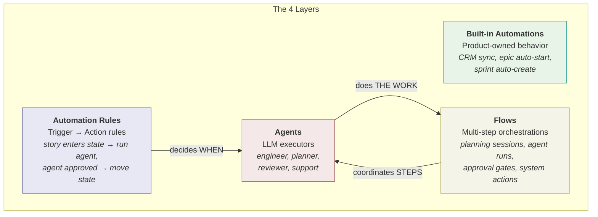

1. **Built-in automations**
   Product-owned automation Teampulse ships itself.
   Examples: CRM buyer-signal ingestion, CRM summary refresh, PM epic auto-start, PM sprint auto-create.

2. **Automation rules**
   User-configured trigger -> action rules, mostly used today for PM workflow pipelines.
   Examples: "when a story enters In Progress, run engineer agent", "when an agent run is approved, move the story to the next state".

3. **Agents**
   Explicit LLM executors that can be assigned, configured, run, approved, handed off, and audited.

4. **Flows**
   Durable multi-step orchestrations made of nodes.
   A flow can launch planning sessions, agent runs, approval gates, and system actions in a single tracked run.

The important split is:

- **rules decide when something should happen**
- **agents do the work**
- **flows coordinate multiple steps**
- **built-ins are product behavior that exists outside the user-authored rule graph**

## 2. How the pieces connect

### A. Stage-based PM pipeline

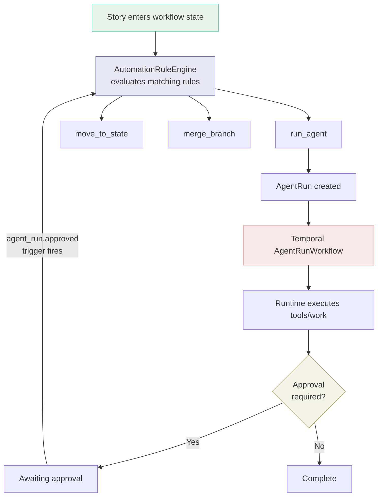

### B. Durable Flow

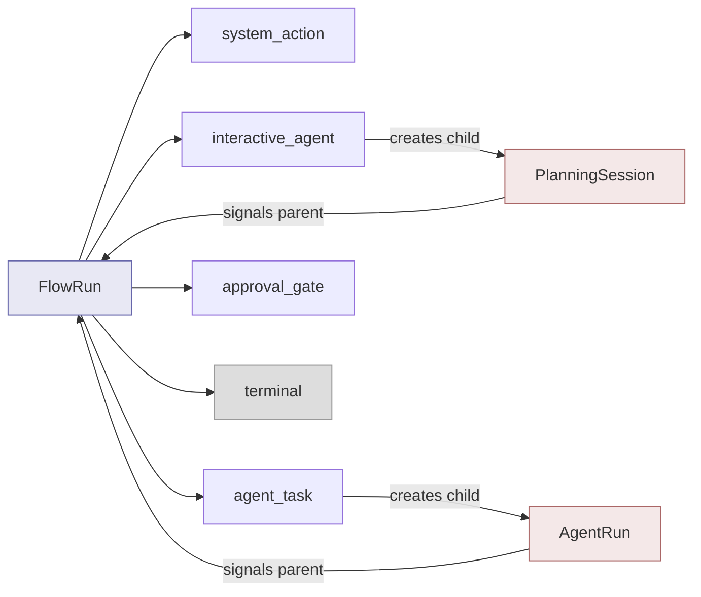

The parent flow waits for child state changes from planning sessions or agent runs, then moves to the next node.

## 3. Current architecture by category

## 3.1 Built-in automations

Current built-in automations fall into 3 groups:

- **CRM background workflows**
  Examples: buyer-signal ingestion, contact summary refresh, deal summary refresh.
- **PM deterministic inline rules**
  Examples: epic auto-start, epic auto-complete.
- **PM scheduled rules**
  Examples: sprint auto-create, move unfinished stories.

Where they are configured:

- CRM intelligence: CRM settings surfaces
- PM built-ins: workspace/team settings automations
- Inventory and health: `Settings > AI & Automations`

Where they run:

- CRM background jobs: mostly **Temporal-backed**
- PM epic auto-start / auto-complete: **inline in API/service code** on story state changes
- PM sprint automations: **hourly ticker in the API server**, not a `FlowRun`

Important: not all automation in Teampulse is a flow or an agent.

## 3.2 Automation rules

Automation rules are stored in `automation_rules` and evaluated by `AutomationRuleEngine`.

Current active trigger types:

- `story.state_entered`
- `agent_run.approved`

Current active action types:

- `run_agent`
- `move_to_state`
- `merge_branch`

Current main UI:

- `Settings > Teams > Workflow`
- `Settings > Workflows`
- the visual stage pipeline builder in `PipelineBuilder.tsx`

What the pipeline builder actually does:

- assigning an agent to a state creates a `story.state_entered -> run_agent` rule
- enabling auto-advance creates an `agent_run.approved -> move_to_state` rule
- enabling merge branch creates a `story.state_entered -> merge_branch` rule

So the "pipeline" is not a separate runtime. It is a structured UI on top of automation rules.

## 3.3 Agents

Agents are workspace-scoped records in `agents`.

They have their own lifecycle:

- configuration
- assignment
- run creation
- execution
- approval
- handoff
- artifacts
- audit history

### Agent classes

Current canonical classes:

- `product_planner`
- `engineer`
- `reviewer`
- `support`

Agents are LLM-only. Humans are modeled separately as users or workspace members for assignment and handoff.

### Runtime kinds

Current implemented runtime kinds:

- `opencode`
- `native_sdk`

What they mean:

- `opencode`
  The Temporal worker prepares a workspace and shells out to the OpenCode runtime.
- `native_sdk`
  The Temporal worker runs the agent in-process using the SDK-backed runtime and tool registry.

### Current runtime profiles

Runtime policy starts from a class/capability profile, then may be overridden per agent.

Current class defaults:

| Profile | Default runtime | Main purpose | Default target types |
| --- | --- | --- | --- |
| `engineer` | `opencode` | code implementation | `story` |
| `product_planner` | `native_sdk` | planning/review across PM/Docs/CRM | `epic`, `story`, `crm_deal` |
| `reviewer` | `opencode` | validation/testing | `story` |
| `support` | `native_sdk` | support triage and drafts | `support_conversation` |

### Supported invocation modes

Modes are used mostly by flows and planning:

- `interactive`
- `autonomous`

Current behavior:

- `product_planner`: autonomous, and interactive if the runtime/provider supports it
- `support`: autonomous, and interactive if the runtime/provider supports it
- `engineer`: autonomous only
- `reviewer`: autonomous only

### Per-agent options that are configurable today

These are set on the PM Agents page and stored on the agent record:

- name
- class
- runtime kind
- provider
- model
- system prompt
- planning notes
- monthly token budget
- trigger mode
- schedule
- approval mode
- max concurrent runs
- allowed tools
- allowed commands
- allowed targets
- team ownership

### Trigger modes on the agent record

The schema supports:

- `manual`
- `auto_on_assignment`
- `auto_on_event`

Current code reality:

- `manual` is active
- story assignment / story movement auto-run paths are active
- schedule-based execution is active
- rule-driven execution is active
- `auto_on_event`, `trigger_events`, and `target_selector` exist on the model but do not currently have a general event-bus runner wired through the codebase

That means some trigger configuration is already modeled, but not all of it is fully operational yet.

## 3.4 Flows

Flows are durable orchestrations stored in:

- `flow_runs`
- `flow_node_runs`

They are exposed in the PM Flows page and orchestrated by `FlowRunWorkflow`.

A flow is:

- a **template** with a fixed node graph
- a **run** against a target object
- a series of **node runs** that track progress, retries, output, approval state, and child IDs

### Current built-in flow templates

Implemented templates:

1. `pm.epic_planning_v1`
2. `pm.epic_planning_v2`
3. `pm.story_completion_v1`
4. `crm.deal_review_v1`

### Current flow targets

- `epic`
- `story`
- `crm_deal`

### Current flow node types

All current nodes are one of:

- `interactive_agent`
- `agent_task`
- `approval_gate`
- `system_action`
- `terminal`

### What each node type means

#### `interactive_agent`

Used when a human and agent collaborate live.

Current behavior:

- creates a child `PlanningSession`
- flow enters `awaiting_input`
- user sends messages directly to the session
- finalization signals the parent flow to continue

Typical use:

- drafting/spec planning in epic planning flows

#### `agent_task`

Used for autonomous agent work.

Current behavior:

- creates a child `AgentRun`
- flow waits while the run is queued/running
- on completion or approval state change, the child signals the parent flow

Typical use:

- story planning
- story completion assessment
- deal review

#### `approval_gate`

Used when a human must decide what happens next.

Current behavior:

- flow enters `awaiting_approval`
- actions can include `approve`, `request_changes`, `reject`
- `request_changes` can loop back to an earlier node

#### `system_action`

Used for deterministic internal commands.

Current behavior:

- no child agent run is created
- the node executes an internal command directly

Current command examples:

- `docs.ensure_spec_doc`
- `pm.approve_epic_spec`
- `pm.create_story_batch`
- `pm.create_followup_stories`
- `crm.apply_deal_actions`

#### `terminal`

Marks the end of the flow.

## 4. Current flow templates and their node graphs

### Epic Planning v2

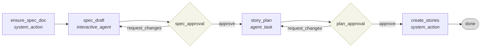

### Epic Planning v1

Legacy version of the above:

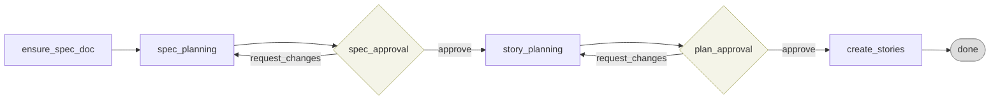

### Story Completion

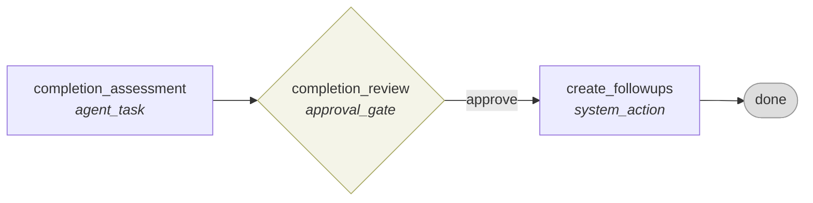

### CRM Deal Review

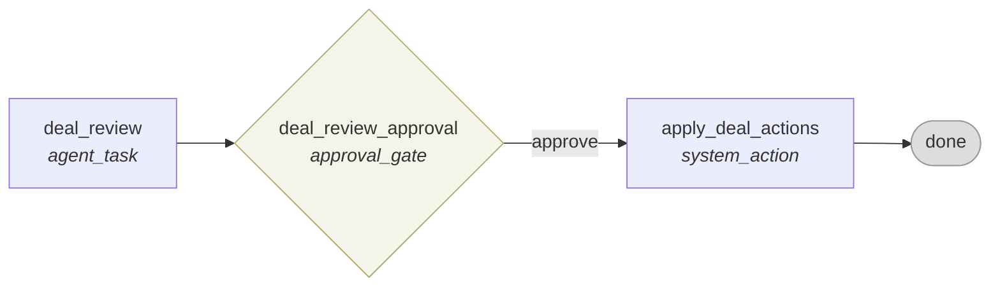

## 5. Node options: what is configurable and where

Today, **flow nodes are code-defined**, not user-authored in the UI.

Their options are set in `server/internal/service/flow_templates.go`.

Each node can define:

- `id`
- `type`
- `required_mode`
- `actions`
- `allowed_tools`
- `loopback_node_id`
- `command_name`

### Current per-node tool sets

Planning-style nodes currently use read-heavy tool sets such as:

- `read_file`
- `read_file_range`
- `list_directory`
- `search_files`
- `ripgrep`
- `grep`
- `list_symbols`
- `web_search`
- `list_documents`
- `read_document`
- `search_documents`

Story completion assessment currently uses:

- `list_documents`
- `read_document`
- `search_documents`
- `list_story_checklist`

CRM deal review currently uses:

- `list_deals`
- `list_buyer_signals`
- `list_contacts`

### Where node-level agent choice is set

It depends on the flow:

- epic planning flow start picks a spec planner and optionally a story planner
- story completion flow start picks one agent
- deal review flow start picks one agent

Those are selected at **flow start time** on the PM Flows page and persisted into the run input/spec snapshot.

## 6. Tool model

Tools live in the worker tool registry.

They are the capabilities an agent/runtime is allowed to use while executing.

Current tool families:

- Code/filesystem
  `read_file`, `write_file`, `list_directory`, `search_files`, `read_file_range`, `ripgrep`, `grep`, `list_symbols`
- Commands
  `run_command`
- Git/delivery
  `create_branch`, `commit_and_push`, `open_pr`
- PM
  `add_story_comment`, `update_story_state`, `list_story_checklist`
- Support
  `list_conversation_messages`, `draft_support_reply`, `update_conversation_status`
- CRM
  `list_deals`, `update_deal_stage`, `add_deal_note`, `list_contacts`, `list_buyer_signals`
- Docs
  `list_documents`, `read_document`, `search_documents`
- Research
  `web_search`

How tool access is decided:

1. start from the class runtime profile
2. apply per-agent overrides from `allowed_tools`
3. for some flows, narrow the tool set again at node-launch time
4. pass the final allowed tool set into the runtime execution context

So the final tool boundary is:

- **class defaults**
- then **agent overrides**
- then sometimes **flow-node narrowing**

## 7. Where things are configured in the product

| Thing | Main UI surface | Backing concept |
| --- | --- | --- |
| Agents | `PM > Agents` | `agents` |
| Workflow-stage pipeline | `Settings > Teams > Workflow` / workflow manager | `automation_rules` |
| PM built-in automations | `Settings > Automations` | `pm_automations` |
| Flow start/run inspection | `PM > Flows` | `flow_runs`, `flow_node_runs` |
| Runner health | project delivery / runner health views | Temporal queues + active `agent_runs` |
| Support AI auto-reply | `Settings > Chat AI` | support settings + support agent run trigger |
| CRM intelligence | CRM email/settings surfaces | Temporal CRM workflows |
| Workspace planning methodology / web research | workspace settings | planning input resolution |

## 8. Triggers: what starts what today

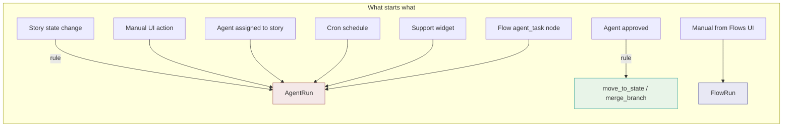

## 8.1 What starts automation rules

Current active triggers:

- story creation enters an initial state
- story moved to a new workflow state
- agent run approved

These are evaluated inline in the PM story/agent services.

## 8.2 What starts agent runs

Current active start paths:

- manual run from the UI/API
- assignment of an agent to a story
- story state change when a story already has an assigned agent
- `run_agent` automation-rule action
- support widget AI auto-reply path for support conversations
- cron schedule for scheduled agents
- flow `agent_task` nodes

## 8.3 What starts flows

Current active start path:

- manual start from the PM Flows UI / flow API

Important current-state note:

- flow templates declare supported triggers such as `manual`, `internal_domain_hook`, `story.state_entered`, and `cron`
- there is also a `flow_triggers` table in the schema
- but in the current codebase there is **not** a general workspace-level flow-trigger dispatcher wired up yet

So today, durable `FlowRun` execution is real, but generalized auto-triggered flow launching is still mostly groundwork.

## 9. Where everything runs

This is the question that causes the most confusion.

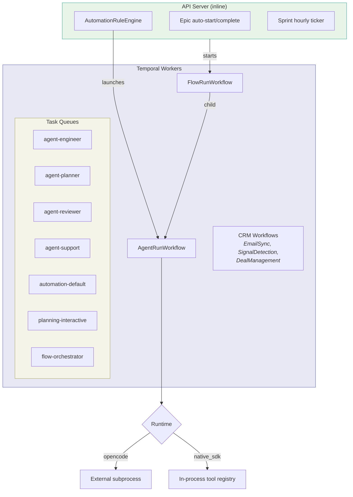

## 9.1 Are flows always run in Temporal?

**Durable `FlowRun` flows: yes.**

If a `FlowRun` is started, the orchestration loop is Temporal-backed:

- `FlowService.StartRun` creates the DB record
- `RunEngine.StartFlowRun` starts `FlowRunWorkflow`
- the workflow runs on the `flow-orchestrator` queue

But:

- not every automation in the product is a `FlowRun`
- PM built-ins are not `FlowRun`s
- automation rules are not `FlowRun`s
- CRM background automations are Temporal-backed, but they are their own workflows, not `FlowRun`s

So the accurate answer is:

- **FlowRun-based flows are always Temporal**
- **the broader automation platform is not always a FlowRun**

## 9.2 Where are agent runs executed?

Executable agent runs are Temporal-backed.

The path is:

1. create `agent_runs` row
2. start `AgentRunWorkflow`
3. Temporal worker picks it up from a task queue
4. worker prepares workspace/repo state
5. worker dispatches to the runtime adapter
6. runtime uses tools and writes artifacts
7. run completes or waits for approval

### Shared Temporal queues

Current shared queues:

- `agent-engineer`
- `agent-planner`
- `agent-reviewer`
- `agent-support`
- `automation-default`
- `planning-interactive`
- `flow-orchestrator`

Queue selection is based on resolved profile, with cross-module agents falling back to `automation-default`.

## 9.3 Where does the actual model/tool loop run?

Inside the **Temporal worker process**, not the API server.

Current execution styles:

- `opencode`
  external runtime/subprocess in the worker workspace
- `native_sdk`
  in-process runtime in the worker using the tool registry

Planning sessions also run in Temporal workers, with a Temporal session used to keep the same cloned repo across message turns.

## 9.4 What still runs inline in the API server?

These are not offloaded into `FlowRun` orchestration:

- PM epic auto-start / auto-complete logic
- automation-rule evaluation
- sprint hourly ticker
- some settings/inventory/health assembly

Inline code can still launch Temporal work after making a decision.

## 10. Current data model

The most important records are:

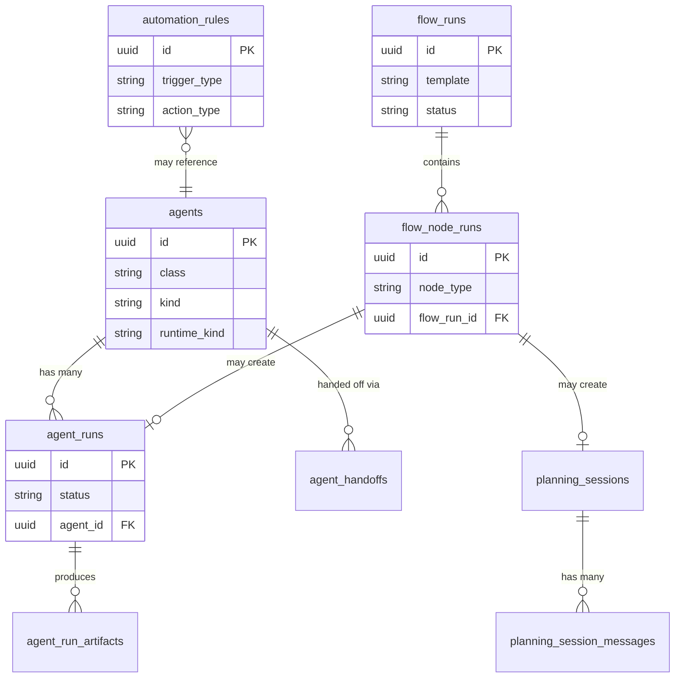

### Agent execution

- `agents`
- `agent_runs`
- `agent_run_artifacts`
- `agent_handoffs`

### Durable flows

- `flow_runs`
- `flow_node_runs`
- `flow_triggers` (schema exists; general trigger dispatcher is not broadly wired yet)

### Interactive planning

- `planning_sessions`
- `planning_session_messages`

### Rules and built-ins

- `automation_rules`
- `pm_automations`
- `automation_health`

## 11. The main "what should I use?" guide

Use this when deciding how a new automation should fit into the platform:

### Use a built-in automation when

- the behavior is product-owned
- the rules are fixed by Teampulse
- it is not meant to be configured as an open-ended user workflow

### Use an automation rule when

- the trigger is a simple event like story-state entry or agent approval
- the action is straightforward
- the user should configure it from workflow settings

### Use an agent when

- work should be done by an explicit actor
- you need runs, approvals, artifacts, or handoffs
- you need tool access and auditability

### Use a flow when

- the work has multiple steps
- it needs human checkpoints
- it needs retries/loopbacks per step
- it may mix sessions, agent runs, and deterministic commands

## 12. What is fully implemented vs partly prepared

### Fully active today

- agent CRUD
- agent runs through Temporal
- runtime profiles and queue routing
- per-agent tool/command/target overrides
- runner health reporting
- workflow-stage automation rules
- durable flow runs and node runs
- interactive planning session child workflows
- story completion flow
- CRM deal review flow
- epic planning flows
- schedule-based Temporal cron launcher for agents

### Present in schema/model but not yet broadly wired as a general platform

- generalized `flow_triggers` dispatch
- generalized `auto_on_event` agent execution
- general use of `trigger_events`
- general use of `target_selector`

## 13. Short answer summary

If you only remember one thing, remember this:

- **Built-ins** are shipped product automation
- **Automation rules** are lightweight trigger -> action logic, mostly for PM pipelines
- **Agents** are executable actors with runs, approvals, tools, and artifacts
- **Flows** are durable multi-step orchestrations made of nodes
- **Flow nodes** can launch planning sessions, agent runs, approval gates, or internal commands
- **Agent runs and flow runs are Temporal-backed**
- **Not all automation is a flow**
- **The API server decides many things inline, then launches Temporal work when needed**

## 14. Known Problems & Simplification Roadmap

This section captures architectural problems identified through code review, along with a phased simplification plan. Problems are ordered by recommended execution sequence, not by severity.

### 14.1 Problem: Sprint ticker in main.go

**Priority: highest — low risk, high value.**

The sprint auto-create and move-unfinished-stories automations run on an hourly `time.Ticker` goroutine inside the API server process (`server/cmd/api/main.go:815`). The actual sweep logic is in `server/internal/service/pm_automation.go:307`.

Problems:
- **No durability** — if the API server restarts mid-tick, the work is lost silently
- **No observability** — no run records, no health reporting, no retry tracking
- **Inconsistent** — every other scheduled automation (CRM sync, deal management, scheduled agents) uses Temporal cron workflows

**Recommendation:** Move to a Temporal cron workflow (`SprintAutomationCronWorkflow`) on the `automation-default` queue. The sweep logic in `pm_automation.go` stays unchanged — only the scheduler moves. This gives durability, automatic retries, visibility in the Temporal UI, and consistency with all other scheduled work in the platform.

### 14.2 Problem: Duplicate action concepts

**Priority: highest leverage refactor.**

Flow `system_action` commands and rule actions overlap but are not interchangeable:

- `move_to_state` exists as both a rule action and a concept within flow system actions
- Flow-only commands like `pm.create_followup_stories`, `pm.create_story_batch`, `crm.apply_deal_actions`, `docs.ensure_spec_doc`, and `pm.approve_epic_spec` are not available to rules
- Rule-only actions like `run_agent` and `merge_branch` are not available as flow system action commands

This means adding a new capability requires deciding which system gets it, and cross-system use requires duplicating the implementation.

**Code locations:**
- `server/internal/service/internal_command_service.go:14` — `InternalCommandDefinition` struct and `InternalCommandService`, already has most of the abstraction needed
- `server/internal/service/internal_command_service.go:221` — `pm.create_followup_stories` command
- `server/internal/service/internal_command_service.go:410` — `crm.apply_deal_actions` command
- `server/internal/service/automation_rule_engine.go` — rule action execution (separate dispatch)
- `server/internal/worker/flow_run_workflow.go` — flow system action execution (separate dispatch)

**Recommendation:** Extend `InternalCommandService` into the shared dispatch layer rather than inventing a new registry. It already defines `InternalCommandDefinition` with `Name`, `Module`, `SupportedTargetTypes`, and an `Execute` function — the same contract needed by both flow nodes and rule actions. Wire `AutomationRuleEngine` and `FlowRunWorkflow` system action execution to dispatch through `InternalCommandService.Execute()`. New capabilities are added once and available everywhere.

### 14.3 Problem: Dead `flow_triggers` schema

**Priority: low-risk cleanup (after a data check).**

The `flow_triggers` table exists in the database schema and trigger types are defined in the model, but no dispatcher is wired. `FlowTrigger` is defined in `server/internal/model/flow.go:116` and the repository can create rows (`flow.go:148`), but no code reads or evaluates them.

**Important caveat:** Code inspection alone cannot prove whether rows exist in production. Before dropping the table, verify with a `SELECT count(*) FROM flow_triggers` in prod/staging.

**Code locations:**
- `server/internal/model/flow.go:116` — `FlowTrigger` model definition
- `server/migrations/` — migration that creates the table

**Recommendation:** After confirming no meaningful prod data exists, remove the `flow_triggers` table. When flow auto-start is needed, use the existing rule engine with a new `start_flow` action type. This keeps trigger evaluation in one place (`AutomationRuleEngine`) rather than building a parallel trigger dispatcher.

### 14.4 Problem: Two rule systems

**Priority: phased effort — start with epic lifecycle only.**

The platform has two independent rule systems that both fire on story state changes:

- **`pm_automations`** — rigid schema with `ConfigInt`, `ConfigInt2`, `ConfigInt3` columns, inline evaluation in story/epic services, own health observability via `automation_health`
- **`automation_rules`** — extensible JSONB config, evaluated by `AutomationRuleEngine`, own health observability

Both run inline in the API server. Both react to story state changes. The overlap is most visible in epic lifecycle management: epic auto-start and epic auto-complete in `pm_automations` are textbook trigger→action rules (`all stories started → start epic`, `all stories done → complete epic`) that predate the rule engine.

**Code locations:**
- `server/internal/service/pm_automation.go` — `pm_automations` evaluation
- `server/internal/service/automation_rule_engine.go:93` — `AutomationRuleEngine.EvaluateEvent`, story-centric event model
- `server/internal/model/pm_automation.go` — rigid `ConfigInt`/`ConfigInt2`/`ConfigInt3` schema
- `server/internal/model/automation_rule.go:8` — only two trigger types (`story.state_entered`, `agent_run.approved`) and three action types (`run_agent`, `move_to_state`, `merge_branch`)

**Scope constraint:** `automation_rules` is currently story-centric. The `AutomationEvent` struct carries `StoryID`, the engine always loads a story, and only story-related triggers and actions exist. Epic auto-start/complete can migrate with moderate work (they already fire on story state changes). Sprint auto-create and move-unfinished-stories **cannot** migrate without first adding cron triggers and non-story execution context to the rule engine.

**Recommendation — phased:**

1. **Phase 1:** Migrate epic auto-start and epic auto-complete into `automation_rules` with new action types `update_epic_state`. These already fire on story state changes and fit the existing event model.
2. **Phase 2 (after 14.1):** Once sprint scheduling is in Temporal, evaluate whether sprint automations should become rule-triggered or remain as Temporal cron activities. This requires adding a `cron` trigger type and non-story execution context to `AutomationRuleEngine`.
3. **Phase 3:** Retire `pm_automations` table and its evaluation path once all automations have migrated.

### 14.5 Observation: Simple flows use flow-only capabilities

**Status: not actionable yet.**

Story completion (`pm.story_completion_v1`) and deal review (`crm.deal_review_v1`) are both 3-node linear sequences:

```
agent_task → approval_gate → system_action → done
```

On paper this looks like it could be a rule chain (`run_agent → agent_run.approved → system_action`). In practice, these flows depend on capabilities that only exist in the flow system today:

- **Rich approval behavior:** `request_changes` with loopback reruns and `reject` actions are defined in flow templates (`server/internal/service/flow_templates.go:200`). Plain agent approval (`server/internal/service/agent.go`) only supports approve with `send_message`.
- **Override payloads:** Approval gate nodes pass structured payloads to the next system action node.
- **Manual launch and review UI:** Story completion and deal review are first-class entries in the Flows page, with dedicated launch and review surfaces.
- **Non-story targets:** Rule approval events only fire for story targets (`server/internal/service/agent.go:715` — `run.TargetType == "story" && run.StoryID != nil`). Deal review targets `crm_deal`, which the rule engine cannot handle.

**Prerequisite work before this could be revisited:**
1. Extend agent approval to support `request_changes` and `reject` actions
2. Add non-story approval event triggers to `AutomationRuleEngine`
3. Support override/payload passing in rule chains
4. Provide equivalent manual-launch and review UX outside of the Flows page

Until these prerequisites exist, demoting these flows would lose real functionality.

### 14.6 Target architecture (north star)

This diagram represents the long-term direction, not a single milestone. The phased plan above converges toward this state incrementally.

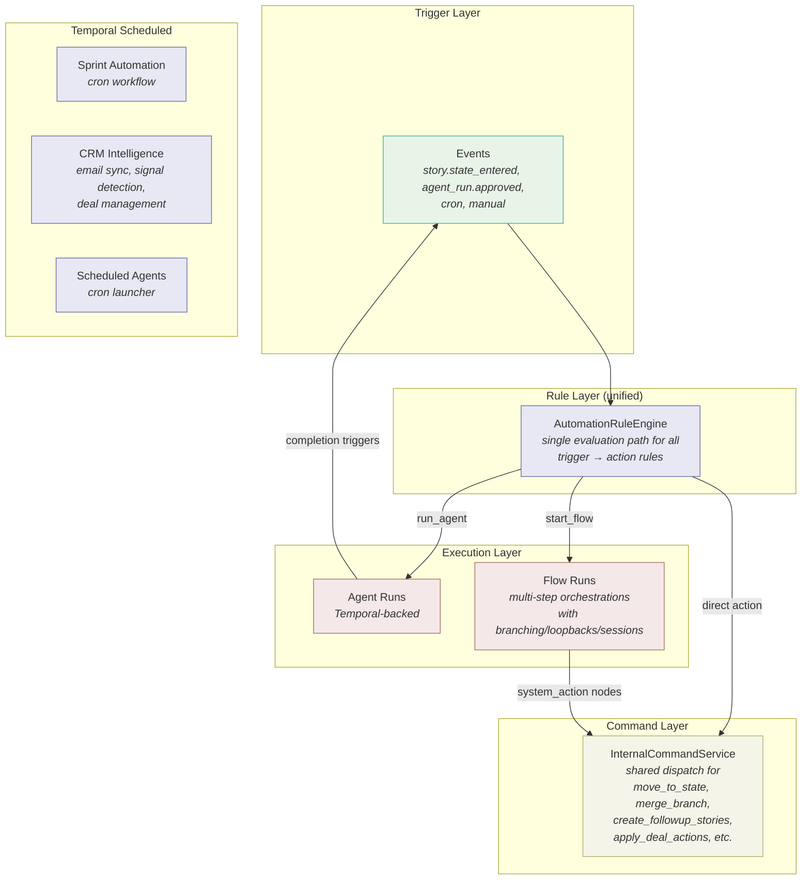

### 14.7 Recommended execution order

| Step | Problem | What to do | Risk |
|------|---------|-----------|------|
| 1 | 14.1 Sprint ticker | Move scheduler to Temporal cron. Sweep logic unchanged. | Low |
| 2 | 14.2 Duplicate actions | Wire `AutomationRuleEngine` and `FlowRunWorkflow` to dispatch through `InternalCommandService`. | Medium |
| 3 | 14.3 Dead `flow_triggers` | Verify no prod data, then drop table. Add `start_flow` rule action. | Low |
| 4 | 14.4 Two rule systems (phase 1) | Migrate epic auto-start/complete into `automation_rules`. | Medium |
| 5 | 14.4 Two rule systems (phase 2+) | Extend rule engine for cron triggers and non-story context. Migrate remaining `pm_automations`. | High |
| 6 | 14.5 Simple flows | Revisit only after agent approvals support `request_changes`/`reject` and rule events fire for non-story targets. | High |
