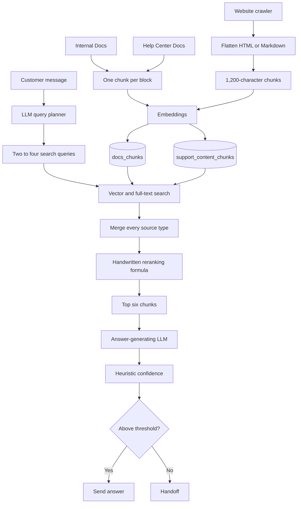
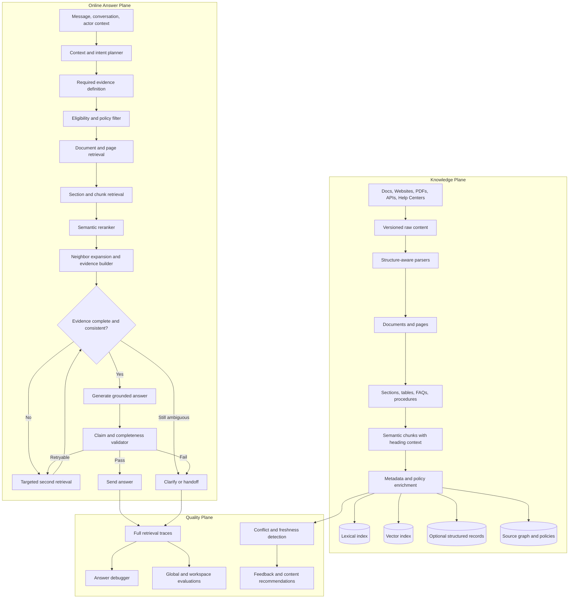

# PRD: Multi-Tenant Knowledge Retrieval Platform

**Status:** Execution-ready draft
**Date:** 2026-07-17
**Accountable DRI:** AI Platform Lead (a named individual must be assigned before kickoff)
**Contributing owners:** Support Backend Lead, Docs Backend Lead, AI Quality Lead, Product Lead
**Primary areas:** Knowledge ingestion, retrieval, support AI, evaluation

---

## 1. Product Thesis

Helpin should provide every workspace with a reliable knowledge runtime, not merely a collection of embedded text chunks.

The platform must understand a request, select eligible and authoritative sources, retrieve complete evidence, detect conflicts, generate a grounded response, and validate that response before it reaches a customer.

This architecture is intentionally multi-tenant and source-agnostic. It must work for any workspace and for content from Helpin Docs, public help centers, internal documents, websites, PDFs, and future connectors. Product-specific rules must be represented as workspace configuration and metadata rather than application code.

The desired progression is:

```text
search every chunk
  -> retrieve structured evidence
  -> validate complete, authoritative answers
```

---

## 2. Problem Statement

The existing support RAG pipeline can retrieve content that is semantically related but not authoritative or sufficient for the customer's intent.

Representative failure classes include:

1. A heading matches the question while its answer is stored in a separate block or chunk.
2. A general article outranks a curated internal recommendation.
3. A billing or tax article answers a general pricing question without providing prices.
4. Historical blog content conflicts with a current canonical product page.
5. The model produces a confident response because some related evidence exists, even though required facts are missing.
6. The system cannot explain to an administrator why a source was selected or excluded.

Adding more content does not inherently solve these failures. Indexing an entire website can increase ambiguity when it introduces duplicated, outdated, or contradictory claims.

---

## 3. Goals

1. Build a general knowledge architecture shared by all workspaces and AI surfaces.
2. Preserve semantic document structure during ingestion and chunking.
3. Apply workspace, permission, audience, brand, language, and freshness constraints before retrieval.
4. Represent source authority and canonical-topic policies explicitly.
5. Retrieve documents hierarchically: source/page, section, then chunk.
6. Rerank candidates by direct answer quality, authority, freshness, applicability, and completeness.
7. Detect conflicting facts and prevent weaker claims from reaching generation.
8. Define the evidence required to answer a request and retrieve until that evidence is complete.
9. Validate generated claims against retrieved evidence and the original request.
10. Replace model self-confidence with calibrated, measurable grounding signals.
11. Provide answer debugging, regression testing, and content-health feedback.
12. Preserve strict workspace isolation and internal-source privacy.

### 3.1 Launch scope and failure priority

The launch-critical path addresses the failures that can produce a wrong autonomous answer before investing in broad administrative tooling.

The initial priority is:

1. **Unsafe sufficiency and authority decisions** — failure classes 2-5: related content is mistaken for complete evidence, or weaker and stale sources override applicable canonical content.
2. **Structural retrieval loss** — failure class 1: the matching heading and the answer body are separated during ingestion or context construction.
3. **Administrator diagnosis** — failure class 6: useful for scale, but not required to prove the safer answer path. Full self-service debugging follows the launch-critical rollout.

This order is a starting hypothesis based on the observed pricing and plan-recommendation failures. Phase 0 must classify at least 500 recent answer attempts by failure class, handoff outcome, customer impact, and frequency. At the Week 2 checkpoint, the Product Lead and AI Quality Lead will publish the measured ordering and may reorder later milestones. They may not remove the security, evidence-completeness, or end-to-end latency gates.

Launch scope includes semantic ingestion, filtered retrieval, canonical-source policies, a versioned evidence registry, reranking, evidence construction, deterministic validation, and calibrated answer decisions. Open-domain fact extraction and the full administrator debugger are explicitly post-launch work.

---

## 4. Non-Goals

1. Hardcode pricing, plan, policy, or product rules for a specific workspace.
2. Replace PostgreSQL or pgvector solely to deliver this architecture.
3. Train a custom foundation model in the first release.
4. Allow unpublished, unauthorized, expired, or audience-ineligible content into retrieval.
5. Expose internal source titles, URLs, IDs, or citations to visitors.
6. Guarantee that every request receives an answer; clarification and handoff remain valid outcomes.
7. Rebuild every source connector before the normalized knowledge layer is introduced.
8. Depend on open-domain subject/predicate/value extraction for launch correctness.
9. Deliver the complete self-service answer debugger before the new answer path reaches general availability.

---

## 5. Current Architecture

### 5.1 Ingestion

Current ingestion has two primary paths:

- Helpin Docs and help-center documents are indexed into `docs_chunks`.
- Crawled websites are indexed into `support_content_chunks`.

Documents use top-level blocks when available. Each block is independently passed through a character-based chunker. Crawled Markdown or HTML is normalized into plain text, whitespace and structural boundaries are collapsed, and the result is passed through the same chunker.

The current defaults are:

- embedding model: `text-embedding-3-small`
- embedding dimensions: `1536`
- chunk size: `1,200` characters
- overlap: `200` characters

### 5.2 Online retrieval

The support AI flow currently:

1. Uses an LLM planner to produce two to four search-query variants.
2. Embeds each query.
3. Runs PostgreSQL full-text and pgvector search over selected Docs spaces.
4. Runs the same search over selected website sources.
5. Fuses lexical and vector results per repository.
6. Merges all source types and query variants.
7. Deduplicates by chunk ID.
8. Reranks with a handwritten formula using the first search query.
9. Limits each document to two chunks.
10. Keeps at most twelve results.
11. Sends the first six chunks to the answer-generating model.
12. Calculates confidence from retrieval quality, source coverage, model confidence, and `can_answer`.
13. Sends the answer when confidence exceeds the workspace threshold; otherwise it hands off.

### 5.3 Current flow



### 5.4 Current limitations

| Area | Current limitation |
|---|---|
| Content structure | Website headings, lists, cards, and tables are flattened. |
| Docs chunking | A heading and its explanatory blocks may be indexed separately. |
| Boundaries | Chunks use character counts rather than semantic or token boundaries. |
| Source selection | Every selected source enters one global competition. |
| Authority | Canonical pages, curated guidance, blogs, and historical pages have no explicit authority relationship. |
| Freshness | Updated and historical claims can compete without validity rules. |
| Audience | Retrieval does not yet have a general audience and brand policy layer. |
| Reranking | A handwritten score uses only the first generated search query. |
| Context | Only six chunks reach the answer model; parent and neighboring sections are not expanded. |
| Completeness | Finding related content is treated as sufficient even when required facts are missing. |
| Conflicts | Contradictory facts are not detected or resolved before generation. |
| Validation | Confidence does not verify that each claim is supported or that the original request was answered. |
| Debugging | Retrieval traces are not exposed as a complete administrator-facing answer debugger. |

Relevant current implementation areas:

- `server/internal/service/support_content_sync.go`
- `server/internal/service/docs_embedding.go`
- `server/internal/repository/docs_chunk.go`
- `server/internal/repository/support_content_chunk.go`
- `server/internal/service/support_ai.go`
- `server/internal/service/support_ai_confidence.go`

---

## 6. Proposed Architecture

The proposed system has three planes:

1. **Knowledge Plane** — ingestion, structure, metadata, policies, indexing, freshness, and conflict detection.
2. **Online Answer Plane** — intent planning, eligibility, retrieval, reranking, evidence construction, generation, and validation.
3. **Quality Plane** — traces, debugging, evaluation, feedback, and content recommendations.



---

## 7. Knowledge Plane

### 7.1 Versioned raw content

Connectors should preserve the original source payload and record:

- connector and source ID
- source URL or external object ID
- workspace ID
- content hash
- source revision or ETag when available
- fetched, published, and updated timestamps
- parser version
- ingestion status and error

Raw source storage remains source-specific. The normalized knowledge layer sits above it.

### 7.2 Structure-aware parsers

Each parser produces a common document tree while retaining source-specific provenance.

#### HTML

- Extract the primary content area.
- Remove navigation, footer, cookie notices, and repeated boilerplate.
- Preserve H1-H6 hierarchy, paragraphs, lists, tables, FAQs, tabs, and pricing cards.
- Retain structured data such as JSON-LD when relevant.
- Record canonical URL and page metadata.

#### Helpin Docs and Markdown

- Preserve block types and heading hierarchy.
- Group a heading with the paragraphs, lists, and tables it governs.
- Retain stable block IDs and ranges.

#### PDFs

- Preserve page numbers, headings, reading order, lists, and tables.
- Mark low-confidence OCR sections.

#### APIs and structured connectors

- Preserve native structured records when available instead of converting everything to prose.

### 7.3 Semantic sections and chunks

Chunks should be self-contained units derived from sections, not arbitrary windows over flattened text.

Default behavior:

- target 300-700 tokens
- preserve paragraph and section boundaries
- prepend document title and heading path
- merge small adjacent blocks
- keep tables and plan cards intact when possible
- use controlled overlap at semantic boundaries
- store parent section and previous/next chunk links
- record token count and parser/chunker version

Example:

```text
Document: Product Plan Recommendations
Section: Website and Product Analytics

For customers needing website, product, and ecommerce analytics,
the recommended option is the Growth plan.

Included capabilities:
- Website analytics
- Product analytics
- Ecommerce analytics
- Funnels and user journeys
```

### 7.4 Normalized data model

The first implementation may dual-write alongside existing tables.

#### `knowledge_documents`

Represents a page, article, document, PDF, or structured object.

Core fields:

```text
id
workspace_id
source_id
source_type
external_id
title
canonical_url
language
visibility
audience_policy_id
brand_id
status
authority_level
published_at
source_updated_at
last_verified_at
valid_from
valid_until
content_hash
parser_version
created_at
updated_at
```

#### `knowledge_sections`

Represents a semantic section or structured unit.

```text
id
workspace_id
document_id
parent_section_id
heading
heading_path
section_type
position
content_text
structured_data
source_block_ids
topics
entities
created_at
updated_at
```

#### `knowledge_chunks_v2`

Represents the searchable unit.

```text
id
workspace_id
document_id
section_id
previous_chunk_id
next_chunk_id
chunk_index
content
token_count
embedding
embedding_provider
embedding_model
embedding_version
lexical_document
authority_level
source_updated_at
valid_from
valid_until
metadata
created_at
updated_at
```

#### `knowledge_facts` (experimental, post-GA)

This optional table stores facts that arrive from native structured connectors or later pass a proven extraction-quality gate. Open-domain extraction of subject/predicate/value triples is not launch-critical. Pricing correctness at launch comes from canonical-source selection, required evidence, and numeric consistency checks against the retrieved source text.

```text
id
workspace_id
document_id
section_id
subject
predicate
value
unit
currency
qualifiers
valid_from
valid_until
authority_level
evidence_chunk_id
```

#### `knowledge_source_policies`

Stores workspace configuration rather than product-specific code.

```text
id
workspace_id
agent_id
topic_or_intent
selector_type
selector_value
audience_policy_id
canonical_document_ids
preferred_source_ids
excluded_source_ids
minimum_authority
freshness_requirement
conflict_behavior
precedence
created_at
updated_at
```

#### `knowledge_conflicts`

Stores detected contradictions for review and runtime exclusion.

```text
id
workspace_id
topic
entity
conflict_key
candidate_evidence_ids
winning_evidence_id
resolution_reason
status
created_at
updated_at
```

### 7.5 Source authority

Authority must be a generic, configurable signal. A suggested default ordering is:

1. Workspace-pinned canonical content
2. Curated internal guidance
3. Official product and help documentation
4. Official product pages
5. General website pages
6. Blog and comparison content
7. Historical or unverified content

Authority is not an unconditional ranking override. Relevance, audience applicability, freshness, and direct answer quality still matter.

### 7.6 Freshness and conflict detection

The ingestion pipeline should:

- detect duplicate and near-duplicate sections
- compare explicit numeric and categorical values in canonical evidence when reliable
- flag conflicting values from native structured data or high-confidence deterministic extraction
- prefer current canonical sources at runtime
- expire content with `valid_until`
- record when a source was last verified
- trigger reindexing when source content or parser versions change
- notify administrators about unresolved high-impact conflicts

---

## 8. Online Answer Plane

### 8.1 Context builder

The request context may include:

- latest message
- recent conversation history
- workspace and agent
- channel
- language
- active brand
- visitor audience and attributes
- authenticated customer context when permitted
- current date and locale

The context builder must enforce privacy boundaries and minimize unnecessary personal data.

### 8.2 Intent and evidence planner

The planner produces a structured contract, not only search strings.

Example:

```json
{
  "decision": "answer",
  "intent": "pricing_general",
  "entities": ["product"],
  "answer_type": "plan_summary",
  "risk": "time_sensitive_commercial",
  "required_evidence": [
    "plan_names",
    "starting_prices",
    "billing_cadence",
    "usage_tier",
    "enterprise_status",
    "canonical_url"
  ],
  "search_queries": [
    "current product pricing plans",
    "plan starting prices and billing options"
  ]
}
```

`intent`, `answer_type`, `risk`, and every `required_evidence` value must be registry identifiers. They are not free text generated by the model.

#### Versioned intent and evidence registry

The server owns a versioned `IntentDefinitionRegistry`. Each intent definition specifies:

- a stable intent ID and schema version
- allowed answer types and risk tiers
- stable evidence-field IDs
- field type, required/optional status, and cardinality
- deterministic validators for currencies, numbers, dates, URLs, enums, and units
- source-authority and freshness requirements
- channel-specific retry and validation policy
- the clarification or handoff behavior when evidence is incomplete

Example:

```yaml
intent: pricing_general
version: 1
risk: time_sensitive_commercial
required_evidence:
  - id: plan_names
    type: string_list
  - id: starting_prices
    type: money_list
  - id: billing_cadence
    type: enum_list
  - id: enterprise_status
    type: enum
  - id: canonical_url
    type: url
```

Planner output is validated against the selected registry version with JSON Schema or an equivalent typed decoder. An unknown intent or evidence-field ID is rejected and mapped to the generic intent policy; it never falls through to fuzzy string matching. The trace records the registry version used for each answer. Initial definitions are code-owned and reviewed like API contracts. Validated workspace extensions may be added later without allowing arbitrary planner-defined fields.

Platform-owned initial intents may include:

- `pricing_general`
- `plan_recommendation`
- `billing_tax`
- `feature_availability`
- `troubleshooting`
- `integration_setup`
- `policy`
- `account_specific_action`
- `competitor_comparison`
- `how_to`
- `unknown`

Workspaces may extend or map topics through policy configuration without changing server code.

### 8.3 Eligibility filtering

Eligibility is applied before scoring.

Required filters include:

- exact `workspace_id`
- agent-linked source
- published and active status
- visibility and permissions
- audience and brand
- language
- validity dates
- source policy exclusions
- internal/public safety rules

An ineligible source must never be allowed into the candidate set even if its embedding is highly similar.

#### Filtered pgvector execution strategy

PostgreSQL and pgvector remain the initial storage choice only with an explicit filtered-ANN strategy. Complex workspace, permission, audience, brand, language, validity, and policy predicates can reduce approximate-index recall if rows are filtered only after an HNSW or IVFFlat scan.

The retrieval implementation must therefore:

1. Express every hard eligibility rule in the SQL query. Application-side post-filtering is not a security boundary.
2. Require pgvector 0.8 or later and enable iterative index scans for filtered HNSW or IVFFlat queries. Tune `hnsw.ef_search`, `hnsw.max_scan_tuples`, IVFFlat probes, and scan limits using the Phase 0 corpus.
3. Use maintained policy-scope cardinalities or a cheap planner estimate for the eligible row set; do not run a full count on every request. Use an exact filtered scan when the estimate is at or below an initially configurable 20,000-chunk cap; benchmark data may change this cap before launch.
4. Use iterative ANN for larger eligible sets. If it returns fewer than `k` eligible rows or misses the recall floor, retry with a larger scan budget or an exact filtered scan within the channel latency budget.
5. Hash-partition common indexes by `workspace_id`. Add dedicated partitions or per-workspace partial indexes only for tenants whose scale and query profile justify the operational cost.
6. Materialize compact policy-scope IDs for audience and brand rules so the database can filter on indexed scalar values instead of evaluating complex policy logic during ANN search.
7. Shadow a sample of ANN queries against exact filtered search and continuously measure filtered top-k recall by workspace size and filter selectivity.

An ANN index may inspect additional rows internally, but only rows satisfying the SQL eligibility predicate may be returned to the retrieval service. In this PRD, "candidate set" means the service-visible result after database-enforced eligibility. Launch is blocked if the production pgvector version lacks iterative scan support, filtered recall is below target, or any adversarial test can return an unauthorized row.

### 8.4 Hierarchical retrieval

Retrieval proceeds in stages:

1. Retrieve the most relevant documents or pages.
2. Retrieve sections inside those documents.
3. Retrieve chunks inside the selected sections.
4. Expand to parents and adjacent chunks where needed.
5. Retrieve native structured records when available for intents requiring exact values.

Candidate pools remain separate until fusion:

- curated internal knowledge
- public help content
- general website content
- structured data
- actions and integrations

This prevents one high-volume source class from consuming every candidate position.

### 8.5 Candidate generation and fusion

The initial implementation can continue using PostgreSQL full-text search and pgvector.

Recommended candidate flow:

1. Run lexical and vector retrieval in parallel for each query variant.
2. Retrieve candidates per source class rather than globally.
3. Fuse lexical, vector, and multi-query ranks with reciprocal rank fusion.
4. Deduplicate by semantic section and source document.
5. Keep a broad set, such as the best 30-50 candidates, for semantic reranking.

### 8.6 Semantic reranking

A small cross-encoder or constrained LLM reranker should score candidates against the original request and planner contract.

The default launch implementation is a locally hosted or otherwise fixed-cost cross-encoder with a p95 stage budget of 250 ms. An LLM reranker is permitted only if it stays within the channel call cap, latency budget, and cost budget. Low-risk requests may skip semantic reranking when lexical/vector fusion has a strong margin and benchmark results show no quality regression.

Signals include:

- direct answer quality
- intent match
- entity match
- required-fact coverage
- authority
- freshness
- audience applicability
- language and brand match
- source-policy preference
- contradiction status
- document and source diversity

The reranker should evaluate every query variant or the normalized standalone request, not only the first generated query.

### 8.7 Evidence builder

The evidence builder groups chunks into coherent evidence packets:

```text
Intent: pricing_general

Required evidence:
- plan names: found
- starting prices: found
- billing cadence: found
- usage tier: found
- enterprise status: found
- canonical URL: found

Primary evidence:
- Canonical pricing page / Growth
- Canonical pricing page / Scale
- Canonical pricing page / Enterprise

Excluded evidence:
- Historical blog price, superseded by canonical page
```

Responsibilities:

- expand heading matches to their answer blocks
- group related sections
- remove duplicate boilerplate
- enforce source diversity where useful
- include exact provenance
- track required-fact coverage
- surface unresolved conflicts
- stay within a token budget

### 8.8 Targeted retrieval retry

If required evidence is incomplete, the system may perform one targeted retrieval pass using registry-defined missing fields. The retry is retrieval-only unless a channel policy explicitly permits another generation call.

Examples:

```text
missing: billing cadence
query: annual versus monthly billing for current plans

missing: recommended plan
query: recommended plan for website and product analytics
```

After the retry:

- answer if evidence is complete
- ask a focused clarifying question if the request has multiple plausible intents
- hand off or state the limitation when authoritative evidence is unavailable

Live chat never retries generation after validation failure. It clarifies, hands off, or states the limitation. Email, internal preview, and asynchronous channels may perform one regeneration when both the latency and cost budgets allow it.

### 8.9 Grounded generation contract

The answer model receives evidence packets and returns structured claims:

```json
{
  "answer": "...",
  "can_answer": true,
  "claims": [
    {
      "text": "The Growth plan starts at a specified monthly price.",
      "evidence_ids": ["knowledge_section_id"]
    }
  ],
  "public_source_ids": ["public_document_id"]
}
```

Internal evidence may guide the answer but remains absent from visitor-facing citations and metadata.

### 8.10 Answer validator

The validator checks:

1. Does the response answer the original request?
2. Are all required evidence fields represented?
3. Is every material claim supported by cited evidence?
4. Are numeric values, units, currencies, dates, and qualifiers consistent?
5. Did a weaker or expired source override a canonical source?
6. Are there unresolved contradictions?
7. Does the response obey audience, brand, privacy, and internal-source rules?
8. Are public citations valid and applicable?

Required-evidence matching uses the exact field IDs and types from the registry version selected by the planner. Numeric and categorical checks compare generated values directly with evidence spans; they do not require persistent open-domain fact triples.

Outcomes:

- **pass** — send the answer
- **retryable** — perform one targeted retrieval or regeneration
- **clarify** — ask one focused question
- **handoff** — escalate safely
- **cannot answer** — state the limitation without inventing facts

### 8.11 Calibrated confidence

Confidence should use measurable features rather than primarily model self-reporting.

Candidate features include:

- expected source retrieved
- top reranker score and score margin
- required-fact coverage
- claim support ratio
- source authority
- source freshness
- contradiction count
- validator result
- intent-specific historical evaluation performance
- successful targeted retry

Thresholds should be stricter for pricing, billing, security, legal, policy, and account-specific requests than for low-risk conversational or general how-to requests.

---

## 9. Quality Plane

### 9.1 Retrieval traces

Every answer attempt should record:

- request and normalized intent
- planner contract
- search-query variants
- eligible and excluded source counts
- exclusion reasons
- raw lexical and vector candidates
- fused and reranked candidates
- parent and neighbor expansions
- evidence packets sent to generation
- required evidence found and missing
- generated claims and evidence mappings
- validation result
- final confidence and decision
- latency, model, token usage, rate-card version, and allocated cost by stage

Sensitive internal content in traces must remain restricted to authorized workspace actors.

### 9.2 Answer debugger

An administrator-facing debugger should answer:

1. What did the system think the customer meant?
2. Which sources were eligible?
3. Which sources were retrieved and why?
4. Which stronger or weaker sources were excluded?
5. What evidence was sent to the model?
6. Which claims passed or failed validation?
7. Why did the confidence threshold pass or fail?
8. What change would improve similar answers?

The debugger should support actions such as:

- pin a canonical source
- scope a source to a topic or audience
- exclude stale content
- create a short guidance item
- update an existing document
- add an evaluation case

### 9.3 Evaluation system

The **AI Quality Lead** is the DRI for benchmark design, labels, measurement, and release reports. The AI Platform team owns the evaluation runner and trace instrumentation. Support Operations and workspace subject-matter experts own domain labels and adjudication. Product owns the final launch decision.

Phase 0 produces the following versioned datasets:

1. **Failure and handoff audit:** at least 500 anonymized recent production answer attempts from at least 10 eligible workspaces, stratified by intent, channel, workspace size, answer/handoff outcome, and feedback. Each case is assigned one or more failure classes from Section 2.
2. **Global benchmark v1:** at least 500 cases, including at least 150 commercial or policy cases, 150 how-to or troubleshooting cases, 100 ambiguous, incomplete, stale, or conflicting-source cases, and 100 permission, audience, privacy, and cross-workspace adversarial cases.
3. **Workspace canary suites:** at least 50 cases per launch workspace, labeled with expected facts, acceptable sources, prohibited claims, audience, and expected answer/clarify/handoff behavior.

At least 20% of cases receive two independent human labels. The target inter-annotator agreement is Cohen's kappa >= 0.75; disagreements on critical intents are adjudicated by a subject-matter expert. A judge model may propose labels or score non-critical dimensions, but human-adjudicated labels are the gold standard for launch gates.

"Unsupported material claims < 1%" is measured at the material-claim level on at least 500 blinded, human-reviewed answer attempts. Reviewers mark whether each claim is directly supported by eligible evidence and whether its numeric values and qualifiers match. The launch gate requires both a point estimate below 1% and the upper bound of a 95% confidence interval at or below 1%. Results must be reported by intent and risk tier, not only as a blended average.

The global benchmark is reviewed quarterly and refreshed after material product changes. Canary suites add regressions continuously and are reviewed before each retrieval release.

Maintain two evaluation layers:

#### Global platform benchmark

Tests generic behavior shared by all workspaces:

- intent recognition
- expected-source recall
- permission filtering
- authority handling
- stale-content handling
- conflict resolution
- claim grounding
- clarification behavior
- internal-source privacy

#### Workspace evaluation suites

Allow each workspace to define representative questions, expected facts, preferred sources, disallowed claims, and target audiences.

Evaluation cases should run when changing:

- parsers
- chunking
- embedding models
- query planning
- ranking weights
- reranker models
- prompts
- validators
- source policies

Release reports must include the current-production baseline, proposed result, sample size, confidence interval where applicable, cost, end-to-end latency, and any workspace-level regressions.

### 9.4 Content-health recommendations

The platform should identify:

- missing content
- ambiguous sections
- heading/body separation
- duplicate content
- conflicting facts
- stale high-impact content
- weak canonical coverage
- high-volume unanswered topics
- frequently retrieved but low-performing content

---

## 10. Multi-Tenant Security and Privacy

Security constraints are architectural, not prompt-only.

1. Every normalized record and index row includes `workspace_id`.
2. Every query applies workspace and eligibility filters before vector or lexical ranking.
3. Internal visibility and team permissions are enforced before candidate construction.
4. Audience and brand policies are evaluated before retrieval.
5. Internal titles, URLs, source IDs, and citations are removed before visitor-facing generation.
6. Retrieval traces containing internal evidence require explicit workspace permissions.
7. Cache keys include workspace, agent, audience, language, brand, and policy versions.
8. Cross-workspace evaluation data contains no raw customer content unless explicitly anonymized and approved.

The required security acceptance criterion is zero cross-workspace or unauthorized-source leakage.

---

## 11. Current vs. Proposed Summary

| Dimension | Current | Proposed |
|---|---|---|
| Normalization | Flattened text or isolated blocks | Structured document tree |
| Chunking | 1,200 characters with overlap | Semantic, token-based sections |
| Indexes | Separate Docs and website chunk repositories | Unified retrieval abstraction over normalized knowledge |
| Metadata | Basic source/document fields | Authority, freshness, audience, brand, intent, entities, validity |
| Source selection | All linked sources compete | Eligibility and policy filtering before search |
| Retrieval | Chunk-first | Document -> section -> chunk -> neighbors |
| Candidate pools | Globally merged | Separate pools with controlled fusion |
| Reranking | Handwritten lexical/vector overlap | Semantic direct-answer reranker |
| Context | First six chunks | Coherent evidence packets |
| Completeness | Not modeled | Required-evidence contract and retry |
| Conflicts | Not modeled | Canonical-source checks and evidence-level numeric consistency; structured fact extraction remains optional |
| Generation | Free-form answer with source IDs | Claim-to-evidence contract |
| Validation | Heuristic confidence threshold | Relevance, completeness, grounding, consistency, privacy |
| Confidence | Best retrieval score plus model confidence | Calibrated intent-specific signals |
| Debugging | Backend traces | Administrator answer debugger |
| Improvement | Manual and reactive | Evaluations, feedback, and content-health recommendations |

---

## 12. Example Behavior

These are platform-level examples, not hardcoded workspace rules.

### 12.1 General pricing question

```text
Question: What is your pricing?

Intent: pricing_general
Required evidence: current plans, starting prices, cadence, usage tier,
enterprise status, canonical URL

Behavior:
1. Filter to current, applicable sources.
2. Prefer workspace-configured canonical pricing content.
3. Exclude or downrank historical comparisons.
4. Retrieve structured plan sections and native structured records when available.
5. Validate that the response contains actual prices when available.
```

### 12.2 Plan recommendation

```text
Question: Which plan is suitable for website and product analytics?

Intent: plan_recommendation
Required evidence: use case, recommended plan, included capabilities

Behavior:
1. Retrieve curated plan guidance and canonical plan descriptions.
2. Expand the matching heading to its explanatory blocks.
3. Prefer a directly applicable recommendation over general comparison content.
4. Ask for clarification only when multiple plans remain equally applicable.
```

### 12.3 Tax question

```text
Question: Do your prices include VAT?

Intent: billing_tax
Required evidence: tax inclusion, billing-location behavior, payment processor

Behavior:
1. Select tax and billing documentation.
2. Do not substitute the general pricing page when it lacks tax details.
3. Validate that the answer distinguishes advertised price from checkout total.
```

---

## 13. Delivery Plan and Prioritization

The migration is incremental, reversible, and limited to an 18-week launch-critical path. The full administrator improvement loop and experimental open-domain fact extraction follow general availability.

### 13.1 Staffing and ownership

This schedule assumes dedicated capacity from kickoff through rollout.

| Workstream | DRI | Required capacity |
|---|---|---|
| Program, architecture, and launch accountability | AI Platform Lead | 1 accountable owner; a named individual is required before kickoff |
| Retrieval, ranking, evidence, and validation | AI Platform Lead | 2 backend/search engineers |
| Parsing, normalized schema, and reindexing | Docs Backend Lead | 1 backend engineer |
| Support AI integration and channel behavior | Support Backend Lead | 1 backend engineer |
| Benchmarks, labels, and release reports | AI Quality Lead | 0.5 quality/data FTE plus Support subject-matter experts for at least 4 hours per week |
| Scope, unit economics, and rollout decision | Product Lead | 0.5 product/design FTE |
| Security and production readiness review | Security/SRE Lead | 0.25 advisory FTE at design and launch gates |

Four dedicated engineers are the minimum staffing assumption. With two or fewer engineers, the launch-critical estimate becomes 28-36 weeks and the post-GA debugger must remain separately staffed. Each role must have a named person in the delivery tracker before Phase 0 exits.

### 13.2 Milestones

| Phase | Weeks | DRI | Launch-critical outcome |
|---|---:|---|---|
| 0. Baseline and decision checkpoint | 0-2 | AI Quality Lead | Measured failure ordering, current quality/cost/latency baselines, versioned benchmark |
| 1. Structural ingestion and chunks v2 | 3-6 | Docs Backend Lead | Normalized documents, sections, semantic chunks, controlled reindex |
| 2. Unified and securely filtered retrieval | 5-9 | AI Platform Lead | Shadow retrieval service, filtered pgvector strategy, exact-search comparison |
| 3. Authority, policies, and evidence registry | 7-11 | AI Platform Lead | Canonical-source policy, eligibility scopes, typed intent/evidence contracts |
| 4. Reranking and evidence construction | 10-13 | AI Platform Lead | Direct-answer reranking, neighbor expansion, completeness tracking |
| 5. Generation and validation | 12-15 | Support Backend Lead | Claim mapping, deterministic checks, calibrated answer/clarify/handoff decision |
| 6. Shadow, canary, and GA decision | 14-18 | Product Lead | Security, quality, latency, and cost gates pass; controlled workspace rollout |
| Post-GA. Debugger and content health | 19-26 | Product Lead | Self-service trace explanation, content recommendations, admin policy actions |
| Experimental. Open-domain facts | Not before Week 19 | AI Quality Lead | Proceed only if a separate extraction benchmark proves incremental value |

Phases 1 and 2 overlap after the normalized schema is locked. Phase 3 policy and registry contracts must be stable before Phase 4 exits. Phase 5 can begin with mocked evidence packets but cannot pass until filtered retrieval and evidence-registry integration are complete.

### 13.3 Phase deliverables and exits

#### Phase 0 — Baseline and decision checkpoint

- Capture current retrieval and answer traces, subject to approved retention rules.
- Complete the failure/handoff audit and the evaluation datasets defined in Section 9.3.
- Measure current top-k recall, groundedness, evidence completeness, unsupported claims, handoffs, autonomous resolutions, end-to-end latency, token use, and unit cost.
- Record the installed pgvector version and benchmark exact versus filtered ANN recall and latency across workspace sizes.
- Publish the measured failure-class ordering and confirm or revise the remaining milestone priority.

**Exit criteria:** The current path is reproducible; all baseline cells in Section 16 are populated; the Product Lead, AI Quality Lead, and AI Platform Lead approve the benchmark and priority order.

#### Phase 1 — Structural ingestion and chunks v2

- Introduce the normalized document and section model.
- Add structure-aware HTML, Markdown, and Helpin Docs parsers.
- Add token-based semantic chunking and neighbor links.
- Dual-write `knowledge_chunks_v2` alongside current chunks.
- Reindex active, agent-linked sources for selected canary workspaces.

**Exit criteria:** Structural chunks improve expected-source recall over the Phase 0 baseline without permission regressions and remain within the reindex cost and storage budgets.

#### Phase 2 — Unified and securely filtered retrieval

- Create a `KnowledgeRetrievalService` consumed by Support AI.
- Add adapters for current Docs and website repositories.
- Implement database-enforced eligibility, the exact-scan threshold, pgvector iterative scans, partitioning, and fallback behavior from Section 8.3.
- Add document, section, and chunk retrieval with per-source-class pools and multi-query fusion.
- Shadow ANN results against exact filtered retrieval and preserve a feature flag for the current path.

**Exit criteria:** Shadow traces are comparable, filtered top-k recall meets the target, and adversarial tests return zero unauthorized candidates.

#### Phase 3 — Authority, policies, and evidence registry

- Add authority, freshness, validity, audience, brand, topic, and entity metadata.
- Add the canonical-source selector precedence defined in Section 18.
- Implement the versioned intent and evidence registry with strict planner-output validation.
- Add generic defaults and workspace source-policy configuration.

**Exit criteria:** Canonical and audience-specific sources are selected consistently, unknown evidence fields are rejected deterministically, and policy evaluation stays inside the retrieval latency budget.

#### Phase 4 — Reranking and evidence construction

- Select a cross-encoder using the Phase 0 benchmark.
- Add parent and neighbor expansion and coherent evidence packets.
- Add registry-backed required-evidence coverage tracking.
- Add one targeted retrieval retry where the channel budget permits.

**Exit criteria:** Direct-answer ranking and evidence completeness meet Section 16 targets without exceeding per-channel cost or latency limits.

#### Phase 5 — Generation and validation

- Add claim-to-evidence generation.
- Add completeness, grounding, numeric, date, qualifier, privacy, and canonical-source checks.
- Detect contradictions within the selected evidence without depending on open-domain fact triples.
- Introduce calibrated answer, clarify, handoff, and cannot-answer decisions.

**Exit criteria:** Unsupported and stale material claims meet launch thresholds; live chat performs no post-validation generation retry; internal source metadata remains private.

#### Phase 6 — Shadow, canary, and GA decision

- Run global and workspace evaluation suites as release gates.
- Add an engineering trace viewer sufficient to reproduce and diagnose canary failures.
- Roll out workspace by workspace with feature flags and A/B measurement.
- Publish the quality, latency, security, and unit-economics launch report.

**Exit criteria:** All Section 16 gates pass for two consecutive weekly canary reports, no critical regression is open, rollback is exercised successfully, and the accountable DRI signs the GA decision.

### 13.4 Reindex execution controls

Chunks v2 must not trigger an unbounded full reindex of every workspace.

1. Inventory active, agent-linked source revisions and compute a token and storage forecast before scheduling work.
2. Reindex canary workspaces first, followed by active sources in rollout workspaces. Inactive sources migrate lazily when relinked or refreshed.
3. Reuse outputs when `content_hash`, parser version, chunker version, and embedding version are unchanged.
4. Enforce daily global and per-workspace token, concurrency, and spend caps with pause/resume support.
5. Report actual embedding, parsing, storage, and failed-job cost against the forecast.
6. Keep old chunks through the rollback window, then delete them through a separately approved retention job.

---

## 14. Cost Model and Unit Economics

The budgets below are product constraints, not assumptions about a particular provider's current price. Phase 0 must calculate the current baseline using the production rate card and use the same accounting method for the new path.

For answer attempt `a`:

```text
model_cost(a) = sum over model stages(
  input_tokens * input_rate_per_million / 1,000,000
  + output_tokens * output_rate_per_million / 1,000,000
)

variable_cost(a) = model_cost
  + embedding allocation
  + reranker compute allocation
  + marginal retrieval infrastructure allocation

cost_per_autonomous_resolution =
  variable cost of all answer attempts in the measured cohort
  / autonomously resolved conversations in that cohort
```

The numerator deliberately includes the cost of attempts that eventually hand off, because those attempts affect the product's economics.

### 14.1 Call and retry envelopes

| Execution tier | External generative-model calls | Generation retries | Default validation |
|---|---:|---:|---|
| Live chat, normal risk | Maximum 2: planner and generation | 0 | Deterministic |
| Live chat, critical intent | Maximum 3: planner, generation, optional small validator | 0 | Deterministic plus model-assisted only when required |
| Email or internal preview | Maximum 4 including one optional regeneration | 1 | Deterministic, optionally model-assisted |
| Offline evaluation or batch analysis | Explicit job budget | Configured per job | Full validation permitted |

Lexical/vector retrieval retries and a local cross-encoder do not consume a generative-model call. Simple, high-confidence intents may use a deterministic planner and consume fewer calls.

### 14.2 Cost guardrails (monitoring, not launch gates)

| Metric | Launch budget |
|---|---:|
| Blended variable cost per production answer attempt | <= $0.040 |
| Variable cost per autonomous resolution | <= $0.060 |
| p95 variable cost for a single production answer attempt | <= $0.100 |
| Variable cost for 10,000 autonomous resolutions | <= $600 |
| Reranker compute allocation | <= $0.002 per query |
| Reindex embedding cost | <= $0.030 per 1 million source tokens |
| Peak normalized-index storage during dual-write | <= 2.5x current chunk-index storage |

These are monitoring guardrails, not launch gates. The primary launch objective is answer quality and autonomous resolution rate (Section 16); a launch that materially improves resolution rate is not blocked by exceeding a cost guardrail. Sustained overruns trigger a post-launch review with Product and Finance rather than a rollback, unless unit cost threatens product viability. Cost is still measured per attempt and per stage from Phase 0 onward so trade-offs are made knowingly rather than silently.

Every trace records provider, model, input/output tokens, cache use, retry count, and rate-card version. The launch report separates variable model spend, reranker allocation, vector/database allocation, and the one-time reindex cost. A 30-day production projection must include low, expected, and high traffic and token scenarios.

---

## 15. End-to-End Latency and Channel Policy

Latency is measured from receipt of the customer message to the final answer decision, including queues, network time, external model calls, retrieval, reranking, generation, and validation.

| Channel | User feedback | p50 final decision | p95 final decision | Hard deadline | Retry policy |
|---|---:|---:|---:|---:|---|
| Live chat | Typing/working state <= 300 ms p95 | <= 4 s | <= 8 s | 12 s | At most one targeted retrieval retry; no generation retry |
| Email and asynchronous support | Delivery acknowledgement <= 1 s p95 | <= 10 s | <= 20 s | 30 s | One targeted retrieval retry and at most one regeneration |
| Internal answer preview | Working state <= 300 ms p95 | <= 8 s | <= 20 s | 30 s | Same as email, cancellable by the operator |
| Offline evaluation and batch jobs | Job accepted <= 1 s p95 | N/A | <= 60 s per case | Job-specific | Explicit batch budget |

The normal live-chat component guardrails are:

| Stage | p95 guardrail |
|---|---:|
| Context and intent planning | 900 ms |
| Filtered candidate generation and fusion | 500 ms |
| Semantic reranking | 250 ms |
| Evidence construction | 100 ms |
| Answer generation and structured parsing | 4.2 s |
| Deterministic validation | 200 ms |
| Optional critical-intent model validator | 1.2 s |
| Queue, network, and application overhead outside the above | 500 ms |

The end-to-end SLO is authoritative; component budgets are diagnostics rather than permission to exceed it. Low-risk requests may skip semantic reranking when benchmarked fusion confidence is sufficient. A targeted retrieval retry starts only if its remaining deadline budget is at least 1.5 seconds. On a hard deadline, the system asks a concise clarifying question, hands off, or states that it cannot verify the answer.

Customer-visible answer text is buffered until deterministic evidence and privacy validation passes. The UI shows a typing/working state immediately; high-risk claims are never streamed before validation. If future token streaming is introduced for low-risk intents, it requires a separate safety evaluation and may not weaken the final-decision SLO.

Launch is blocked until the new path meets these SLOs under representative concurrency for two consecutive weekly canary reports. Provider timeouts, circuit breakers, and the current-path feature flag must be tested before GA.

---

## 16. Evaluation and Launch Criteria

Phase 0 populates every baseline below by the end of Week 2. Targets are provisional until that report is reviewed, but no target may be removed merely because the current baseline is poor.

| Metric | Current-production baseline | Launch target |
|---|---|---|
| **Autonomous resolution rate** (AI fully handles the conversation: no handoff, no human correction, no negative feedback) | TBD, Week 2 | **Primary launch metric.** Statistically significant improvement over baseline; the numeric target is set at the Phase 0 checkpoint |
| Answer attempt rate (AI attempts an answer instead of immediately handing off) | TBD, Week 2 | Improvement over baseline without breaching the unsupported-claim gate |
| Workspace isolation and unauthorized-source leakage | TBD, Week 2 | 0 incidents and 0 adversarial-test failures |
| Expected authoritative source in top 3 for critical intents | TBD, Week 2 | >= 95% |
| Filtered pgvector top-10 recall versus exact eligible search | TBD, Week 2 | >= 98% overall and >= 95% in every workspace-size bucket |
| Required-evidence completeness for critical intents | TBD, Week 2 | >= 95% |
| Unsupported material claims | TBD, Week 2 | < 1% point estimate and 95% confidence upper bound <= 1% |
| Stale source selected over current canonical source | TBD, Week 2 | < 1% |
| Internal source metadata exposed publicly | TBD, Week 2 | 0 incidents |
| Live-chat end-to-end latency | TBD, Week 2 | p50 <= 4 s, p95 <= 8 s, hard deadline 12 s |
| Email/internal-preview end-to-end latency | TBD, Week 2 | p95 <= 20 s, hard deadline 30 s |
| Retrieval plus reranking latency | TBD, Week 2 | p95 <= 750 ms |
| Blended variable cost per answer attempt | TBD, Week 2 | <= $0.040 |
| Variable cost per autonomous resolution | TBD, Week 2 | <= $0.060 |
| End-to-end quality regression on global benchmark | TBD, Week 2 | No statistically significant aggregate or critical-intent regression |

Critical-intent evaluations include:

- pricing and plan questions
- billing and taxes
- security and privacy
- refunds and cancellation
- feature availability by plan
- troubleshooting
- integrations
- enterprise requirements
- ambiguous requests requiring clarification
- questions with conflicting or expired sources

Security, privacy, and unsupported-claim gates are absolute. Quality and latency targets must pass both the global benchmark and each canary workspace suite; a blended result cannot hide a severe workspace-level regression. Cost is monitored per Section 14.2 and does not gate launch.

---

## 17. Rollout Strategy

1. Run chunks v2 and the new retrieval service in shadow mode.
2. Compare current and proposed candidates on identical production requests without affecting replies.
3. Sample filtered ANN requests against exact eligible search and alert on recall drift.
4. Enable the new path for internal test workspaces.
5. Enable it for selected canary workspaces.
6. Compare autonomous resolution, handoff, correction, negative feedback, end-to-end latency, and cost per resolution.
7. Roll back per workspace through feature flags if any quality, security, latency, or cost gate regresses.
8. Promote the new path only after two consecutive weekly canary reports pass every launch gate.
9. Retire current chunk versions only after reindexing and rollback windows complete.

All parser, chunker, embedding, reranker, registry, and policy versions must be recorded so a response can be reproduced.

---

## 18. Key Design Decisions

| Question | Decision |
|---|---|
| Do we need a new vector database immediately? | No. Start with PostgreSQL full-text search and pgvector behind a unified retrieval interface, with exact filtered scans, pgvector 0.8+ iterative scans, partitioning, and measured ANN recall. |
| What is the permanent chunk model? | `knowledge_chunks_v2` is the permanent normalized searchable table for unstructured knowledge. Source-specific raw tables remain the ingestion system of record. After migration, the table may be renamed without changing its contract. |
| How are canonical sources configured? | Use deterministic selector precedence: exact document/page; topic plus URL pattern; URL pattern; topic plus source/space; source/space default; topic workspace default; workspace default. The most specific applicable rule wins, and ties use explicit authority and freshness rules. |
| Should internal content always outrank public content? | No. Authority is one signal; direct relevance, audience, freshness, and workspace policy also apply. |
| Should every source be merged before retrieval? | No. Maintain separate candidate pools and fuse after database-enforced eligibility and source-aware retrieval. |
| May the planner invent required evidence fields? | No. Intent and evidence fields come from a server-owned, versioned registry; unknown identifiers fail typed validation. |
| Should the LLM decide whether its answer is correct? | No. Use server-owned evidence contracts and a separate validation stage. |
| Is open-domain fact extraction required for launch? | No. Launch uses canonical-source selection and evidence-level consistency checks. `knowledge_facts` accepts native structured records and remains experimental for extracted triples. |
| What is the live-chat retry policy? | One targeted retrieval retry only when budget remains; zero generation retries; clarify or hand off after validation failure. |
| Should confidence be universal? | No. Calibrate by intent and risk. |
| Should workspace behavior require custom code? | No. Represent source preferences, canonicality, audience, and freshness as configuration. |
| Should old and new retrieval paths coexist during rollout? | Yes. Dual-write, shadow, compare, and switch through feature flags. |

---

## 19. Remaining Open Questions

The schema-gating questions about chunks v2, canonical-source granularity, fact extraction, and channel latency are resolved in Section 18. Remaining questions have owners and decision deadlines.

| Question | Owner | Decision due | Blocks |
|---|---|---:|---|
| Which cross-encoder gives the best quality, latency, and allocated cost on the benchmark? | AI Platform Lead | End of Week 2 | Phase 4 implementation |
| Which audience model should be shared between Support, Docs, CRM, and Automations? | Product Lead | End of Week 4 | Phase 3 policy contract |
| Which validator checks require a model after deterministic validation? | AI Quality Lead | End of Week 4 | Phase 5 call envelope |
| Which retrieval traces may be retained, and for how long, under workspace retention settings? | Security/SRE Lead | End of Week 2 | Production shadow traces |
| How should multilingual content share authority and canonical relationships? | Product Lead | End of Week 6 | Non-English GA scope only |
| Which high-risk intents default to clarification or handoff when evidence is incomplete? | Support Backend Lead | End of Week 4 | Phase 5 decision policy |

---

## 20. Definition of Done

The launch-critical architecture is done when:

1. Current Docs and website sources produce normalized documents, sections, and semantic chunks, with a connector contract for later source types.
2. Database-enforced eligibility and workspace isolation pass adversarial tests before any result enters the service-visible candidate set.
3. Filtered pgvector retrieval meets measured recall and latency targets or falls back to exact eligible search.
4. Source authority, freshness, audience, and canonical-topic policies are configurable with deterministic precedence.
5. The planner and validator share a versioned, typed intent and evidence registry.
6. Online retrieval is hierarchical and source-aware, and evidence completeness affects the answer decision.
7. Generated material claims are mapped to evidence and validated for grounding, numeric consistency, privacy, and applicability.
8. Confidence and answer/clarify/handoff behavior are calibrated from observable signals.
9. Global and workspace evaluation suites gate rollout under the ownership and labeling protocol in Section 9.3.
10. Cost per attempt, cost per autonomous resolution, and one-time reindex cost are measured and within Section 14 budgets.
11. End-to-end latency meets the channel SLOs in Section 15 under representative concurrency.
12. Shadow and canary reports pass every Section 16 gate for two consecutive weeks and rollback has been exercised.

The complete post-GA program is done when administrators can diagnose and improve answers without engineering assistance. Open-domain structured fact extraction is a separate experiment and is not part of either GA gate unless later evidence shows that its incremental value exceeds its extraction risk and operating cost.
