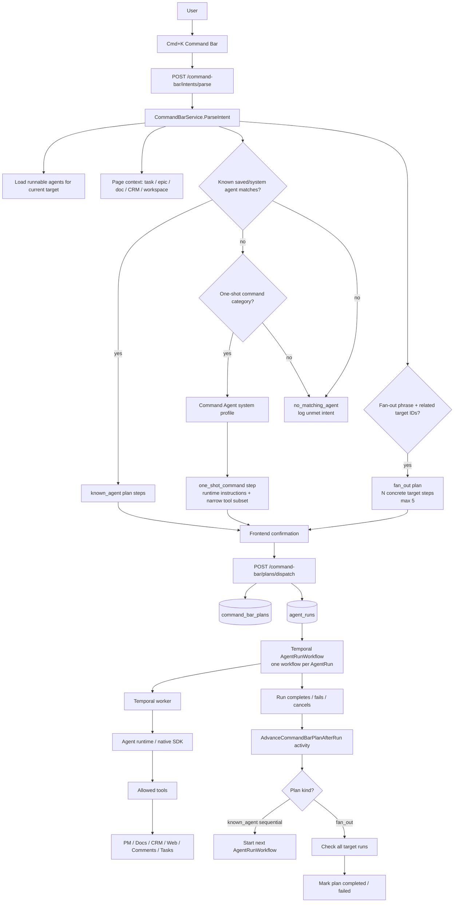
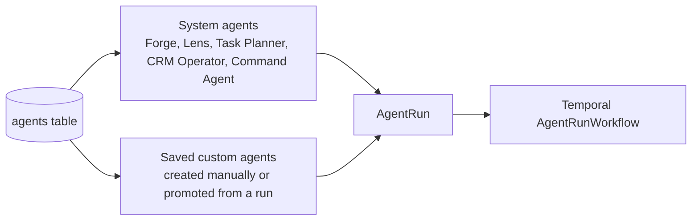
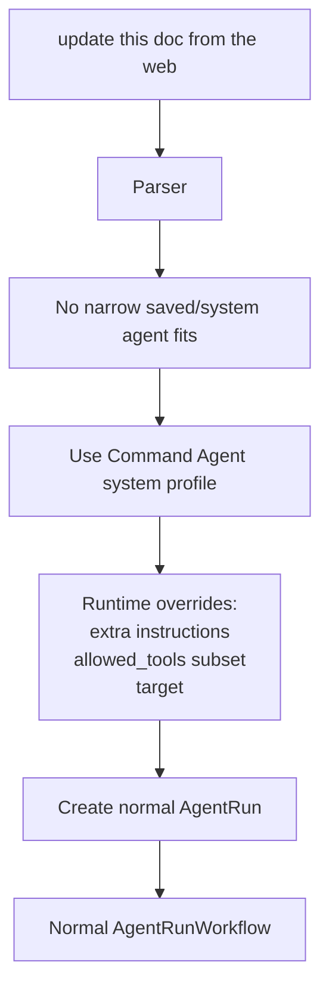
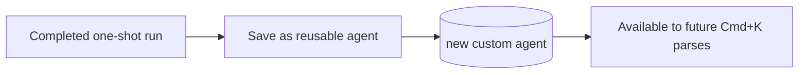
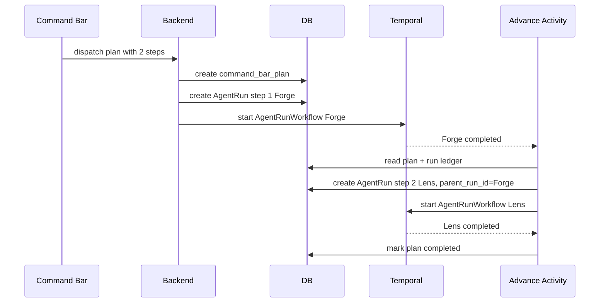
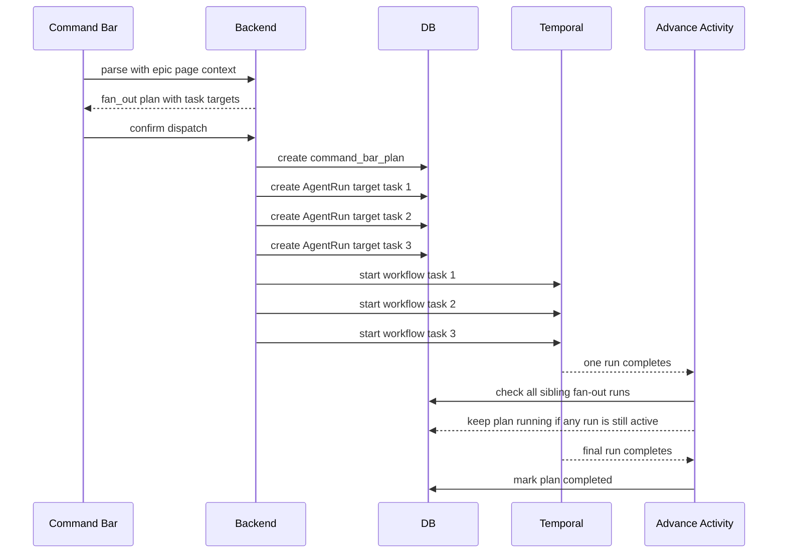
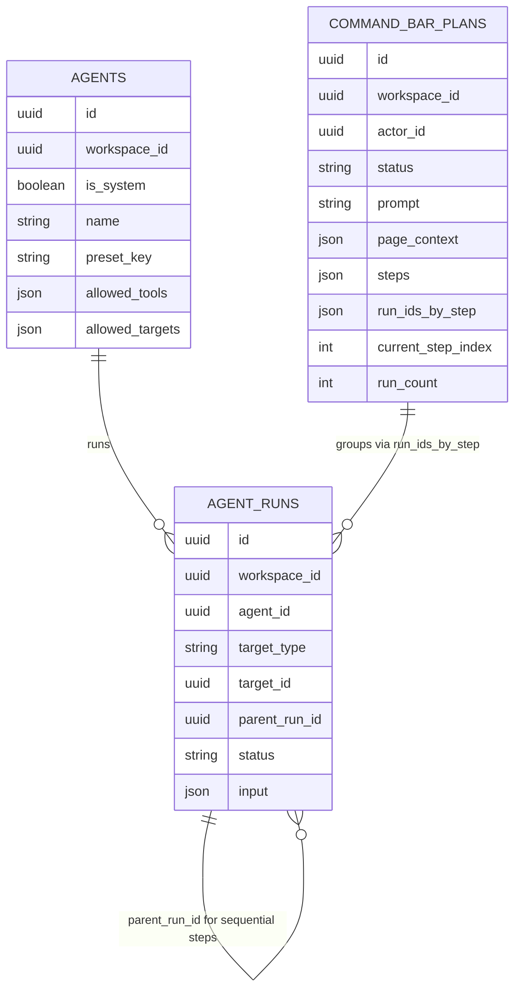

# Command Bar Agent Architecture

**Date:** 2026-04-28
**Status:** Working architecture reference for command-bar plans, Temporal runs, saved agents, one-shot Command Agent runs, and bounded fan-out.

## Summary

The command bar is a planner and dispatcher. It does not execute work directly, and it does not create a Temporal workflow when the user opens Cmd+K or types.

The durable execution primitive remains `AgentRun`.

One confirmed command-bar step creates one `AgentRun`. Each `AgentRun` starts one normal Temporal `AgentRunWorkflow`.

There is no separate command-bar Temporal workflow, meta-agent workflow, or parent workflow wrapping a multi-step plan.

## High-Level Flow



## Temporal Boundary

Temporal starts only after the user confirms dispatch.

| Step | Temporal? | What happens |
|---|---:|---|
| Cmd+K opens the bar | No | Frontend state only |
| User types an intent | No | Frontend state only |
| `POST /command-bar/intents/parse` | No | Stateless parser/LLM call returns a plan or no-match |
| User reviews chips and closes the bar | No | Nothing is persisted or dispatched |
| User confirms a 1-step plan | Yes | 1 `AgentRun` row and 1 `AgentRunWorkflow` |
| User confirms a 3-step sequential plan | Yes | 3 `AgentRun` rows total, started one after another |
| User confirms fan-out across 5 targets | Yes | 5 `AgentRun` rows and 5 workflows, started together |

The unit of Temporal work is:

```text
AgentRun = one Temporal AgentRunWorkflow
```

## Agent Definitions vs. Agent Runs



An agent is a reusable executor definition. It owns configuration such as:

- name
- preset key
- runtime kind
- allowed targets
- allowed tools
- default prompt/profile
- approval mode

An `AgentRun` is a durable execution instance of an agent against a target.

Temporal runs `AgentRunWorkflow` for the `AgentRun`. It does not run the agent definition directly.

## The Command Agent

The ad hoc agent path does not automatically create and save a new custom agent.

Instead, ad hoc command-bar work uses a product-owned system profile:

```text
Command Agent + runtime instructions + narrowed tools + concrete target
```

That creates a normal `AgentRun`.



This is a one-shot run:

- nothing is saved as a reusable agent by default
- the run gets a narrow `allowed_tools` subset
- the run carries command-bar trigger metadata
- the user may promote the completed run later

Promotion is opt-in:



## Sequential Multi-Step Plans

Example:

```text
run forge and then lens for this task
```

This creates a sequential plan. Dispatch starts only step 1. When step 1 completes, a post-run Temporal activity starts step 2.



Sequential plan state is stored in:

- `command_bar_plans.steps`
- `command_bar_plans.run_ids_by_step`
- `command_bar_plans.current_step_index`
- `agent_runs.parent_run_id`

The agent running step 1 should not be told to run step 2. The scheduler owns sequencing.

## Fan-Out Plans

Example from an epic page:

```text
run lens across all child tasks
```

Fan-out requires concrete related target IDs in page context. The parser does not fan out over vague selectors.



Fan-out behavior:

- every step targets a concrete entity
- all target runs start together
- fan-out is capped at 5 targets
- the rail groups the runs under one plan
- cancel cancels active group runs
- retry retries only failed or cancelled target runs
- successful target runs are not repeated during fan-out retry
- the plan completes only after all target runs complete
- the plan fails if any target run fails or is cancelled

## Plan Kinds

| Plan kind | Meaning | Dispatch behavior |
|---|---|---|
| `known_agent` | Existing saved/system agent matched the intent | Sequential by default |
| `one_shot_command` | Command Agent with runtime instructions and narrowed tools | Single normal `AgentRun` |
| `fan_out` | Same agent across multiple concrete related targets | Starts all target runs in parallel, capped at 5 |

## Persistence Model



## Runtime Input Contract

Every command-bar run receives trigger metadata in `agent_run.input`.

The important fields are:

- `trigger.source = "command_bar"`
- `trigger.type = "command_bar"`
- `trigger.payload.plan_id`
- `trigger.payload.prompt`
- `trigger.payload.page_context`
- `trigger.payload.steps`
- `trigger.payload.run_count`
- `trigger.payload.step_index`

The current step also receives `additional_context`, which includes step-scoped instructions and scheduler guidance.

For sequential plans, the agent should execute only its own step. It should not invoke later steps itself.

## Retry And Cancel

Sequential retry:

- cancel any active runs from the retry step onward
- remove run IDs from the retry step onward
- restart the selected step
- later steps start after completion as usual

Fan-out retry:

- reject retry if any group run is still active
- retry only failed or cancelled target runs
- keep successful target runs untouched
- update `run_ids_by_step` for retried targets

Cancel:

- cancels active runs for the plan
- marks the plan cancelled
- prevents later sequential steps from starting

## Mental Model

```text
Command Bar = planner + dispatcher UI

CommandBarService = parser, validator, plan persistence, dispatch policy

agents table = reusable executors

Command Agent = broad system executor for one-shot ad hoc commands

agent_runs table = durable run instances

Temporal = execution engine for each AgentRun

AdvanceCommandBarPlanAfterRun = lightweight scheduler after each run finishes

command_bar_plans = grouped plan state for UI, retry, cancel, and sequencing
```

## Non-Goals

The current architecture does not implement:

- a command-bar parent Temporal workflow
- arbitrary automatic saved-agent creation
- automatic deduplication of generated agents
- fan-out over vague targets without concrete related IDs
- cross-agent semantic handoff beyond `parent_run_id` and shared plan metadata
- a general meta-agent that supervises other agents

