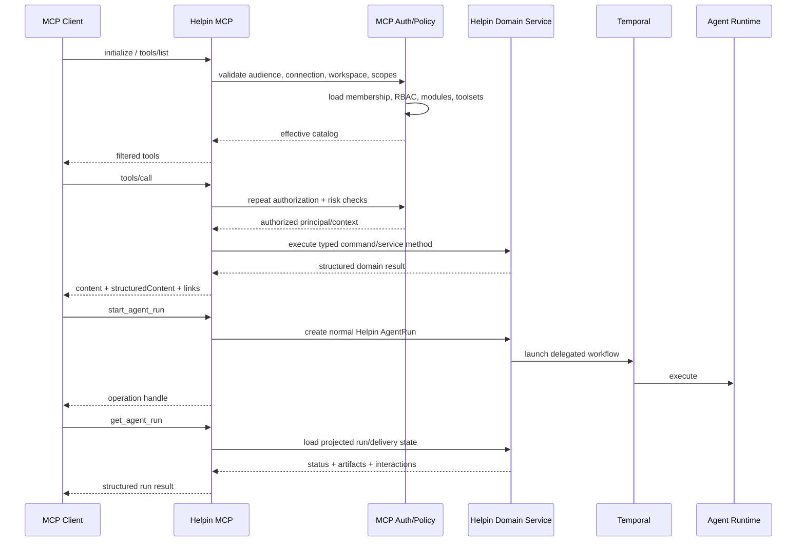

# Helpin Public MCP Server Implementation Plan

**Date:** 2026-07-10

**Status:** Proposed

**PRD:** [Helpin Public MCP Server and Workflow Skills](../prds/helpin-public-mcp-server.md)

**UI PRD:** [Helpin MCP User Experience](../prds/helpin-mcp-ui.md)

**Primary owners:** Platform, Agent Platform, Security, Infrastructure

---

## 1. Outcome

Build a production-grade, hosted Helpin MCP server that lets external AI clients act in one Helpin workspace using user OAuth or a restricted service identity. Reuse Helpin's canonical product tool contracts and domain services, preserve Helpin RBAC and module boundaries, support durable Helpin agent delegation, and ship workflow prompts plus optional client Skills.

The first public endpoint is:

```text
https://mcp.helpin.ai/mcp
```

The first release is read-oriented by default and supports bounded PM/Docs writes plus asynchronous Helpin agent runs. CRM and Support follow after the core authorization, policy, audit, and contract framework is proven.

---

## 2. Current-State Baseline

### Reusable today

- `server/internal/commandtools/metadata.go`
  - canonical aliases, descriptions, and input schemas for many product tools
- `server/internal/service/internal_command*.go`
  - reusable PM, Docs, CRM, Support, Git, and release-context execution
- `server/internal/worker/tool_names.go`
  - canonical and `mcp__helpin__*` name normalization
- `server/internal/service/agent_tool_gateway.go`
  - filtered discovery, execution recording, and run interactions
- `server/cmd/helpin-mcp-bridge/main.go`
  - stdio MCP framing and private HTTP proxy for Helpin-controlled runs
- existing authorization permissions and RBAC
- existing domain activity/audit behavior
- existing `agent_run` lifecycle and Agent Runtime projection

### Must not be reused as the public boundary

- `AgentRunToolToken` is tied to an active run, not a user connection.
- `/api/agent-run-tools/*` derives workspace, actor, target, and tool policy from a run.
- `InternalCommandService.Execute` receives trusted metadata and is not an external authorization layer.
- interaction tools such as `request_user_input` are run artifacts, not generic public MCP interactions.
- local runtime tools such as filesystem, shell, git credentials, and web fetch are not public Helpin product tools.

### Known contract gaps

- no public OAuth authorization server/resource-server flow
- no user/service-principal MCP data model
- no Streamable HTTP server
- no public toolset/scope/RBAC policy registry
- no public output schemas or structured result standard
- no public-tool annotations
- inconsistent pagination and response bounds across existing commands
- several useful read/fetch tools do not exist (`get_task`, `get_contact`, `get_deal`)
- no public asynchronous operation contract
- no connection/revocation UI
- no MCP-specific audit and rate-limit layer
- no workflow prompt/Skill package or compatibility suite

---

## 3. Architecture Decisions to Lock Before Coding

These decisions are blocking for the implementation rather than optional polish.

### 3.1 Remote-first, dedicated hostname

- Use Streamable HTTP at `mcp.helpin.ai/mcp`.
- Route the hostname to an isolated MCP handler mounted in the Helpin API for v1.
- Keep the handler stateless unless a supported feature requires sessions.
- Make ingress, rate limits, dashboards, and kill switches independently configurable.
- Preserve the option to move the package into `cmd/mcp-server` later.

### 3.2 One workspace per connection

- Workspace is selected during consent.
- Access token and connection record are workspace-bound.
- Tool inputs do not accept arbitrary workspace overrides.
- Cross-workspace use requires another labeled connection.

### 3.3 Separate principals, shared domain behavior

Introduce an execution principal independent of `AgentRun`:

```go
type MCPPrincipal struct {
    Kind         string // user or service
    WorkspaceID  string
    UserID       string
    ServiceID    string
    ConnectionID string
    ClientID     string
    Scopes       []string
    Toolsets     []string
    ReadOnly     bool
}
```

Resolve and authorize this principal before constructing `model.InternalCommandContext` or calling a domain service.

### 3.4 Typed tools over generic API passthrough

- Curate public tools.
- Reuse existing aliases where semantics are public-safe.
- Add facade handlers where internal commands assume a run target or return an internal shape.
- Do not ship a generic REST/GraphQL write tool in the first release.

### 3.5 Portable async polling first

- `start_agent_run` returns an operation/run handle immediately.
- `get_agent_run` returns current product status, interactions, artifacts, and links.
- Keep the contract compatible with future MCP task-augmented execution.

### 3.6 Official SDK with explicit version decision

- Spike the official Tier-1 `github.com/modelcontextprotocol/go-sdk`.
- Confirm current protocol, Streamable HTTP, tools, resources, prompts, structured content, annotations, and auth integration.
- Determine whether Helpin moves from Go 1.24 to Go 1.25 or pins an SDK version.
- Do not extend the hand-written private bridge into the public server without this spike.

### 3.7 Skills remain optional client packages

- MCP prompts are portable.
- Canonical workflow Markdown is shared.
- Codex, Claude, and other packages are adapters around the same workflows and remote endpoint.

---

## 4. Target Request Flow



---

## 5. Workstreams

### Workstream A — Protocol and SDK Foundation

#### A1. Complete an SDK/protocol spike

Deliver a small, throwaway or guarded prototype that:

- starts an official SDK server
- mounts Streamable HTTP in Chi
- handles stateless initialize, ping, tools/list, and tools/call
- returns `structuredContent` and an output schema
- exposes one resource template and one prompt
- verifies Origin/Host/content type behavior behind the intended ingress
- runs the MCP conformance suite
- connects from Codex, Claude Code, Cursor, and VS Code

Record:

- selected SDK version
- required Go version
- protocol version
- required ingress timeouts and headers
- stateless/session behavior
- cross-origin and DNS-rebinding protections

#### A2. Add isolated packages

Create:

```text
server/internal/mcpserver/
  server.go
  transport.go
  tools.go
  resources.go
  prompts.go
  result.go
  errors.go
  pagination.go
```

Mount the handler through a dedicated router dependency. Do not place product business logic in the protocol adapter.

#### A3. Add protocol tests

- initialize negotiation
- notification handling
- unknown methods
- malformed JSON-RPC
- protocol vs tool execution errors
- input schema validation
- request and result size bounds
- stateless request concurrency
- cancellation/timeouts
- compatibility with clients that ignore structured content, prompts, or resources

**Exit gate:** The unauthenticated development server passes protocol/conformance tests with only a harmless health/context stub.

---

### Workstream B — OAuth, Connections, and Service Principals

#### B1. Produce a focused threat model

Cover:

- OAuth client registration and redirect URI attacks
- PKCE, authorization-code interception, and CSRF
- token audience and resource indicator validation
- token theft, refresh replay, and revocation
- dynamic registration SSRF
- session hijacking
- cross-workspace entity substitution
- prompt injection and data exfiltration
- duplicate mutation on retry
- denial of service and agent-run cost abuse
- audit content sensitivity

Security must approve the trust model before external OAuth is enabled.

#### B2. Add data models and migrations

Add models/repositories for:

- MCP client registrations
- MCP connections
- refresh-token families
- service principals
- restricted access tokens
- MCP audit events
- MCP idempotency records

Use versioned `dbmigrate` SQL for constraints, indexes, token-family uniqueness, and revocation/backfill behavior. Store only token hashes for opaque credentials.

Implement retention and tenant lifecycle from the PRD:

- 90-day default MCP product-call audit retention
- up to 365 days for restricted authentication/revocation/security events
- immediate token/connection revocation during workspace deletion
- deletion/export handling for customer-visible connection and activity metadata
- pseudonymization of security records retained after workspace deletion
- same-region storage as the workspace unless regional architecture explicitly changes

#### B3. Implement MCP OAuth discovery

Endpoints include the appropriate forms of:

```text
/.well-known/oauth-protected-resource
/.well-known/oauth-authorization-server
/oauth/authorize
/oauth/token
/oauth/register               # if DCR ships
/oauth/revoke
```

Requirements:

- OAuth 2.1 authorization code with PKCE S256
- exact redirect matching
- Helpin sign-in reuse without exposing Helpin session tokens to the client
- workspace selection and consent
- client-requested scopes mapped to proposed toolsets
- scopes and toolsets shown clearly
- user may remove optional toolsets or force read-only, but cannot add authority beyond the client request or workspace policy
- final scopes/toolsets persisted on the connection; expansion requires reauthorization
- short-lived, MCP-audience access token
- rotating refresh token with replay detection
- resource parameter validation
- Client ID Metadata Documents and/or DCR according to the locked decision
- denied and revoked connections fail on the next request

#### B4. Add current-state RBAC evaluation

Every request resolves:

- connection status
- workspace and principal
- current workspace membership
- current role/team relationships
- module access
- plan entitlements
- scopes, toolsets, and read-only state

Cache only safe data for a short duration and invalidate on revocation or permission change.

#### B5. Add restricted service identities

After user OAuth is stable:

- admin creates named service principal
- chooses scopes, toolsets, read-only, and expiry
- token is displayed once
- database stores hash and prefix
- UI/API support rotate and revoke
- service identity has an explicit audit actor
- high-risk and user-presence-required tools reject service principals

**Exit gate:** OAuth connect, refresh, cross-workspace rejection, role downgrade, revocation, and token replay tests pass end to end.

---

### Workstream C — Public Tool Contract and Policy Registry

#### C1. Define a public tool specification

Do not overload `RuntimeToolMetadata` until it contains every field required by both callers. Introduce a public specification that references the canonical command alias:

```go
type PublicToolSpec struct {
    Name                string
    Title               string
    Description         string
    Toolset             string
    CommandName         string
    InputSchema         map[string]any
    OutputSchema        map[string]any
    RequiredScopes      []string
    RequiredPermissions []authorization.Permission
    RequiredModule      string
    ReadOnly            bool
    Destructive         bool
    Idempotent          bool
    OpenWorld           bool
    RiskClass           string
    PrincipalKinds      []string
}
```

The spec drives both discovery and call authorization.

#### C2. Build deterministic catalog filtering

`tools/list` filters by:

- selected toolsets
- OAuth scopes
- read-only mode
- principal type
- Helpin RBAC
- enabled modules and entitlements
- server feature flags and emergency disable lists

Sort tools deterministically. Snapshot each toolset and common scope combination.

#### C3. Standardize input contracts

For each public tool:

- top-level object
- snake_case
- explicit required fields
- `additionalProperties: false` where possible
- identifiers accept a documented ID/key/URL only when safely resolvable
- list limits and cursor bounds
- string and collection size limits
- idempotency key for writes
- no `workspace_id` override

#### C4. Standardize outputs

Every result contains:

- compact text content
- structured content conforming to `outputSchema`
- canonical object type and ID
- Helpin URL and optional MCP resource link
- pagination cursor when relevant
- provenance for search-derived data
- warnings as typed fields rather than prose-only caveats

Define common envelopes for:

```text
identity/context
entity reference
paginated collection
mutation receipt
operation handle
tool execution error
```

#### C5. Add public tool audit and idempotency middleware

Before execution:

- authorize
- rate limit
- validate schema
- reserve/check idempotency key for writes
- assign correlation ID

After execution:

- store sanitized audit event
- record domain actor/client attribution
- store replayable mutation receipt or result reference
- emit metrics and tracing

**Exit gate:** Catalog and call-time policy cannot diverge; property tests prove that any tool omitted by policy is also rejected when called directly.

---

### Workstream D — MVP Context, Search, PM, and Docs Tools

#### D1. Context

Implement `get_current_context` with:

- authenticated user/service identity
- workspace ID, name, slug, and URL
- role and enabled modules
- effective scopes, toolsets, and read-only status
- server/tool-contract version

Never return private auth or integration data.

#### D2. Search

Implement `search_workspace` as a bounded facade over existing search services.

Initial types:

- task
- document
- epic if supported by current repositories
- deal/contact when CRM is enabled later
- support conversation when Support is enabled later

Return typed references, highlights, provenance, and URLs. Do not return full bodies from a broad search.

#### D3. PM read tools

Public-adapt and test:

- `list_workspace_teams`
- `list_tasks`
- new `get_task`

Add:

- stable cursors
- ID/key/URL resolution
- compact descriptions/comments by default
- explicit fields for state, team, assignees, priority, labels, epic, and dependencies

#### D4. PM write tools

Public-adapt and test:

- `create_task`
- `update_task_state`
- `add_task_comment`

Then add:

- new `update_task`
- opt-in `create_task_batch`
- opt-in `set_task_dependencies`

Ensure all existing PM service validation, workflow defaults, activity, notification, and WebSocket behavior remains intact.

#### D5. Docs read tools

Public-adapt and test:

- `search_documents`
- `list_documents`
- `read_document`
- `get_document_blocks`

Return bounded Markdown/content, current revision, and resource links.

#### D6. Docs write tools

Public-adapt and test:

- `create_document`
- `update_document_block`

Defer broad `write_document_content` until its overwrite semantics and approval policy are accepted. If later enabled, require a content revision/precondition and a restricted scope/feature flag.

#### D7. Contract parity tests

For each adapted existing command:

- same valid input produces equivalent domain outcome
- public adapter adds RBAC, scope, bounds, idempotency, and structured result
- internal agent-run behavior remains unchanged
- target-default semantics are replaced by explicit public-safe identifiers where necessary

**Exit gate:** A read-only client can understand a workspace and inspect tasks/docs; a read/write client can create/update a task and create/addressably edit a document with full audit and idempotency.

---

### Workstream E — Helpin Agent Delegation

#### E1. Add agent discovery

Implement `list_agents` using the Helpin source of truth:

- saved/system agents the principal can launch
- name, preset, description, allowed targets
- applicable toolsets/domains
- approval and interaction behavior
- no provider credentials or internal runtime configuration

#### E2. Add run start

Implement `start_agent_run` through `AgentService`, not Agent Runtime directly.

Input:

- agent ID or stable preset selector
- explicit Helpin target reference
- user instruction/additional context
- optional bounded allowed-tool subset
- required idempotency key

Policy:

- `agents:run`
- target-domain read/edit scope as appropriate
- current RBAC on the target
- agent target compatibility
- workspace quotas and concurrency
- selected MCP toolsets form an upper bound on product tools available to the run
- runtime-local coding tools remain governed by the agent/target and existing runtime policy

Output is an operation handle with Helpin run/resource URLs.

#### E3. Add status and results

Implement `get_agent_run` from Helpin's durable projected state:

- queued/running/needs-input/needs-approval/completed/failed/cancelled
- concise progress summary
- outstanding interaction metadata
- artifacts and created/updated entity references
- delivery state and failures where available
- retry/poll guidance
- Helpin run URL

Do not expose chain of thought, raw secrets, provider tokens, or Agent Runtime internal endpoints.

V1 completion delivery is explicit polling through `get_agent_run` using `poll_after_seconds`. Helpin's existing product notifications continue independently for the Helpin user, and every response includes the Helpin run URL. Do not add external completion webhooks or require MCP server notifications for v1; evaluate them with native MCP Tasks after the portable path is proven.

#### E4. Add cancellation

Implement `cancel_agent_run` with ownership/control checks and idempotency.

#### E5. Add interaction response later in beta

Implement `respond_to_agent_interaction` only after:

- interaction schema versions are stable
- the requesting principal may respond
- stale/terminal interaction checks exist
- approval interactions show exact action/risk/input hash
- responses are idempotent

#### E6. Prepare MCP Tasks compatibility

Keep operation records and responses mappable to MCP task-augmented execution. Add native `taskSupport` only after the target-client compatibility matrix passes.

**Exit gate:** An external client can launch Atlas/Forge/Quill or a custom agent through Helpin, poll durably, cancel safely, and receive product-level terminal artifacts without any Agent Runtime credential.

---

### Workstream F — CRM and Support Expansion

Start only after the core beta has stable audit, redaction, and authorization.

#### F1. CRM read

- existing `list_contacts`
- new `get_contact`
- existing `list_deals`
- new `get_deal`
- existing `list_buyer_signals`

Add field minimization, association bounds, and provenance.

#### F2. CRM bounded write

- `add_deal_note`
- `update_deal_stage`

Defer enrichment and contact/company creation/merge until quota, merge, and approval behavior are reviewed.

#### F3. Support read

- new `list_support_conversations`
- new `get_support_conversation`
- existing `list_conversation_messages`

Add PII/attachment minimization and mailbox/status filters.

#### F4. Support draft

- implement a public draft facade informed by `draft_support_reply`; do not directly reuse its run-output-summary staging
- guarantee draft-only behavior
- clearly return where the draft is visible in Helpin
- exclude customer send, status change, assignment, and merge from public beta

**Exit gate:** CRM/Support calls pass module-specific privacy review and cannot perform a customer-visible or destructive action.

---

### Workstream G — Resources, Prompts, and Skills

#### G1. Resources

Implement templates for current workspace, tasks, documents, deals, conversations, and agent runs.

Requirements:

- same policy path as tools
- stable `helpin://` URI grammar
- MIME type and compact content
- last-modified metadata
- resource links from relevant tool results
- no subscriptions in v1

#### G2. Portable prompts

Implement and test:

- `plan_feature`
- `prepare_release`
- `delegate_to_helpin_agent`

Then add:

- `triage_customer_issue`
- `review_pipeline`

Prompt handlers include only authorized workspace context and declare missing capabilities gracefully.

#### G3. Canonical workflow package

Create:

```text
integrations/helpin-mcp/
  README.md
  manifest.json
  prompts/
  skills/
  tests/
```

Initial Skills:

1. Feature to Delivery
2. Release Readiness
3. Delegate to Helpin
4. Support to Product
5. Docs Maintenance
6. CRM Pipeline Review

#### G4. Client adapters

Provide supported install packages/configuration for:

- Codex
- Claude Code/Desktop
- Cursor
- VS Code/GitHub Copilot
- ChatGPT custom connector instructions

Each adapter references the remote endpoint and canonical workflow content; none embeds credentials.

#### G5. Workflow tests

Each Skill has a staging fixture and asserts:

- required tool discovery
- safe tool order
- idempotent retry
- useful behavior when a tool is absent
- explicit stop before excluded actions
- final receipt contains Helpin entity/run links

**Exit gate:** Three beta workflows complete end to end in every supported client or have a documented client limitation and fallback.

---

### Workstream H — Settings, Admin, and Developer Experience

#### H1. User connection settings

Add **Settings → Integrations → MCP**:

- connection list
- client identity
- workspace/user/service identity
- scopes, toolsets, read-only status
- created/last-used/expiry
- revoke
- recent usage/error summary

#### H2. Admin controls

- workspace enable/disable
- allowed toolsets
- service principal policy
- active connections and restricted tokens
- workspace-wide revoke
- audit search/export appropriate to role

#### H3. Platform operations

- global kill switch
- client denylist
- tool/toolset feature flags
- rate-limit overrides
- request/connection/run correlation
- dashboards and alerts

#### H4. Documentation

Publish:

- overview and security model
- setup for each supported client
- OAuth and restricted-token guidance
- complete generated tool reference
- toolsets and scopes
- workflow examples
- rate limits and errors
- revocation and incident response
- compatibility and changelog policy

#### H5. Installation links and marketplace readiness

- one-click install URLs where clients support them
- verified domain and branding
- privacy/security disclosures
- marketplace submission artifacts
- status and support contacts

**Exit gate:** A non-engineer can connect, understand granted authority, inspect usage, and revoke without database or operator access.

---

### Workstream I — Reliability, Security, and Rollout

#### I1. Rate limits

Implement configurable limits with these beta starting values:

- 60 general requests/minute per connection
- 180 general requests/minute per workspace
- 20 search calls/minute per connection
- 20 mutating calls/minute per connection
- 10 agent-run starts/hour per user
- 3 concurrent MCP-started runs per user and 10 per workspace
- 25 items per batch mutation unless a tool is stricter
- list page size 50 by default and 100 maximum
- synchronous result size 256 KiB
- 30-second synchronous deadline before work must use an operation handle

Return typed retry guidance.

#### I2. Observability

Add:

- RED metrics by method/tool/client
- OAuth and refresh metrics
- audit correlation
- distributed traces through domain service and agent-run launch
- result size and latency histograms
- denial/rate-limit reason codes
- no credential or unrestricted-content logging

#### I3. Security validation

- SAST/dependency review
- OAuth conformance tests
- cross-workspace and IDOR test suite
- redirect URI and DCR SSRF tests
- token audience, expiry, replay, and revocation tests
- Origin/Host/content-type tests
- prompt-injection red-team fixtures
- PII/result-redaction tests
- duplicate-write retry tests
- fuzz JSON-RPC and tool schemas
- external penetration test before GA

#### I4. Client compatibility matrix

For Codex, Claude Code, Cursor, VS Code, and ChatGPT where available, test:

- discovery and OAuth
- refresh and reconnect
- tools/list filtering
- read and bounded write
- structured and text fallback
- resource link behavior
- prompts
- async polling
- revoke while connected
- error and rate-limit rendering

#### I5. Rollout flags

Recommended flags:

```text
MCP_SERVER_ENABLED
MCP_OAUTH_ENABLED
MCP_SERVICE_TOKENS_ENABLED
MCP_PM_WRITE_ENABLED
MCP_DOCS_WRITE_ENABLED
MCP_AGENT_RUN_ENABLED
MCP_CRM_ENABLED
MCP_SUPPORT_ENABLED
```

Support global, environment, workspace, and percentage gates where appropriate.

#### I6. Incident runbook

Document:

- global shutdown
- tool/toolset shutdown
- revoke token families and clients
- investigate a request by correlation ID
- identify affected workspaces/entities
- rotate signing/encryption keys
- communicate and restore service

**Exit gate:** Staging failure drills prove that revocation and kill switches take effect immediately and leave an auditable record.

---

## 6. Delivery Sequence

The workstreams can overlap after the architecture decisions, but external exposure must follow the gates below.

### Ownership, size, and timing

The plan assumes two dedicated backend/platform engineers, one part-time frontend engineer, and part-time Security, Infrastructure/SRE, Product, Developer Experience, and domain-team support. The initiative sponsor must assign and receive acknowledgement from named owners on 2026-07-10. The remaining Phase 0 dates are valid only after that staffing gate; if it slips, the sponsor publishes replacement dates immediately.

| Phase | Accountable owner | Supporting owners | Size | Expected elapsed time |
| --- | --- | --- | --- | ---: |
| 0. Decisions and threat model | Platform lead | Security, Backend, Infrastructure, Product | S | 1 week |
| 1. Secure protocol skeleton | Platform lead | Security, Infrastructure | L | 2–3 weeks |
| 2. Read-only dogfood | Platform lead | PM/Docs backend, Frontend, SRE | M | 2 weeks |
| 3. Bounded writes | PM/Docs domain lead | Platform, Frontend, Security | M | 2–3 weeks |
| 4. Agent delegation and workflows | Agent Platform lead | Platform, Product, Developer Experience | L | 2–3 weeks |
| 5. CRM, Support, and headless access | CRM/Support domain leads | Platform, Security, Privacy | L | 3–4 weeks |
| 6. Public beta and GA hardening | Platform lead | SRE, Security, Developer Experience, Support | L | 2–4 weeks |

With overlap between domain adapters, UI, Skills, and documentation, the target elapsed time to public beta is approximately 12–18 weeks after Phase 0 decisions. A required Go upgrade, OAuth-provider work, or security finding can extend the critical path.

### Phase 0 — Decisions and threat model

Scope:

- A1 SDK spike
- B1 threat model
- endpoint/deployment decision
- Go/SDK version decision
- OAuth client-registration decision
- one-workspace connection decision
- beta tool list and excluded actions

Deliverables:

- architecture decision records
- threat model
- compatibility spike report
- frozen beta catalog draft

Blocking decision schedule:

| Decision | Accountable owner | Decide by | Required output | Stop condition |
| --- | --- | --- | --- | --- |
| Named owner assignment for every Phase 0 gate and delivery phase | Initiative sponsor | 2026-07-10 | Acknowledged named-owner matrix | Do not start any remaining Phase 0 decision clock or implementation |
| Go baseline and official MCP SDK version | Platform lead | 2026-07-14 | Compatibility/conformance spike and ADR | Do not begin production protocol package |
| CIMD/DCR OAuth client-registration strategy | Platform lead, reviewed by Security | 2026-07-15 | Client matrix plus redirect/SSRF analysis and ADR | Do not finalize OAuth schema or registration endpoints |
| OAuth authorization-server implementation approach | Security lead | 2026-07-15 | Build-vs-provider decision covering all MCP OAuth requirements | Do not implement authorize/token flows |
| Beta tool catalog and excluded actions | Product lead | 2026-07-16 | Reviewed tool/scope/RBAC/risk matrix | Do not expose domain tools beyond context stub |
| Audit retention and regional handling | Security lead | 2026-07-17 | Legal/privacy-approved retention and deletion/export decision | Do not open design-partner beta |

If a decision misses its date, the owner records a replacement date and the dependent work remains blocked rather than selecting a default implicitly.

### Phase 1 — Secure protocol skeleton

Scope:

- A2–A3 protocol package/tests
- B2–B4 user OAuth and connection records
- C1–C2 tool policy/catalog
- H3 basic kill switches

Deliverable:

- authenticated staging endpoint with only `get_current_context`

### Phase 2 — Read-only dogfood

Scope:

- C3–C5 contracts/audit/rate-limit framework
- D1–D3 context/search/PM read
- D5 Docs read
- H1 connection/revocation settings
- I1–I4 baseline observability/security/client matrix

Deliverable:

- Helpin staff read-only dogfood in supported clients

### Phase 3 — Bounded writes

Scope:

- D4 PM writes
- D6 Docs writes
- idempotency and mutation receipts
- admin read-only/toolset controls

Deliverable:

- design-partner beta for task and document workflows

### Phase 4 — Agent delegation and workflows

Scope:

- E1–E4 agent tools
- G1–G5 resources/prompts/Skills
- agent-run quotas and result receipts

Deliverable:

- external clients can delegate durable work to Helpin agents and run reference workflows

### Phase 5 — CRM, Support, and headless access

Scope:

- F1–F4 CRM/Support
- B5 restricted service identities
- module-specific privacy reviews

Deliverable:

- wider product beta with controlled automation use cases

### Phase 6 — Public beta and GA hardening

Scope:

- H2–H5 full admin/docs/marketplace work
- I3 security validation and penetration test
- I5–I6 rollout and incident readiness
- SLOs and support ownership

Deliverable:

- public beta, followed by GA when success and safety gates hold

---

## 7. Parallelization

After Phase 0, teams can work in parallel:

| Track | Can proceed in parallel with | Dependency |
| --- | --- | --- |
| OAuth/data model | protocol skeleton | Locked identity/workspace model |
| Tool policy/contracts | OAuth and transport | Locked beta catalog |
| PM/Docs adapters | settings UI | Public context and policy interfaces |
| Agent delegation | prompts/Skills | Stable operation/tool result envelope |
| Observability | all implementation tracks | Correlation and audit contracts |
| Client compatibility | each shipped slice | Deployed staging endpoint |

Do not parallelize separate implementations of the same tool contract for internal and public MCP. Extract or adapt one canonical domain behavior and test both callers.

---

## 8. Test Strategy

### Unit

- OAuth claims and audience
- scope/toolset/RBAC policy matrix
- catalog filtering
- schema validation
- output envelopes
- pagination/cursors
- idempotency reservation/replay/conflict
- sanitized audit payloads
- entity workspace ownership

### Integration

- OAuth authorize/token/refresh/revoke
- real router middleware to domain service
- tool list then direct call with permission change
- database transaction and duplicate retry
- agent run start/projection/cancel
- resources and prompts
- Redis expiry/replay behavior

### End-to-end

- connect from each target client
- read-only workspace investigation
- create/update task
- create and edit document block
- start and poll Helpin agent
- role downgrade while connected
- admin revoke while connected
- tool disabled while visible in a stale client list
- rate limit and safe retry

### Security

- tenant isolation across every identifier type
- malformed/oversized JSON-RPC
- hostile redirect/DCR metadata URL
- hostile Helpin content attempting tool escalation
- token substitution/pass-through
- refresh reuse
- audit/log secret scanning

### Contract

- snapshot input/output schemas
- generated tool docs match catalog
- aliases and deprecations
- Skills only reference available canonical tools
- internal command/public adapter parity
- MCP conformance suite in CI

---

## 9. Definition of Done for Each Tool

A public MCP tool is not done until it has:

- product owner and use case
- canonical name and title
- concise model-facing description
- strict input schema and typed decoder
- output schema and structured result
- toolset, scopes, RBAC permission, module, and entitlement mapping
- read/write, destructive, idempotent, open-world, and risk metadata
- tenant ownership checks
- pagination and size bounds where relevant
- idempotency for writes
- domain and MCP audit attribution
- safe, actionable errors
- unit, authorization, integration, tenant-isolation, and contract tests
- generated documentation and at least one example prompt
- inclusion in the client compatibility suite
- feature flag and operational disable path

---

## 10. Suggested Backlog Slices

These are reviewable delivery slices rather than one large MCP pull request.

1. **ADR + SDK spike:** transport, Go version, auth integration, conformance results.
2. **MCP models/migrations:** registrations, connections, tokens, audit, idempotency.
3. **OAuth discovery and consent:** current user session to workspace-bound MCP connection.
4. **Protocol skeleton:** authenticated initialize and context tool.
5. **Policy/catalog:** toolsets, scopes, RBAC, read-only, annotations, schemas.
6. **Audit/rate/idempotency middleware.**
7. **PM read slice:** teams, task search/list/get.
8. **Docs read slice:** search/list/read/blocks/resources.
9. **Settings/revocation UI.**
10. **PM write slice:** create/update/state/comment.
11. **Docs write slice:** create/addressable update.
12. **Agent read/start/status/cancel slice.**
13. **Prompts and first three Skills.**
14. **CRM read/write slice.**
15. **Support read/draft slice.**
16. **Service principals/restricted tokens.**
17. **Public documentation/install links/marketplace assets.**
18. **Security hardening, external test, SLO, and incident drill.**

Each slice should preserve a deployable, disabled-by-default state until its rollout gate is met.

---

## 11. Rollout Gates

### Internal dogfood gate

- conformance suite passes
- user OAuth works in at least Codex and Claude Code
- current-context and PM/Docs reads enforce tenant/RBAC boundaries
- connection revocation is immediate
- audit/log review finds no token or unrestricted-content leakage

### Design-partner gate

- Cursor and VS Code added to compatibility matrix
- write idempotency proven under forced retry
- admin enable/disable and connection visibility shipped
- rate limits and alerts active
- documented beta limitations and support owner

### Agent-delegation gate

- start/status/cancel use normal Helpin `agent_run`
- product result includes artifacts/delivery links
- quotas prevent runaway launch/cost
- no runtime credential is returned
- terminal/reconciliation failures are visible

### Public beta gate

- threat model actions closed
- security review approved
- supported-client matrix green
- incident/revocation drill completed
- setup/tool/security docs published
- status monitoring and on-call ownership active

### GA gate

- external security test complete
- SLO met during beta
- compatibility/deprecation policy published
- usage/safety metrics within accepted thresholds
- marketplace and enterprise-policy requirements resolved

---

## 12. Estimated Shape of Work

This is a multi-workstream platform feature, not a bridge-only task. The critical path is:

```text
SDK/protocol decision
  -> OAuth and workspace identity
  -> policy/catalog/audit/idempotency
  -> read-only tools
  -> bounded writes
  -> agent delegation
  -> broader modules and public rollout
```

Using the ownership assumptions in the delivery table, a realistic target is:

- internal read-only dogfood: roughly 3–5 engineering weeks after decisions
- bounded-write design-partner beta: roughly 2–4 additional weeks
- agent delegation and workflow pack: roughly 2–4 additional weeks
- CRM/Support, service principals, public-beta hardening: additional phased work

The combined target to public beta is approximately 12–18 elapsed weeks because some domain, UI, workflow, and documentation work overlaps.

These ranges are planning guidance, not commitments. OAuth standards work, SDK/Go compatibility, and security findings are the main schedule risks.

---

## 13. Immediate Next Actions

1. Review and approve the PRD's product boundary and initial exclusions.
2. Assign and receive acknowledgement from all named Phase 0 and delivery-phase owners on 2026-07-10; republish decision dates immediately if this slips.
3. Run the official Go SDK/Go-version compatibility spike and decide the Go/SDK baseline by 2026-07-14.
4. Produce the MCP OAuth and tenant-isolation threat model; decide client registration and authorization-server approach by 2026-07-15.
5. Freeze the internal-dogfood tool list:
   - `get_current_context`
   - `search_workspace`
   - `list_workspace_teams`
   - `list_tasks`
   - `get_task`
   - `search_documents`
   - `list_documents`
   - `read_document`
6. Record the Phase 0 decisions as ADRs and keep dependent work blocked until their decision gates pass.
7. Create the schema for public tool metadata and policy.
8. Build the authenticated staging skeleton behind `MCP_SERVER_ENABLED=false`.
9. Commit the PRD and implementation plan in the same changeset before circulating repository links.

The first engineering PR should be the SDK/architecture spike and decision record, not a broad export of the existing agent-run gateway.
