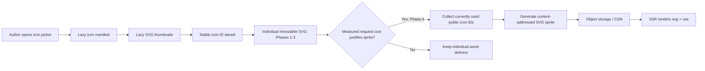

# Help Center Icon Delivery Plan

- **Status:** Superseded by [`2026-07-16-help-center-icons-mvp-plan.md`](2026-07-16-help-center-icons-mvp-plan.md)
- **Date:** 2026-07-16
- **Owners:** Docs, Help Center, Platform
- **Scope:** Space, collection, document, and featured-card icons displayed in the Helpin editor and public Help Center, plus application surfaces that consume the shared `IconPicker`, `StoredIcon`, or `ICON_MAP` module

## 1. Executive decision

Helpin should keep the complete Hugeicons catalog available to authors without shipping the catalog, its React components, or its runtime loader to public Help Center visitors.

The proposed delivery model is:

1. Generate a canonical icon manifest and optimized SVG assets from a pinned Hugeicons version at build time.
2. Store and exchange stable icon IDs, not React component names or SVG markup.
3. Load the editor's icon manifest and thumbnails only after the picker opens.
4. First ship public icons as individual immutable SVG assets, then render them from a small, versioned SVG sprite containing only the icons used by that Help Center if measurements justify the added backend complexity.
5. Use an individual immutable SVG asset when previewing a newly selected icon or when a sprite is temporarily stale.
6. Preserve legacy aliases and intentional emoji/text values during migration. An unresolved identifier-shaped value receives a neutral fallback and telemetry; it is never exposed to visitors as internal text.

This provides full catalog parity while keeping the public Help Center icon implementation out of its JavaScript bundle.

## 2. Current problem

The authoring application and public Help Center currently use different icon systems.

- `frontend/src/components/ui/icon-picker.tsx` dynamically imports the complete `@hugeicons/core-free-icons` package and derives the picker options from every exported value ending in `Icon`.
- `icon-picker.tsx` starts `loadAllIcons()` as a module-scope side effect. Importing `StoredIcon`, `ICON_MAP`, or `IconPicker` therefore begins loading the complete catalog even if no picker mounts or opens.
- The shared module is consumed outside docs settings, including team and support-inbox surfaces. Those imports keep the eager catalog behavior alive unless all shared consumers migrate.
- `help-center/src/lib/icons.ts` contains a manually maintained map of about 80 exact Lucide mappings plus heuristic aliases.
- `help-center/src/components/PhIcon.tsx` renders an unresolved icon name as visible text.
- The API correctly passes the stored icon string through. The failure is in the Help Center renderer, not persistence.

The installed package contains 5,099 individual icon modules, and the picker walks every qualifying `*Icon` export. Only a small fraction resolve in the Help Center, and heuristic matches can display a generic icon rather than the icon selected by the author.

There is also a performance concern in adopting Hugeicons directly in the Help Center. In the installed Hugeicons 4.1.1 package, `loader.web.js` is approximately 294 KB uncompressed and 37 KB gzipped before any selected icon module is loaded. The loader code-splits icon bodies, but its name-to-import registry still becomes public runtime JavaScript.

## 3. Goals

- Every icon offered by the space, collection, and document picker renders consistently in the editor, preview, and published Help Center.
- Supporting the full catalog does not materially increase the Help Center's initial JavaScript bundle.
- Icons participate in server rendering and do not appear after hydration.
- Icon rendering causes no layout shift.
- Icons support `currentColor`, light/dark themes, tinting, and existing size classes.
- Published pages download only the icons that the specific Help Center uses.
- Icon assets are immutable, cacheable, same-origin from the browser's perspective, and reusable across navigation.
- Existing stored library IDs and intentional emoji/text values continue to render during rollout.
- The editor no longer downloads the complete icon module unless the picker is used.

## 4. Non-goals

- Replacing Hugeicons with another library.
- Redesigning the visual appearance of the icon picker.
- Adding arbitrary customer SVG uploads in the first release.
- Migrating every existing icon column to JSONB in the first release.
- Using the icon delivery system for fixed application controls such as close, search, or chevron icons. Those should remain direct, statically analyzable component imports.
- Reworking `AgentIconPicker`. It uses a separate, fixed `AGENT_ICON_PRESETS` catalog and does not import the shared full-catalog picker.

## 5. Industry patterns

The relevant public product patterns are consistent even though their private renderers are not fully documented.

- Mintlify lets a project select one icon library and stores an icon name, URL, or project-relative asset path. This gives its build system a bounded source and the opportunity to include only referenced assets. See [Mintlify icon settings](https://www.mintlify.com/docs/organize/settings-appearance) and [Mintlify's Icon component](https://www.mintlify.com/docs/components/icons).
- Notion represents an icon as a typed value: native icon name and color, emoji, custom emoji, external image, or uploaded file. Its March 2026 API changelog notes that native icons previously appeared as external SVG URLs and now use a structured name-and-color representation. See [Notion's icon object](https://developers.notion.com/reference/emoji-and-icon) and [Notion's changelog](https://developers.notion.com/page/changelog).
- GitBook supports icons, emoji, uploaded assets, and site-level icon weight/style configuration. See [GitBook icon customization](https://gitbook.com/docs/publishing-documentation/customization/icons-colors-and-themes).

The shared lesson is to persist icon identity separately from icon delivery and to avoid making the public renderer aware of an entire authoring catalog.

## 6. Proposed architecture



### 6.1 Canonical generated catalog

Add a build-time generator owned by a small shared package, for example `packages/helpcenter-icons/`. The generator must import the pinned Hugeicons package only in build tooling, never in public runtime code.

For each supported icon it produces:

```json
{
  "id": "rocket01",
  "library": "hugeicons",
  "library_version": "4.1.1",
  "export_name": "Rocket01Icon",
  "label": "Rocket 01",
  "symbol_id": "hi-rocket01",
  "asset_path": "/_helpin/icons/hugeicons/4.1.1/rocket01.svg"
}
```

Generated outputs:

- A searchable editor manifest containing IDs and labels.
- One sanitized, optimized SVG per icon.
- Symbol fragments used by the sprite compiler.
- A legacy alias map for previously stored Phosphor/Lucide-style keys.
- A generated TypeScript type or validation set for icon IDs.

The generator must initially use the existing `pascalToKebab` conversion verbatim, quirks included. Compatibility with stored values takes priority over producing prettier new IDs:

- `Rocket01Icon` → `rocket01`
- `FolderOpenIcon` → `folder-open`
- `AArrowDownIcon` → `aarrow-down`
- `ThreeDViewIcon` → `three-dview`

The conversion then moves into one shared build-time source and receives regression tests for acronyms, numeric prefixes, collisions, and every current export. A generated forward map is safer than attempting to reverse kebab-case names at runtime. Changing the canonical conversion later requires an explicit alias/backfill migration; it must not happen implicitly as part of this work.

### 6.2 Persistence contract

The first release should preserve the existing nullable string columns on `docs_spaces`, `docs_collections`, and `docs_documents`. This avoids a schema migration for the correctness fix.

The read pipeline trims the value and consults the canonical and legacy maps case-insensitively before classifying the value as display text or an unresolved identifier. This preserves the current lowercase-first behavior: a stored value such as `Rocket` continues to resolve to the `rocket` icon rather than rendering as the word "Rocket."

After that ordered lookup, the string is interpreted as follows:

- A null or empty value means no custom icon.
- A canonical Hugeicons ID resolves exactly.
- A known legacy value resolves through `legacy-icon-aliases.json`.
- An existing non-identifier value, including an emoji or other intentional Unicode text, renders as text using the existing emoji-safe behavior.
- A value matching `^[a-z0-9-]+$` but absent from the canonical and legacy catalogs resolves to the entity's neutral fallback icon and emits telemetry.

Trim new values before validation and perform the same case-insensitive canonical/legacy lookup first. A matched case variant or supported alias is stored as its canonical ID, never as the submitted raw text. Otherwise, new writes accept only null/empty or a bounded display-text value. A display-text value must be valid UTF-8, must not match the identifier pattern, must contain at least one non-ASCII code point, must contain no control characters or line breaks, and must contain at most 16 Unicode code points and 64 UTF-8 bytes. This supports emoji, CJK, and other intentional Unicode display values without attempting full emoji grapheme validation in Go. It rejects ASCII export names and labels such as `Rocket01Icon`, `rocket icon`, and `FAQ`, preventing them from re-entering the raw-name rendering path.

Validation belongs in the shared docs service boundary so it applies consistently to REST handlers and direct service callers. It must explicitly cover:

- Space create/update.
- Collection create/update.
- Document create/update.
- Help Center config create/update, including every `homepage_config.featured_cards[].icon` value regardless of card link type.
- Public MCP `create_space`, `update_space`, `create_collection`, `update_collection`, and any document tool accepting `icon`.

This is required because `docs_space.go`, `docs_collection.go`, `docs_document.go`, the Help Center `UpdateConfig` path, and the MCP tool dispatcher currently pass icon strings to persistence without catalog validation. `UpdateConfig` must parse and validate raw featured-card icon values rather than relying on the editor UI's collection-update path. MCP callers must receive a structured invalid-argument error with valid usage guidance; silently accepting an LLM-invented icon name would recreate the defect. Tool descriptions should direct agents to omit the optional icon or discover a valid ID through a bounded `search_icons`-style catalog tool/resource. Do not embed all 5,099 IDs in every MCP tool schema.

If Helpin later formalizes emoji, native color, or uploaded icons as typed values, introduce an explicit versioned `IconRef` API shape:

```ts
type IconRef =
  | { type: 'library'; library: 'hugeicons'; name: string; color?: string }
  | { type: 'emoji'; value: string }
  | { type: 'asset'; url: string }
```

That future extension should not block the initial repair.

### 6.3 Editor picker

The editor must remove the module-scope `loadAllIcons().then(...)` side effect. Deferring only the `IconPicker` component's effect is insufficient because any import of `StoredIcon` or `ICON_MAP` currently starts the full-catalog download.

Instead:

1. Dynamically import the generated searchable manifest as a Vite chunk from the editor's own origin when the popover first opens.
2. Cache the manifest for the current browser session.
3. Virtualize the result grid rather than rendering the whole catalog.
4. Render thumbnails using the generated individual SVG URL.
5. Lazy-load thumbnails outside the picker viewport.
6. Render an already-selected canonical icon directly from its deterministic asset URL without loading the full search manifest. Resolve stored legacy IDs through the small compatibility alias map first.
7. Optionally preload the manifest on picker-button hover or focus to reduce perceived opening latency.

Replace synchronous `ICON_MAP[name]` consumers with the asset-backed stored-icon renderer or another interface that does not require the full in-memory component map. This migration includes docs pages, settings, team settings, support rail/inbox configuration, and every other import returned by a repository-wide `StoredIcon|ICON_MAP|IconPicker` audit.

The editor and Help Center use different browser origins, so generated catalog entries contain relative asset paths rather than a single hard-coded origin. The editor resolves those paths against a configured immutable asset base (the API/CDN origin, with permissive public asset headers); the Help Center resolves them through its relative same-origin asset route. Only the small legacy alias map is eligible for the editor's eager stored-icon renderer chunk. The complete searchable manifest remains lazy.

`AgentIconPicker` and `CustomAgentCreatePanel` remain out of scope because the agent picker uses a separate fixed preset list rather than the shared full-catalog module.

This removes icon path data and the full Hugeicons export module from ordinary editor page loads while preserving behavior across all actual shared-module consumers.

### 6.4 Individual SVG assets

Every icon receives an immutable, versioned URL:

```text
/_helpin/icons/hugeicons/4.1.1/rocket01.svg
```

The catalog-version directory is immutable, so the version plus canonical ID is sufficient to address the content. An icon library upgrade writes a new version directory and never changes the old URL. This makes a selected canonical icon's URL computable from its stored ID without downloading the full search manifest. A legacy alias first resolves through the small compatibility alias map.

These assets provide:

- Editor picker thumbnails.
- Editor selected-icon rendering.
- Help Center preview rendering.
- A fallback while a newly generated workspace sprite is not yet available.
- A safe fallback if sprite generation fails.

The Help Center browser-facing URL must be same-origin, including on custom domains and reverse-proxy base paths. Phase 1 adds an immutable individual-icon asset route to both Help Center public router groups in `server/internal/router/router.go`; Phase 3 depends on this route and must not ship without it. The route streams/proxies the S3 object or uses a CDN mapping that preserves the browser-visible Help Center origin. A redirect to a different S3 origin is not sufficient for future external `<use>` compatibility.

The editor uses the configured absolute API/CDN asset base described in section 6.3. Both delivery paths address the same immutable generated objects and return public cache/CORS headers appropriate to their origin.

For monochrome native icons rendered outside a sprite, use the SVG as a CSS mask with `background-color: currentColor`; do not use a plain `` when theme tinting is required. The element must have explicit width and height. Customer-uploaded multicolor assets, if added later, should use `` instead.

Required response policy:

```text
Content-Type: image/svg+xml
Cache-Control: public, max-age=31536000, immutable
Access-Control-Allow-Origin: *
X-Content-Type-Options: nosniff
```

### 6.5 Per-Help-Center sprite

If the Phase 3 measurements pass the Phase 4 decision gate, compile one workspace-wide sprite containing the unique native icons referenced by the public Help Center projection. Workspace is the correct boundary because `TopBar` can render every published space on every page; per-space sprites would add requests without shrinking the common page dependency.

The sprite source set is limited to:

- Published spaces.
- Published top-level collections, because `NavTree` renders collection icons only at `level === 0`.
- Featured cards. Cards whose `LinkType` is `collection` are synchronized from collection icons server-side; other card types retain independently authored icons and must still be collected directly.

Document icons do not enter the published sprite: published article/document routes do not render them. The authenticated document preview uses the individual immutable asset directly.

The generator sorts and deduplicates icon IDs, then derives a content hash from the catalog version and sorted IDs. The object key is deterministic:

```text
helpcenter/{workspace_id}/icons/{catalog_version}/{icon_set_hash}.svg
```

Example sprite:

```svg
<svg xmlns="http://www.w3.org/2000/svg">
  <symbol id="hi-rocket01" viewBox="0 0 24 24">
    <!-- generated, sanitized Hugeicons paths -->
  </symbol>
  <symbol id="hi-folder-open" viewBox="0 0 24 24">
    <!-- generated, sanitized Hugeicons paths -->
  </symbol>
</svg>
```

No active sprite/version field exists today. Add the active sprite URL, catalog version, icon-set hash, and small set of included IDs to `DocsHelpcenterConfig` (or a tightly related one-to-one record exposed by `PublicGetConfig`). Activating a new sprite invalidates the existing `hc:ws:<workspace_id>` cache tag. The ID set lets the renderer choose an individual asset immediately if a newly saved icon is not in the still-active sprite. The SSR renderer emits:

```tsx
<svg
  aria-hidden="true"
  className={className}
  width={size}
  height={size}
  focusable="false"
>
  <use href={`${spriteUrl}#hi-${iconId}`} />
</svg>
```

All generated shapes use `currentColor`. Width and height are present in the SSR output to prevent layout shift.

When the page has above-the-fold icons, the root response may preload the sprite. Preloading should be measured and enabled only if it improves icon paint without competing with fonts or the LCP image.

### 6.6 Sprite regeneration and atomic activation

Any write that can change the public sprite source set schedules regeneration after the database transaction succeeds. This includes published space/top-level-collection icon updates, relevant publication/deletion changes, and featured-card updates.

Regeneration must be:

- **Idempotent:** the same catalog version and icon set produce the same key.
- **Asynchronous:** an asset upload failure must not fail the customer's content update.
- **Atomic:** upload the new immutable object before switching the active sprite reference.
- **Deduplicated:** concurrent writes for one workspace collapse into one latest-state job.
- **Retryable:** transient storage failures use bounded retries and a dead-letter/error signal.

Until the new sprite becomes active, public API responses may identify icons absent from the active sprite and direct the renderer to their individual SVG URLs. The old sprite remains valid because its URL is immutable.

Use the existing Temporal stack rather than introducing a new worker framework. A workflow ID scoped to the workspace provides deduplication, while Temporal supplies retries and durable execution. The existing Help Center cache invalidation/event hooks are natural workflow scheduling points, but icon collection/compilation remains a separate service boundary so it can be tested independently.

Phase 4 reuses the Phase 1 same-origin asset route for sprite objects. It may extend routing for workspace sprite keys, but it must not introduce a second delivery mechanism. The existing route design must already work for hosted subdomains, custom domains, localized routes, and reverse-proxy base paths.

### 6.7 Rendering modes

| Icon type | Public rendering | Reason |
|---|---|---|
| Native Hugeicons icon | `<svg><use /></svg>` from workspace sprite | One small cached asset, `currentColor`, no icon JS |
| Native icon before sprite rollout, or newly changed icon before sprite activation | Individual generated SVG as a `currentColor` CSS mask | Immediate correctness without icon JavaScript |
| Existing or future emoji | Text with an emoji-specific font stack | Preserves stored intent; no library or asset required |
| Customer image, if added later | `` from sanitized CDN asset | Preserves multicolor images |
| Unknown identifier-shaped value | Neutral folder/file icon plus telemetry | Stable UI; never expose internal key text |
| Existing non-identifier Unicode/text value | Text/emoji renderer | Preserves intentional emoji behavior |

## 7. Alternatives considered

| Option | Bundle/loading result | Decision |
|---|---|---|
| Import all Hugeicons in the Help Center | Very large catalog chunk; unnecessary work for every visitor | Reject |
| Use `@hugeicons/core-free-icons/loader` in the browser | Approximately 37 KB gzipped registry plus an icon JS chunk/request; icons can appear after hydration | Reject for public Help Center |
| Maintain a curated manual Lucide map | Small but incomplete, visually inconsistent, and guaranteed to drift | Reject |
| Serve only individual SVG files | Zero icon JS and simple implementation; a typical page is expected to need roughly 10–30 small HTTP/2 requests before caching | Choose for the initial public release and retain as fallback |
| Inline all used SVG markup into route JSON/HTML | No asset request, but duplicates path data in HTML/serialized route payload and complicates caching | Do not choose initially |
| One sprite containing the entire catalog | One request but excessive transfer for each customer | Reject |
| One sprite containing only icons used by a Help Center | Zero icon JS, one small cacheable request, exact catalog support, but substantially more backend lifecycle complexity | Conditional Phase 4 optimization after individual-asset measurements |

## 8. Security and correctness requirements

- Generate SVG only from the pinned, reviewed library package.
- Strip scripts, event attributes, external references, embedded styles, and unsafe URLs during generation.
- Resolve database values through an allowlisted manifest; never concatenate an unchecked value into a filesystem or object-storage path.
- Prefix symbol IDs and validate them against a strict generated set.
- Preserve intentional non-identifier emoji/text values. Use a neutral fallback when an identifier-shaped value fails validation or resolution.
- Treat library icons as decorative by default with `aria-hidden="true"` and `focusable="false"`.
- Use accessible text labels on icon-only authoring buttons; the SVG itself should not become the button's accessible name.
- Keep native icon delivery same-origin and compatible with the Help Center CSP.
- Hugeicons Free 4.1.1 is MIT-licensed. Retain the bundled license notice with redistributed generated assets and re-check licensing when upgrading the package.

## 9. Migration and rollout

### Phase 0 — Baseline and inventory

- Capture the current editor and Help Center JS bundle reports.
- Query all distinct stored space, collection, document, and featured-card icon values, including icons nested in raw homepage config JSON.
- Classify values as canonical Hugeicons, legacy alias, emoji/text, or unknown.
- Record the exact current `getIconComponent` resolution for every observed stored value so migration parity can be tested. Any observed value that currently resolves to a specific icon must continue to resolve to a specific approved icon after migration.
- Assume intentional emoji/text values exist until this inventory proves otherwise; do not make their preservation conditional on the audit result.
- Record current public LCP, icon paint timing, and requests on a representative Help Center.

### Phase 1 — Catalog and immutable assets

- Add the pinned generator and deterministic key conversion.
- Generate the manifest, individual SVGs, symbol fragments, and legacy aliases.
- Add catalog validation tests covering every picker option.
- Add the immutable individual-icon asset route to both public Help Center router groups and verify hosted-subdomain, custom-domain, locale, and reverse-proxy-base-path behavior.
- Publish the editor's lazy manifest chunk and configure its absolute API/CDN asset base.
- Add shared service validation for REST, internal callers, Help Center featured-card config, and the MCP icon write surface.
- Give MCP callers bounded icon discovery through tool/resource search or equivalent guidance; do not duplicate the complete catalog in each tool schema.
- Retain the Hugeicons MIT license notice alongside generated/distributed assets.

At the end of this phase, every picker icon must have a public SVG asset even though the renderer has not switched yet.

### Phase 2 — Editor lazy loading

- Remove the module-scope `loadAllIcons()` side effect.
- Load the manifest when the picker opens.
- Render selected icons and thumbnails through generated SVG assets.
- Eagerly include only the small legacy alias map needed by stored-icon rendering; keep the complete searchable manifest lazy.
- Add virtualization and optional hover/focus preloading.
- Replace every shared `ICON_MAP` lookup and migrate all `StoredIcon`/`IconPicker` consumers, including teams and support-inbox configuration.
- Remove the editor's dependency on runtime icon data for stored icons without changing the separate fixed agent-icon preset picker.

### Phase 3 — Public correctness through individual assets

- Replace `PhIcon` with a catalog-aware public icon component.
- Render individual SVG assets for all native icons.
- Retain legacy alias support.
- Preserve non-identifier emoji/text rendering.
- Replace unresolved identifier-shaped output with a neutral fallback and telemetry.
- Remove the ignored `weight` prop from the replacement component and its call sites.

This phase fixes the reported customer bug and is the initial production stopping point. Measure request count, transfer size, icon paint, LCP, and cache reuse before authorizing Phase 4.

### Phase 4 — Conditional used-icon sprite compiler

Do not begin this phase until production measurements show that individual SVG requests cause a meaningful performance cost. The expected 10–30 small immutable HTTP/2 requests may be negligible after caching.

- Collect published space, top-level collection, and featured-card icon references only.
- Add idempotent sprite generation and object upload through a workspace-scoped Temporal workflow.
- Add active sprite URL, catalog version, icon set, and hash to the Help Center config/public response model.
- Reuse the Phase 1 same-origin asset route for workspace sprite objects.
- Schedule regeneration from write paths that can change the public sprite source set.
- Atomically activate generated sprites and retain individual-asset fallback.
- Invalidate the `hc:ws:<workspace_id>` tag when activating a sprite.
- Add immutable cache headers and lifecycle cleanup for unreferenced old sprites.

### Phase 5 — Remove obsolete runtime code

- Remove the manual public Lucide/Phosphor approximation map after legacy coverage is verified.
- Remove Hugeicons runtime loading from ordinary editor routes.
- Remove the unused `@phosphor-icons/react` dependency from `help-center/package.json`.
- Keep only fixed UI-control icon imports that are directly referenced and tree-shaken.
- Remove temporary compatibility telemetry after the unknown-key rate remains at zero.

### Rollback

Guard the new public asset renderer with a server-controlled feature flag. If Phase 4 ships, use a separate sprite flag so rollback switches from sprites to individual generated SVGs, never to raw-name rendering. Generated objects are immutable and may remain in storage until lifecycle cleanup.

## 10. Testing plan

### Generator tests

- Every icon exposed by the picker has exactly one manifest entry, individual asset, and symbol fragment.
- Storage keys are unique.
- Generation is byte-for-byte deterministic for the same package version.
- SVG sanitization rejects executable or external content.
- Acronym and numeric icon names round-trip through the generated map.
- Every stored value observed during Phase 0 that currently resolves through the direct map, normalized aliases, or token heuristics maps to a specific approved asset after migration. A neutral fallback is acceptable only for a value that is currently unresolved or is explicitly approved as a product change.

### Backend tests

- REST, internal service, Help Center config, and MCP icon writes case-normalize canonical/legacy matches, accept bounded display text containing non-ASCII content, and reject unknown identifier IDs, ASCII names/labels, or unsafe/overlong text.
- Write tests cover `Rocket01Icon`, `rocket icon`, and `FAQ` rejection, plus valid emoji/CJK acceptance. An explicitly supported legacy alias may be accepted only if it is normalized to the canonical stored ID.
- Raw `homepage_config.featured_cards[].icon` values are validated for collection and non-collection card types.
- Existing non-identifier values retain the documented read compatibility behavior.
- Individual icon assets are available through a same-origin immutable route in both public router groups.
- If Phase 4 proceeds, public config returns a same-origin, versioned sprite URL and included-ID set.
- If Phase 4 proceeds, sprite keys change when and only when the public icon set or catalog version changes.
- If Phase 4 proceeds, Temporal workflows deduplicate concurrent regeneration requests and retry transient failures.
- If Phase 4 proceeds, failed uploads do not activate a missing sprite.
- If Phase 4 proceeds, published space/top-level-collection and featured-card changes schedule regeneration; document icon changes do not.

### Help Center tests

- SSR and hydrated output match.
- Icons render in the top bar, home cards, navigation tree, article/collection routes, and preview.
- Missing identifier-shaped icons render the correct entity fallback and never show the stored name.
- Case-variant stored values such as `Rocket` resolve through the case-insensitive canonical/legacy lookup before display-text classification.
- Intentional emoji/text values continue to render as text.
- Fixed width and height produce zero icon-related CLS.
- Light/dark mode and custom tint colors use `currentColor` correctly.
- Base-path and custom-domain deployments generate valid same-origin URLs.
- Chrome, Firefox, and Safari load the individual CSS-mask assets successfully and, if Phase 4 proceeds, load external same-origin `<use>` references successfully.

### Editor tests

- Importing any shared `StoredIcon`, `ICON_MAP` replacement, or `IconPicker` consumer does not request the Hugeicons catalog/manifest.
- Opening the picker loads the manifest once.
- The editor resolves canonical assets against its configured API/CDN origin and legacy assets through the eager small alias map.
- Searching and scrolling do not render the full catalog into the DOM.
- A saved icon renders without opening the picker.

### Performance tests

- CI compares the Help Center initial JS bundle against the pre-change baseline.
- CI fails if `@hugeicons/core-free-icons`, its loader, or the generated full manifest enters a public client chunk.
- Network tests verify immutable caching for sprites and individual assets.
- A representative Phase 3 Help Center loads only its individual SVG assets and no icon JavaScript chunks.
- If Phase 4 proceeds, a representative published Help Center downloads one used-icon sprite rather than individual icon assets.

## 11. Performance budgets and acceptance criteria

| Metric | Required outcome |
|---|---|
| Help Center initial JS attributable to catalog support | 0 KB target; no more than 1 KB gzipped glue-code increase |
| Hugeicons runtime code in public client graph | None |
| Phase 3 icon asset requests | Only visible/used individual assets; expected 10–30 on first uncached page and zero repeated transfers after caching |
| Phase 4 icon asset requests, if authorized | One sprite request when uncached; zero repeated transfers after caching |
| Icon-related CLS | 0 |
| Raw icon IDs visible to visitors | 0 |
| Picker-to-public catalog coverage | 100% |
| Observed legacy visual-resolution parity | 100% of Phase 0 values that currently resolve to a specific icon retain a specific approved mapping |
| Unknown stored icon keys after migration | Measured and driven to 0 before compatibility removal |
| Individual and sprite cache policy | One year, immutable, versioned/content-addressed |
| Editor catalog request | Only after picker open, hover, or focus intent |
| Public LCP regression | No statistically meaningful regression; investigate any p75 increase over 50 ms |

The initial change is not complete merely because all icons render. Phases 0–3 complete when catalog parity and the individual-asset delivery budgets pass. Phase 4 has its own authorization and acceptance gate.

## 12. Observability and operations

Add low-cardinality metrics:

- `helpcenter_icon_resolution_total{result="sprite|individual|legacy|emoji|fallback"}`

If Phase 4 is authorized, also add:

- `helpcenter_icon_sprite_generation_total{result="success|failure|deduplicated"}`
- `helpcenter_icon_sprite_generation_duration_seconds`
- `helpcenter_icon_sprite_icons` histogram
- `helpcenter_icon_sprite_bytes` histogram

Do not include raw icon IDs or workspace IDs as metric labels. Unknown IDs may be sampled in structured logs with normal workspace access controls.

Operational rules:

- Pin the icon library version; upgrades generate a new catalog namespace.
- Never overwrite an immutable asset URL.
- Retain the previous active sprite during rollout and failures.
- Apply object-storage lifecycle cleanup only after a retention window long enough for cached pages and rollback.
- Alert on repeated generation failures and any sustained fallback-rate increase.

## 13. Resolved architecture decisions

The first architecture review resolved the original review questions as follows:

1. **Sprite boundary:** workspace-wide. `TopBar` renders all published spaces across pages, so per-space sprites do not improve the common case.
2. **Job system:** use a workspace-scoped Temporal workflow if Phase 4 is authorized. Do not build a new worker framework.
3. **Same-origin assets:** Phase 1 adds a public immutable individual-asset route to both Help Center public router groups, backed by S3/CDN while preserving the browser-visible origin. Phase 4 reuses it for sprites. No suitable route exists today.
4. **Activation metadata:** add an active-sprite URL, catalog version, icon set, and hash to `DocsHelpcenterConfig` or a tightly related one-to-one record. Invalidate `hc:ws:<workspace_id>` on activation.
5. **Sprite inputs:** published space icons, published top-level collection icons, and featured-card icons. Only collection-linked cards are synchronized from collections; all cards remain an explicit source. Document icons are preview-only and use individual assets.
6. **Display-text compatibility:** reads trim and perform case-insensitive canonical/legacy resolution before display-text classification, preserving case variants such as `Rocket`. Existing text remains readable. New display-text writes must be bounded, safe, non-identifier-shaped, and contain at least one non-ASCII code point; ASCII export names and labels are rejected. Only unresolved identifier-shaped values fall back.
7. **Rollout boundary:** ship and measure individual immutable SVGs through Phase 3 before deciding whether the sprite compiler is worth its complexity.
8. **License:** Hugeicons Free 4.1.1 is MIT-licensed. Generated SVG redistribution is permitted with the license notice retained.

The remaining discovery item is the Phase 0 inventory of actual stored values; it affects alias/backfill scope, not the compatibility rule.

## 14. Implementation touchpoints

Expected areas, subject to reviewer confirmation:

- `frontend/src/components/ui/icon-picker.tsx`
- Frontend environment/configuration for the editor's immutable icon asset base
- `frontend/src/components/docs/DocsArrangeTree.tsx`
- All imports of the shared `StoredIcon`, `ICON_MAP`, and `IconPicker`, including `frontend/src/components/settings/TeamsTab.tsx`, `frontend/src/components/support/TeamInboxDialog.tsx`, support rail/inbox settings, and docs routes
- `help-center/src/components/PhIcon.tsx` or its replacement
- `help-center/src/lib/icons.ts`
- `help-center/package.json`
- `help-center/src/components/layout/TopBar.tsx`
- `help-center/src/components/home/LocalizedHomePage.tsx`
- `help-center/src/components/navigation/NavTree.tsx`
- `help-center/src/routes/preview.$docId.tsx`
- `server/internal/model/docs.go`
- `server/internal/service/docs_space.go`
- `server/internal/service/docs_collection.go`
- `server/internal/service/docs_document.go`
- `server/internal/service/docs_helpcenter.go`
- `server/internal/service/mcp_tools.go`
- `server/internal/router/router.go` (both public Help Center route groups)
- Help Center cache invalidation/write paths for spaces, collections, documents, and featured cards
- `server/internal/storage/s3.go` or a narrower icon-asset storage interface
- Existing Temporal workflow/worker packages if Phase 4 is authorized
- A new shared build package such as `packages/helpcenter-icons/`

## 15. Definition of done

### Initial release: Phases 0–3

- Every icon selectable in the editor renders identically in public Help Center surfaces.
- The public Help Center does not include the Hugeicons package, runtime loader, or complete catalog manifest in its client bundle.
- The editor does not load the full catalog before picker intent.
- Every shared icon-module consumer has migrated; no `ICON_MAP` import can trigger a catalog side effect.
- REST, Help Center config, and MCP writes store case-insensitive catalog/legacy matches canonically and otherwise accept only bounded safe display text containing non-ASCII content, or no icon.
- Every observed stored value that currently resolves to a specific icon retains a specific approved mapping.
- Intentional emoji/text values render; unknown identifier-shaped values produce telemetry and a neutral icon.
- SSR, hydration, base-path, custom-domain, cache, accessibility, and browser tests pass.
- Bundle and LCP budgets pass against the recorded baseline.
- Migration and rollback have been exercised in staging with existing customer icon data.

### Optional sprite release: Phase 4

- Production measurements demonstrate a meaningful benefit over individual immutable assets.
- Workspace-scoped Temporal generation, same-origin delivery, atomic activation, cache invalidation, retry, and rollback tests pass.
- Published pages use the workspace sprite while preview/newly changed icons retain the individual-asset fallback.
- The sprite reduces requests without regressing LCP or adding public icon JavaScript.
