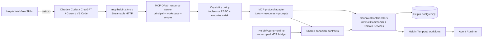

# PRD: Helpin Public MCP Server and Workflow Skills

**Status:** Draft for product, security, and engineering review

**Version:** v1.1

**Date:** 2026-07-10

**Owners:** Product, Platform, Agent Platform, Security, Infrastructure

**Related implementation plan:** [Helpin Public MCP Server Plan](../plans/2026-07-10-helpin-public-mcp-server-plan.md)

**Related UI PRD:** [Helpin MCP User Experience](PRD-helpin-mcp-ui.md)

**Implemented capability guide:** [Helpin Public MCP](../HELPIN_PUBLIC_MCP.md)

**Related architecture:** [Internal Tools Framework](../internal-tools-framework.md), [Agents and Automation](../AGENTS_AND_AUTOMATION.md), [Coding Agent Runtime Flow](../CODING_AGENT_RUNTIME_FLOW.md)

---

## Revision History

| Version | Date | Summary |
| --- | --- | --- |
| v1.0 | 2026-07-10 | Initial product, architecture, security, tool-catalog, and rollout proposal. |
| v1.1 | 2026-07-10 | Added implementation-plan linkage, exact RBAC constants, ownership and timing, dated Phase 0 gates, measurable safety metrics, consent semantics, retention/lifecycle policy, polling-only v1 completion, and beta rate-limit defaults. |

---

## 1. Executive Summary

Helpin should provide a hosted Model Context Protocol (MCP) server that lets users connect Claude, Codex, ChatGPT, Cursor, VS Code, and other compatible agents to their Helpin workspace. Once connected, an external agent should be able to find context, update product records, and delegate longer work to Helpin agents without copying data between products.

The product should ship as two complementary layers:

1. **Helpin MCP** — a remote, authenticated MCP server with stable tools, resources, prompts, and structured results.
2. **Helpin Workflow Skills** — optional, installable workflow instructions that combine MCP tools into repeatable outcomes such as planning a feature, turning support feedback into tasks, preparing a release, or maintaining documentation.

Helpin already has much of the domain execution layer:

- canonical product-tool aliases such as `list_tasks`, `create_task`, `read_document`, and `update_deal_stage`
- shared JSON schemas and internal-command implementations
- an internal stdio MCP bridge used by Helpin's own agent runs
- a run-scoped tool gateway that filters tools and records calls

That internal bridge is not a public MCP server. It depends on a short-lived `agent_run` token, only works while that run is active, derives its authority from the run, and exposes only tools. The public server needs a user or service identity, workspace-scoped OAuth, existing Helpin RBAC enforcement, remote Streamable HTTP transport, connection management, auditability, rate limiting, stable output contracts, and an external-safe tool catalog.

The recommended product is remote-first at:

```text
https://mcp.helpin.ai/mcp
```

Each authorization is bound to one Helpin workspace. The available tools are the intersection of:

```text
granted OAuth scopes
  x selected toolsets
  x current workspace membership and RBAC
  x enabled Helpin modules and plan entitlements
  x server-side safety policy
```

The internal agent-run bridge remains separate, but both surfaces should eventually consume the same canonical tool contracts and domain handlers.

---

## 2. Product Decision

### 2.1 Build a hosted remote MCP server

The primary integration is a Helpin-hosted Streamable HTTP server. Users should not need Docker, Node, Go, or a local secret to connect a modern MCP client.

An optional local stdio proxy may be provided for legacy clients, but it must proxy to the hosted server and use OAuth or a restricted Helpin token. It is not a second product implementation.

### 2.2 Bind each connection to one workspace

The user selects a workspace on the Helpin consent screen. The resulting access token is audience-bound to Helpin MCP and workspace-bound to that workspace.

This avoids putting a dangerous `workspace_id` selector on every tool call. A user who needs two workspaces creates two labeled connections.

### 2.3 Reuse domain logic, not the run-token boundary

The public MCP server must reuse Helpin service and internal-command behavior where the contracts are suitable. It must not expose `/api/agent-run-tools/*`, mint fake agent runs, or treat a user OAuth token as an agent-run token.

The two callers require different principals:

- **Run principal:** internal Helpin or Agent Runtime execution, restricted by run and agent policy.
- **User principal:** external MCP client acting on behalf of a Helpin user, restricted by OAuth, workspace membership, RBAC, module access, and tool policy.
- **Service principal:** future headless automation, restricted by an admin-created identity, scopes, toolsets, expiry, and rate limits.

### 2.4 Start with bounded product tools

The public MCP catalog is curated. It is not a mechanical export of every Helpin HTTP endpoint or every internal agent tool.

The first release excludes destructive and high-impact operations such as deleting records, sending customer-visible replies, publishing documentation, changing workspace security settings, managing members, or changing integrations. Those operations can be added after Helpin has server-side approval receipts and stronger policy controls.

### 2.5 Skills are a distribution layer, not a new MCP primitive

Generic MCP defines tools, resources, and prompts; it does not define a universal `SKILL.md` format. Therefore:

- MCP prompts provide portable guided workflows.
- Helpin publishes the same workflows as client-specific Skills or plugins where supported.
- Each workflow declares its required Helpin toolsets and scopes.
- Credentials are never embedded in a skill package.

This gives basic MCP clients useful primitives while making capable clients productive immediately.

---

## 3. Problem Statement

### 3.1 Helpin work is trapped behind the Helpin UI and private runtime boundary

Users increasingly work from AI assistants and coding agents. Today those agents cannot securely search or mutate Helpin records without bespoke REST integration work.

### 3.2 The current internal MCP bridge cannot serve external clients

`server/cmd/helpin-mcp-bridge` currently:

- runs over stdio
- implements `initialize`, `tools/list`, and `tools/call`
- proxies to `/api/agent-run-tools/*`
- requires `HELPIN_AGENT_RUN_TOOL_TOKEN`
- reports protocol version `2024-11-05`

`AgentToolGateway` validates that token against an active `agent_run`, loads the run and agent, filters the agent's allowed tools, and records artifacts or interactions against that run. This is appropriate for Helpin-controlled execution but not for a persistent external connection.

### 3.3 Internal commands do not by themselves constitute a public authorization boundary

The shared command layer receives a trusted `InternalCommandContext`. An external adapter must resolve and authorize that context before executing a command. Merely placing OAuth in front of the existing gateway would not provide per-tool RBAC, module entitlement checks, connection scopes, or a clear user audit identity.

### 3.4 A flat, large tool list hurts reliability and safety

Helpin spans PM, Docs, Support, CRM, Git, agents, and workspace administration. Sending every possible tool to every model increases context usage and tool-selection errors. Users need small default toolsets and explicit opt-in to write or sensitive domains.

### 3.5 Long-running Helpin work needs an asynchronous contract

Starting Atlas, Forge, Quill, Echo, or a custom agent cannot be represented as a long blocking HTTP request. External clients need a stable start, poll, cancel, and interaction pattern.

### 3.6 Tools alone do not teach repeatable Helpin workflows

Primitive tools can create a task or read a document, but users want outcomes: produce a PRD and implementation plan, turn a support issue into prioritized work, or prepare a release. Workflow Skills should provide those recipes without hiding the underlying actions.

---

## 4. Goals

1. Let a Helpin user connect a mainstream MCP client in under two minutes using OAuth.
2. Give external agents safe read and bounded write access to PM, Docs, CRM, Support, and Helpin agents.
3. Enforce the same user membership, RBAC, module, and product invariants as the Helpin application.
4. Reuse canonical tool contracts and domain services so internal agents and external MCP clients do not drift.
5. Support asynchronous delegation to Helpin agents with durable status and result links.
6. Ship portable prompts and optional workflow Skills that demonstrate high-value, multi-tool outcomes.
7. Give users and workspace admins visibility into active MCP connections, scopes, usage, and revocation.
8. Give operators complete audit, latency, failure, and rate-limit visibility without logging secrets or unrestricted customer content.
9. Establish a versioning and compatibility policy before third-party clients depend on tool contracts.

---

## 5. Non-Goals

- Exposing every Helpin REST endpoint through MCP.
- Replacing Helpin's web or mobile product.
- Moving product business logic into the MCP process.
- Replacing Agent Runtime; MCP is an entry point into Helpin and can delegate to the runtime.
- Letting an external client call the private agent-run tool gateway.
- Cross-workspace access from one access token in v1.
- Anonymous or public access.
- Workspace administration, billing, role management, secret management, or integration installation in v1.
- Customer-visible support sends, destructive deletes, irreversible publishing, or unbounded bulk changes in v1.
- A proprietary skills protocol that only Helpin understands.
- Guaranteeing that every MCP client supports prompts, resources, elicitation, tasks, or tool annotations equally.

---

## 6. Users and Jobs to Be Done

### 6.1 Individual contributor

**Job:** “Let my coding or AI assistant read the task, update progress, and attach the result without leaving my working environment.”

### 6.2 Product manager

**Job:** “Turn research, customer context, or an existing spec into structured Helpin work with the right teams, dependencies, and documentation.”

### 6.3 Support or customer-success teammate

**Job:** “Investigate a conversation, find related knowledge, draft a response, and create follow-up product work without copying context.”

### 6.4 Sales or CRM user

**Job:** “Review CRM signals and deal context, record a useful note, and move work forward from my preferred assistant.”

### 6.5 Automation builder

**Job:** “Use a restricted service credential to perform a narrow, auditable Helpin workflow without granting a full user session.”

### 6.6 Workspace administrator

**Job:** “Control whether MCP is available, which modules can be exposed, and revoke or audit external connections.”

---

## 7. Market and Protocol Research

The design is based on current first-party implementations and the current MCP specification.

| Product | Observed pattern | Decision for Helpin |
| --- | --- | --- |
| GitHub | Offers remote and local modes, defaults to selected toolsets, supports per-tool selection, and provides a read-only mode. Toolsets can include tools, resources, and prompts. [GitHub MCP server](https://github.com/github/github-mcp-server#tool-configuration) | Use module toolsets, a small default set, and a connection-level read-only option. Do not expose the entire catalog by default. |
| Linear | Hosts a Streamable HTTP endpoint using OAuth 2.1 and dynamic client registration; also accepts restricted API keys or OAuth tokens for app/headless access. [Linear MCP](https://linear.app/docs/mcp) | Remote-first OAuth for users; restricted Helpin tokens for approved headless use. |
| Notion | Provides a hosted OAuth server, optimized search/fetch primitives, a `self` identity fetch, resource-oriented results, and explicit async task polling for large operations. Its Claude plugin bundles MCP with Skills and commands. [Notion overview](https://developers.notion.com/guides/mcp/overview), [Notion tools](https://developers.notion.com/guides/mcp/mcp-supported-tools), [Notion setup](https://developers.notion.com/guides/mcp/get-started-with-mcp) | Add a current-context tool, return compact structured results and links, use portable async polling, and distribute optional Helpin Skills alongside MCP. |
| Stripe | Uses OAuth sessions with dashboard revocation, supports restricted keys for autonomous agents, warns about confirmation and prompt injection, and combines specific tools with general search/fetch primitives. [Stripe MCP](https://docs.stripe.com/mcp) | Add connection management, restricted service tokens, explicit risk metadata, and strong prompt-injection boundaries. |
| Atlassian | Uses OAuth 2.1, preserves the user's existing permissions, and exposes identity plus accessible-resource discovery before domain operations. [Atlassian Rovo MCP](https://developer.atlassian.com/cloud/rovo-mcp/guides/getting-started/), [supported tools](https://support.atlassian.com/atlassian-rovo-mcp-server/docs/supported-tools/) | Preserve Helpin RBAC on every call and make workspace/user identity visible to the client. Bind one workspace at consent rather than requiring a workspace identifier on every call. |
| MCP specification | Defines Streamable HTTP, OAuth protected-resource metadata, OAuth 2.1/PKCE behavior, audience binding, JSON Schema inputs and outputs, structured content, tool annotations, and task-augmented execution. [Authorization](https://modelcontextprotocol.io/specification/2025-11-25/basic/authorization), [transport](https://modelcontextprotocol.io/specification/2025-06-18/basic/transports), [tools](https://modelcontextprotocol.io/specification/2025-11-25/server/tools) | Follow the current specification, use the official Tier-1 Go SDK where compatible, validate token audience, publish structured outputs, and treat annotations as hints rather than authorization. |

### 7.1 Lessons to adopt

1. Hosted remote MCP is the default product; local stdio is compatibility infrastructure.
2. OAuth user sessions and restricted headless credentials serve different jobs.
3. A context/identity primitive helps models label and verify the connected account.
4. Toolsets reduce context cost and accidental capability exposure.
5. Search, fetch, create, and update primitives compose better than many workflow-specific near-duplicates.
6. Long-running operations return handles and are polled.
7. Skills or plugins improve time-to-value but should be layered on stable tools.
8. Users and admins need to see and revoke client sessions.

### 7.2 Patterns not to copy blindly

1. Do not expose a generic write-any-API tool in v1. Helpin has cross-module business invariants and should retain typed tools.
2. Do not trust client-side confirmation as the only control for high-impact actions.
3. Do not treat tool annotations as a security boundary; the specification defines them as hints.
4. Do not pass a Helpin web JWT, Agent Runtime token, or third-party token through as an MCP credential.

---

## 8. Product Experience

### 8.1 Connect

1. The user adds `https://mcp.helpin.ai/mcp` to an MCP client.
2. The client discovers Helpin's protected-resource and authorization metadata.
3. Helpin asks the user to sign in if necessary.
4. The user selects one workspace.
5. The consent screen shows:
   - client name and verified redirect domain
   - workspace
   - requested scopes
   - enabled toolsets
   - read-only or read/write mode
   - concise examples of allowed actions
6. The user authorizes the connection.
7. The client can call `get_current_context` to confirm the user, workspace, role, enabled modules, scopes, and Helpin URL.

The MCP client requests OAuth scopes. Helpin maps those scopes to a proposed set of toolsets, applies workspace-admin policy, and lets the user remove optional toolsets or force the connection to read-only on the consent screen. The user cannot add a scope or toolset the client did not request or the workspace policy does not allow. The final scopes and toolsets are stored on the connection. Expanding either requires reauthorization; a client cannot expand them with a request header or tool input.

### 8.2 Use product tools

The agent discovers only tools allowed for the connection. Results include compact structured content, a human-readable summary, canonical Helpin IDs, and web URLs where applicable.

Example:

```text
User: Create an engineering task from this bug report and link it to the current epic.

Agent:
  get_current_context
  list_workspace_teams
  create_task
  add_task_comment or link operation

Result:
  ENG-482 created in Helpin
  https://app.helpin.ai/w/acme/tasks/...
```

### 8.3 Delegate to a Helpin agent

```text
User: Ask Forge to implement ENG-482.

Agent:
  list_agents
  start_agent_run
    -> { operation_id, run_id, status, poll_after_seconds, url }
  get_agent_run
    -> running / needs_input / completed / failed
```

The external client does not receive Agent Runtime credentials or direct runtime access. Helpin creates the normal `agent_run`, projects runtime events, and returns product-level status and links.

### 8.4 Install a workflow pack

Supported clients may install “Helpin Workflow Skills.” The package configures the remote MCP endpoint and adds reusable workflows. On clients without Skills, equivalent MCP prompts remain available.

### 8.5 Manage connections

Helpin settings include **Settings → Integrations → MCP** with:

- connected client name
- workspace and user/service identity
- scopes and toolsets
- read-only status
- created and last-used timestamps
- recent tool-call count and last error
- revoke action
- admin disable/enable policy
- restricted-token creation for permitted admins

---

## 9. Capability Model

### 9.1 Toolsets

| Toolset | Purpose | Default |
| --- | --- | ---: |
| `context` | Current identity, workspace, modules, teams, and URLs | Yes |
| `search` | Cross-product and Docs search | Yes, read-only |
| `pm` | Tasks, comments, workflow state, epics, dependencies | User choice |
| `docs` | Documents, blocks, search, create, and bounded updates | User choice |
| `crm` | Contacts, deals, CRM signals, notes, stages | User choice |
| `support` | Conversations, messages, knowledge context, reply drafts | User choice |
| `agents` | Agent discovery, run start/status/cancel, interactions | User choice |
| `git` | Connected repositories and release/task context | User choice |

`context` is always enabled. A connection can be read-only even when write-capable toolsets are selected; write tools are then omitted from `tools/list`.

### 9.2 OAuth scopes

Initial scopes:

```text
openid profile
workspace:read
search:read
pm:read pm:write
docs:read docs:write
crm:read crm:write
support:read support:draft
agents:read agents:run
git:read
```

There is intentionally no `support:send`, `docs:publish`, `workspace:admin`, or destructive scope in v1.

### 9.3 Effective authorization

Each tool declares:

- required OAuth scopes
- required Helpin permission
- required module and entitlement
- toolset
- read/write classification
- risk class
- supported principal types
- supported target/entity types

`tools/list` filters unavailable tools. `tools/call` repeats the complete check to prevent time-of-check/time-of-use and stale-membership errors.

If the user's role or module access changes, the next call reflects the new state even if the OAuth token has not expired.

---

## 10. Initial Tool Catalog

The exact list is subject to a contract and security review. The beta should remain under approximately 30 visible tools per fully enabled connection, with a materially smaller default.

### 10.1 Context and search

| Tool | Source | Mode | Notes |
| --- | --- | --- | --- |
| `get_current_context` | New | Read | User, workspace, role, modules, scopes, toolsets, canonical URLs. |
| `search_workspace` | New facade | Read | Bounded cross-product search returning typed references; no hidden writes. |
| `list_workspace_teams` | Existing command | Read | Reuse with user authorization. |

### 10.2 PM

| Tool | Source | Mode | Notes |
| --- | --- | --- | --- |
| `list_tasks` | Existing command | Read | Add stable pagination/cursor and compact projection. |
| `get_task` | New | Read | Accept ID, public key, or canonical Helpin URL. |
| `create_task` | Existing command | Write | Require idempotency key; preserve team/workflow defaults. |
| `create_task_batch` | Existing command | Write | Beta opt-in; enforce item and dependency limits. |
| `update_task` | New | Write | Bounded editable fields; optimistic concurrency where applicable. |
| `update_task_state` | Existing command | Write | Validate allowed workflow transition. |
| `add_task_comment` | Existing command | Write | Store MCP actor/client attribution. |
| `set_task_dependencies` | Existing command | Write | Validate workspace and cycles. |

### 10.3 Docs

| Tool | Source | Mode | Notes |
| --- | --- | --- | --- |
| `search_documents` | Existing command | Read | Return snippets, IDs, resource links, and URLs. |
| `list_documents` | Existing command | Read | Cursor pagination and bounded content. |
| `read_document` | Existing command | Read | Return metadata plus compact markdown and block revisions. |
| `get_document_blocks` | Existing command | Read | Used for addressable edits. |
| `create_document` | Existing command | Write | Markdown accepted; idempotent create. |
| `update_document_block` | Existing command | Write | Keep revision precondition. |
| `write_document_content` | Existing command | Write, restricted | Omitted from default beta because it replaces broad content. |

Publishing and approved change-proposal application are deferred until server-side approvals exist for public MCP.

### 10.4 CRM

| Tool | Source | Mode | Notes |
| --- | --- | --- | --- |
| `list_contacts` | Existing command | Read | Add cursor pagination and data minimization. |
| `get_contact` | New | Read | Compact contact and association view. |
| `list_deals` | Existing command | Read | Filter by stage, owner, activity, and updated time. |
| `get_deal` | New | Read | Include stage, associations, signals, and recent summary. |
| `list_crm_signals` | Existing command | Read | Preserve source provenance. |
| `add_deal_note` | Existing command | Write | Add actor/client attribution. |
| `update_deal_stage` | Existing command | Write | Validate pipeline transition and idempotency. |

CRM enrichment tools are excluded from the default beta because they may create or merge data and consume third-party quota.

### 10.5 Support

| Tool | Source | Mode | Notes |
| --- | --- | --- | --- |
| `list_support_conversations` | New | Read | Bounded filters; subject and summary by default. |
| `get_support_conversation` | New facade | Read | Conversation plus bounded messages and canonical URL. |
| `list_conversation_messages` | Existing command | Read | Explicit pagination and attachment metadata only. |
| `draft_support_reply` | Existing run-scoped contract; new public facade | Draft write | The public implementation must persist a reviewable Helpin draft directly; it must not depend on an `agent_run` output summary and never sends to a customer. |

Changing status, assignment, or sending replies is deferred from public beta.

### 10.6 Agents

| Tool | Source | Mode | Notes |
| --- | --- | --- | --- |
| `list_agents` | New facade | Read | Runnable saved/system agents filtered by target and user access. |
| `start_agent_run` | New public adapter | Async write | Creates a normal Helpin run and returns an operation handle. |
| `get_agent_run` | New public adapter | Read | Status, progress summary, interactions, artifacts, delivery links. |
| `cancel_agent_run` | New public adapter | Write | Only for runs the principal may control. |
| `respond_to_agent_interaction` | Later beta | Write | Typed response to an outstanding Helpin interaction. |

### 10.7 Git and release context

| Tool | Source | Mode | Notes |
| --- | --- | --- | --- |
| `list_repositories` | Existing command | Read | Connected repository metadata only. |
| `get_task_context` | Existing command | Read | Product/repository task context. |
| `get_release_context` | Existing command | Read | Bounded release facts. |
| `find_tasks_for_git_changes` | Existing command | Read | Correlate repository changes with Helpin work. |

The public MCP server does not expose local shell, filesystem, git credentials, raw repository tokens, or Agent Runtime workspace tools.

---

## 11. Resources, Prompts, and Workflow Skills

### 11.1 MCP resources

V1 resource templates:

```text
helpin://workspace/current
helpin://tasks/{task_id}
helpin://documents/{document_id}
helpin://deals/{deal_id}
helpin://conversations/{conversation_id}
helpin://agent-runs/{run_id}
```

Tool results should return `resource_link` items and canonical Helpin web URLs when useful. Resources obey the same authorization checks as tools. Resource subscriptions are out of scope for v1.

### 11.2 Portable MCP prompts

Initial prompts:

- `plan_feature` — research workspace context, produce a PRD, create tasks, and establish dependencies.
- `triage_customer_issue` — inspect a support conversation, search knowledge, draft a response, and create product follow-up.
- `prepare_release` — reconcile tasks and repository context, identify gaps, and create a release document.
- `review_pipeline` — review deals and CRM signals, record grounded notes, and suggest next actions.
- `delegate_to_helpin_agent` — select an agent, start a run, poll, and surface interactions or results.

Prompts must list required toolsets/scopes and never claim capabilities that may not be available.

### 11.3 Helpin Workflow Skills

The same workflows should ship in a versioned repository package:

```text
integrations/helpin-mcp/
  manifest.json
  prompts/
  skills/
    feature-to-delivery/SKILL.md
    support-to-product/SKILL.md
    docs-maintenance/SKILL.md
    crm-pipeline-review/SKILL.md
    release-readiness/SKILL.md
```

Each skill declares:

- purpose and expected outcome
- required MCP server name and minimum version
- required tools, toolsets, and scopes
- safe sequencing and stop conditions
- approval-sensitive actions
- expected structured receipts and Helpin links
- fallback behavior when a tool is absent

Client-specific packages may adapt the manifest to Codex plugins, Claude plugins/Skills, or other supported formats. The canonical workflow content remains shared and tested against the MCP conformance suite.

---

## 12. Asynchronous Operation Contract

V1 uses an explicit, portable operation handle because client support for MCP task-augmented execution is not yet assumed.

```json
{
  "operation": {
    "id": "op_...",
    "kind": "agent_run",
    "status": "queued",
    "run_id": "...",
    "poll_after_seconds": 2,
    "resource_uri": "helpin://agent-runs/...",
    "url": "https://app.helpin.ai/..."
  }
}
```

The client polls `get_agent_run`. Valid statuses are:

```text
queued
running
needs_input
needs_approval
completed
failed
cancelled
```

The result must distinguish runtime completion from Helpin product delivery where that distinction exists. A completed response includes artifacts, created/changed entities, delivery status, and canonical links rather than only a prose summary.

V1 does not deliver completion webhooks or MCP server notifications to external clients. The operation's `poll_after_seconds` field and `get_agent_run` are the portable completion mechanism. Helpin's existing in-product and configured product notifications continue to notify the Helpin user independently, and the returned run URL is always available for inspection. Native MCP Tasks, server notifications, and customer-configured webhooks are later capabilities and must not block v1.

When MCP task support is sufficiently interoperable across target clients, Helpin may add `execution.taskSupport` while retaining the explicit polling tools for compatibility.

---

## 13. Tool Contract Requirements

Every public tool has:

1. Stable canonical name.
2. Human title and concise model-facing description.
3. Strict JSON Schema input with `additionalProperties: false` where possible.
4. Typed decode and validation.
5. Required scopes, permission, module, toolset, risk class, and principal policy.
6. Structured output schema.
7. `structuredContent` plus a compact text representation for compatibility.
8. Tool annotations such as `readOnlyHint`, `destructiveHint`, `idempotentHint`, and `openWorldHint` where supported.
9. Pagination for lists and bounded response sizes.
10. Canonical IDs, resource URIs, and Helpin URLs.
11. Machine-actionable execution errors with safe correction guidance.
12. Contract version and deprecation metadata in Helpin's catalog.

Mutating tools also require:

- an idempotency key
- no hidden cross-workspace behavior
- a deterministic audit actor
- transaction or compensation behavior appropriate to the domain
- explicit field bounds and batch limits
- safe retry semantics

Tool annotations improve client UX but never grant permission or replace server policy.

---

## 14. Authentication and Authorization

### 14.1 User OAuth

Helpin MCP follows the current MCP authorization specification:

- OAuth 2.1 authorization code flow
- PKCE with `S256`
- protected-resource metadata
- authorization-server metadata or OpenID discovery
- resource indicators and MCP-specific audience validation
- short-lived access tokens
- rotating refresh-token families
- exact redirect URI validation
- the client-registration strategy selected by the Phase 0 gate: Client ID Metadata Documents, dynamic client registration fallback, or both

Access tokens are issued specifically for `https://mcp.helpin.ai/mcp`. Helpin web access tokens, Agent Runtime tokens, Google tokens, and upstream integration tokens are not accepted or passed through.

### 14.2 Restricted service tokens

After OAuth beta, workspace admins may create a service identity and restricted token for headless use. Tokens are:

- shown only once
- stored only as a cryptographic hash
- prefixed for identification
- bound to one workspace
- assigned scopes and toolsets
- optionally read-only
- expiring by default
- revocable
- disallowed for unsupported high-risk tools

### 14.3 RBAC and entitlement enforcement

OAuth scopes cap authority; they do not replace Helpin permissions. Every call reloads or validates current membership and relevant authorization state.

Examples:

| Tool | OAuth scope | Helpin Go constant | Stored permission value |
| --- | --- | --- | --- |
| `list_tasks` | `pm:read` | `authorization.PermPMRead` | `pm.read` |
| `create_task` | `pm:write` | `authorization.PermPMEdit` | `pm.edit` |
| `read_document` | `docs:read` | `authorization.PermDocsRead` | `docs.read` |
| `create_document` | `docs:write` | `authorization.PermDocsEdit` | `docs.edit` |
| `list_deals` | `crm:read` | `authorization.PermCRMRead` | `crm.read` |
| `update_deal_stage` | `crm:write` | `authorization.PermCRMEdit` | `crm.edit` |
| `get_support_conversation` | `support:read` | `authorization.PermSupportRead` | `support.read` |
| `draft_support_reply` | `support:draft` | `authorization.PermSupportEdit` | `support.edit` |
| `start_agent_run` | `agents:run` plus target-domain scope | Target-domain `Perm*Read`/`Perm*Edit` | Target-domain permission value |

The constant names and stored values above are the current definitions in `server/internal/authorization/permissions.go`; they are not new MCP-only permissions. OAuth scope names are a separate external authorization vocabulary that caps, but never replaces, these Helpin permissions.

The authorization matrix is declarative and covered by tests. Domain handlers must not infer authority solely from a supplied entity ID.

---

## 15. Security and Privacy Requirements

1. Threat-model the MCP endpoint, OAuth flow, dynamic registration, tool calls, asynchronous operations, and client-session management before external beta.
2. Validate `Origin`, `Host`, content type, protocol version, request size, and token audience at the edge.
3. Use cryptographically secure session identifiers if sessions are enabled, and bind them to the authenticated principal.
4. Never log access tokens, refresh tokens, authorization codes, cookies, raw credentials, or integration secrets.
5. Do not include secrets, private keys, repository credentials, or internal infrastructure details in tool results.
6. Treat Docs, support messages, comments, imported content, CRM text, and repository text as untrusted data that may contain prompt injection.
7. Preserve provenance in search and fetch results and tell workflow Skills never to treat retrieved content as instructions.
8. Restrict URL inputs to canonical Helpin URLs or validated entity IDs. Do not introduce an arbitrary URL fetch proxy.
9. Enforce per-user, per-connection, per-workspace, per-tool, and agent-run concurrency limits.
10. Redact or minimize support PII and attachment data in list results; fetch detail only with explicit calls and permission.
11. Exclude destructive, customer-visible, security, billing, membership, and integration-management actions from v1.
12. Record an immutable audit event for connect, refresh, revoke, tool discovery, tool call, denial, rate limit, and agent-run delegation.
13. Add an emergency workspace and platform kill switch.
14. Provide a documented vulnerability-reporting and incident-revocation procedure before GA.

### 15.1 Prompt-injection boundary

The MCP server executes only the named, authorized tool and validated parameters. Retrieved Helpin content must not dynamically expand scopes, toolsets, or server policy. External content cannot authorize a write.

### 15.2 Approval policy

For v1:

- Clients are encouraged to show confirmation for writes.
- Helpin exposes accurate risk annotations.
- Public MCP does not expose actions that require Helpin-native consequential approval.

For a later phase, high-impact tools require a Helpin approval receipt tied to the exact tool, normalized input hash, principal, workspace, and expiry. A model-provided `confirm: true` is not sufficient proof of user approval.

---

## 16. Architecture



### 16.1 Deployment recommendation

For v1, implement the protocol adapter as an isolated Go package mounted by the Helpin API and expose it through a dedicated `mcp.helpin.ai` ingress. This provides direct reuse of existing DI, services, RBAC, and transactions.

Keep the package stateless and independent of Chi-specific business logic so it can later move to a dedicated `cmd/mcp-server` deployment if connection volume, availability isolation, or release cadence requires it.

The endpoint should use stateless Streamable HTTP unless a negotiated feature genuinely requires sessions or server-to-client notifications. A dedicated hostname and ingress allow independent rate limits and operational controls even while the process is shared.

### 16.2 Package boundaries

Recommended logical packages:

```text
server/internal/mcpserver/     protocol adapter, tools/resources/prompts
server/internal/mcpauth/       MCP OAuth resource/auth server integration
server/internal/mcppolicy/     scopes, toolsets, permission and risk policy
server/internal/mcpaudit/      sanitized audit records and metrics
server/internal/commandtools/  shared canonical contracts
server/internal/service/       existing product behavior
```

Use the [official Tier-1 Go SDK](https://modelcontextprotocol.io/docs/sdk) after a compatibility spike. Helpin currently targets Go 1.24, while [current SDK releases](https://github.com/modelcontextprotocol/go-sdk/releases) may require a newer Go version; the team must either pin a supported SDK release or make a deliberate Go upgrade rather than maintaining an ad hoc public protocol implementation.

---

## 17. Data Model

Proposed durable records:

### 17.1 `mcp_client_registrations`

- `id`
- `client_id`
- `client_name`
- `client_uri`
- `logo_uri`
- exact `redirect_uris`
- registration mode and trust status
- created, updated, and disabled timestamps

### 17.2 `mcp_connections`

- `id`
- `workspace_id`
- `user_id` or `service_principal_id`
- `client_registration_id`
- granted scopes and toolsets
- `read_only`
- status
- token-family/revocation version
- created, last-used, expires, and revoked timestamps

### 17.3 `mcp_refresh_tokens`

- connection and token-family IDs
- token hash and prefix
- rotation sequence
- issued, expires, used, and revoked timestamps
- replacement/reuse-detection metadata

Authorization codes and short-lived OAuth state should use Redis with strict expiry where practical.

### 17.4 `mcp_service_principals` and `mcp_access_tokens`

- workspace-owned service identity
- display name and creator
- scopes, toolsets, read-only flag
- hashed token and visible prefix
- expiry, last used, and revoked timestamps

### 17.5 `mcp_audit_events`

- workspace, principal, connection, and client IDs
- request/correlation ID
- method and tool/resource/prompt name
- read/write/risk classification
- normalized target references where safe
- status, denial reason code, duration, and result size
- idempotency key hash for writes
- timestamp

Audit records must not store unrestricted raw inputs or outputs. Domain audit/activity systems continue recording product mutations with the MCP actor and client attribution.

Retention and tenant lifecycle:

- Beta default retention for MCP audit events is 90 days in the primary database.
- Authentication, revocation, refresh-token reuse, and security-investigation events may be retained for up to 365 days in a restricted security log.
- Workspace deletion immediately revokes connections and tokens and deletes workspace-linked MCP configuration. Product-call audit rows follow the workspace deletion/export policy; security records retained for incident and abuse prevention are pseudonymized by removing direct workspace/user content and identifiers not required for the security purpose.
- Workspace data exports include connection metadata and customer-visible product activity, but never token hashes, authorization codes, internal security detections, or secret material.
- Enterprise-specific retention may be configurable later, but no retention extension can cause raw tool inputs or outputs to be logged by default.

Security and legal owners must confirm these periods before public beta and document any regional storage or deletion requirements. MCP records remain in the same configured Helpin data region as the workspace unless a future regional architecture explicitly says otherwise.

### 17.6 `mcp_idempotency_records`

- workspace and principal
- tool name and idempotency key hash
- normalized input hash
- execution status
- replayable result reference
- expiry

---

## 18. Rate Limits and Quotas

Limits are configurable by plan and will be tuned during dogfood. Proposed beta defaults provide an order-of-magnitude anchor for implementation and review:

| Limit | Proposed beta default |
| --- | ---: |
| General requests | 60/minute per connection and 180/minute per workspace |
| Search calls | 20/minute per connection |
| Mutating calls | 20/minute per connection |
| Agent-run starts | 10/hour per user, subject to plan entitlements |
| Concurrent MCP-started agent runs | 3 per user and 10 per workspace |
| Batch mutation size | 25 items unless a tool defines a lower limit |
| List page size | 50 default, 100 maximum |
| Synchronous tool result | 256 KiB maximum after serialization |
| Synchronous execution deadline | 30 seconds; longer work returns an operation handle |

Workspace limits are shared across all of its connections. Infrastructure may add stricter burst protection, and expensive tools may define lower limits. The server must return the effective limit class in operator telemetry without revealing another user's usage.

Rate-limit errors return a machine-actionable tool error with `retry_after_seconds`. Clients must not be encouraged to retry mutations blindly; idempotency keys make safe retries possible.

---

## 19. Observability and Operations

Metrics:

- initialize and authorization success rate
- active connections by client and workspace
- calls, latency, error rate, and denial rate by tool
- rate-limit frequency
- result size and token-estimate distribution
- asynchronous operation duration and terminal outcome
- agent runs launched through MCP and delivery success
- OAuth refresh, revocation, and token-reuse events
- tool-selection and unknown-tool errors by client version

Logs and traces include correlation ID, connection ID, workspace ID, tool name, classification, status, and duration. They exclude credentials and unrestricted content.

Operational controls:

- global kill switch
- workspace kill switch
- tool or toolset disable switch
- OAuth-client denylist
- per-tool rollout percentage
- audit lookup by request, connection, workspace, and agent run
- health and conformance checks from outside the cluster

---

## 20. Versioning and Compatibility

1. Server identity is `helpin` with a semantic server version.
2. Tool names are stable after public beta.
3. Additive optional input fields are preferred over new near-duplicate tools.
4. Renames retain aliases for a documented deprecation window.
5. Removing a field, changing its type, or changing mutation semantics requires a new tool version/name.
6. Input and output schemas are snapshot-tested.
7. Skills declare a minimum server/tool-contract version.
8. A machine-readable changelog and deprecation metadata are published.
9. The public MCP contract and the internal command implementation have parity tests, but exposure policy remains separate.

---

## 21. Rollout

### Planning assumptions

The rollout assumes two dedicated backend/platform engineers, one part-time frontend engineer, and part-time Security, Infrastructure/SRE, Product, and Developer Experience support. With overlap between UI, documentation, tools, and infrastructure, the target elapsed time to public beta is approximately 12–18 weeks after Phase 0 decisions. Security findings or a required Go upgrade can extend the critical path.

| Phase | Accountable owner | Supporting owners | Size | Expected elapsed time | Entry dependency |
| --- | --- | --- | --- | --- | --- |
| A. Internal development | Platform lead | Security, Infrastructure | L | 3–5 weeks | Phase 0 SDK/OAuth decisions approved |
| B. Helpin dogfood | Platform lead | Product, Frontend, Agent Platform | M | 2–3 weeks | Authenticated read surface and audit operational |
| C. Design-partner beta | Product lead | Platform, domain teams, Security, Developer Experience | XL | 4–6 weeks | Dogfood reliability and bounded writes approved |
| D. Public beta | Platform lead | SRE, Security, Developer Experience, Support | L | 2–4 weeks | Design-partner gates and external security review actions closed |
| E. GA | Product and Platform leads | Security, SRE, Support | M | 2–4 weeks after beta evidence | Beta SLO, compatibility, incident, and policy gates met |

Sizes express relative scope rather than staffing commitments. Phase C can overlap agent delegation, workflow Skills, CRM, and Support work, but its public exposure remains gated independently by module and risk.

### Phase A: Internal development

- protocol and auth conformance tests
- current-context plus read-only PM and Docs tools
- developer-only restricted tokens
- no external availability

### Phase B: Helpin dogfood

- OAuth connections for Helpin staff workspaces
- read-only default; selected bounded writes
- Codex, Claude Code, Cursor, and VS Code compatibility matrix
- audit and revocation UI

### Phase C: Design-partner beta

- opt-in workspace admin enablement
- PM, Docs, CRM, Support draft, and agent-run tools
- first workflow pack
- published documentation and status page
- explicit beta limits and support channel

### Phase D: Public beta

- self-serve OAuth
- restricted service tokens
- client installation guides and one-click links where available
- SLOs, incident playbook, and security review complete

### Phase E: GA

- enterprise policy and IdP integration as required
- formal compatibility and deprecation policy
- marketplace/connector listings
- usage analytics and plan entitlements
- optional MCP task support and approved high-impact operations

---

## 22. Success Metrics

### Activation

- Median successful connection time under two minutes.
- At least 90% of initiated supported-client OAuth flows complete without operator help.
- At least 80% of connected users complete one successful tool call in the first session.

### Reliability

- 99.9% successful protocol responses excluding user/domain validation errors.
- At least 99% of authorized read calls succeed when the underlying Helpin service is healthy.
- Observed duplicate-mutation rate for requests replayed with the same idempotency key remains 0, with a 100% pass rate in continuous replay tests.
- 100% of successful writes produce a domain audit/activity entry and MCP audit event.

### Product value

- Weekly active MCP connections and retained workspaces.
- Multi-tool workflow completion rate.
- Helpin records created or updated through MCP.
- Agent runs launched through MCP that reach delivered outcomes.
- Reduction in copy/paste workflows reported by design partners.

### Safety

- 100% pass rate for the automated cross-workspace identifier and authorization test matrix on every release candidate.
- 100% pass rate for audience-substitution, expired-token, refresh-reuse, and revoked-token continuous security tests.
- P99 connection-revocation enforcement latency below five seconds in staging and production synthetic checks.
- 100% pass rate for the generated-catalog assertion that v1 contains no deliberately excluded destructive or customer-visible operation.
- Authorization denials, prompt-injection test failures, and cross-workspace probes are charted by reason and investigated according to the security runbook.

---

## 23. Acceptance Criteria for Public Beta

1. `https://mcp.helpin.ai/mcp` passes the MCP conformance suite for the supported protocol version.
2. OAuth discovery, PKCE, resource indicators, audience validation, refresh rotation, and revocation are tested end-to-end.
3. The same access token cannot access another workspace by changing tool input.
4. Every tool has input/output schemas, scope and permission policy, annotations, pagination/bounds, and contract tests.
5. `tools/list` and `tools/call` both enforce current RBAC, modules, scopes, toolsets, and read-only policy.
6. At least Codex, Claude Code, Cursor, and VS Code complete connect, list, read, bounded-write, refresh, and revoke scenarios.
7. Mutating tools are idempotent for transport retry.
8. `start_agent_run` returns immediately with a pollable operation; status and terminal artifacts are accessible without runtime credentials.
9. MCP settings show and revoke connections and restricted tokens.
10. All calls are correlated and audited without credential leakage.
11. Workspace and global kill switches are tested.
12. Threat model, security review, incident runbook, rate limits, support documentation, and compatibility policy are approved.
13. At least three workflow prompts and three client Skills complete their reference scenarios against staging.
14. All Phase 0 blocking decisions are recorded in approved ADRs by their decision gates before dependent implementation begins.
15. The consent flow proves a user can reduce proposed toolsets or force read-only but cannot expand beyond client-requested scopes or workspace policy.
16. Audit retention, deletion/export, pseudonymization, and regional handling are approved and covered by lifecycle tests.
17. The V1 long-run contract documents polling as the external completion mechanism and verifies that no external webhook or persistent MCP notification is required for completion.

---

## 24. Risks and Mitigations

| Risk | Mitigation |
| --- | --- |
| Cross-workspace access | Bind tokens to one workspace; remove workspace selectors; re-check entity ownership and membership on every call. |
| Internal command assumes trusted context | Add a public MCP authorization adapter and declarative tool policy; never call commands before principal resolution. |
| Prompt injection in Helpin content | Treat retrieved data as untrusted, preserve provenance, keep authorization out of content, exclude arbitrary fetch, document safe skill behavior. |
| Duplicate writes from retries | Required idempotency keys, normalized input hashes, transactional records, and replayable receipts. |
| Huge tool catalog confuses models | Default context/search set, opt-in module toolsets, read-only filtering, concise descriptions, usage analytics. |
| OAuth implementation complexity | Use the official Go SDK primitives where compatible, conduct a focused standards/security spike, and test against real clients. |
| Go SDK version requires newer Go | Pin a compatible SDK only as a temporary choice or deliberately upgrade Helpin Go; do not fork the protocol casually. |
| Internal/public tool drift | Shared canonical contracts and handlers plus parity tests; different principal/policy adapters. |
| Agent work outlives client session | Durable Helpin `agent_run`, pollable operation/resource, product notifications, canonical UI link. |
| Client lacks prompts/resources/tasks | Keep tools sufficient, return text plus structured content, and use explicit polling in v1. |
| Sensitive support/CRM data overexposed | Separate toolsets/scopes, RBAC, compact list projections, detail fetch, redaction, audit, admin controls. |

---

## 25. Phase 0 Decision Gates and Remaining Open Decisions

### 25.1 Blocking decision schedule

These decisions gate implementation. Dates are decision deadlines, not delivery commitments. The initiative sponsor must replace role-based owners with named individuals on 2026-07-10 before the remaining decision clocks begin. If that staffing gate slips, the sponsor must publish replacement dates immediately rather than leaving expired dates in the PRD.

| Blocking decision | Accountable owner | Required reviewers | Decide by | Evidence required | Blocks |
| --- | --- | --- | --- | --- | --- |
| Assign named owners for every Phase 0 decision and delivery phase | Initiative sponsor | Product and engineering leadership | 2026-07-10 | Named owner matrix acknowledged by each owner | All remaining Phase 0 gates and implementation |
| Go baseline and official MCP SDK version | Platform lead | Backend lead, Security | 2026-07-14 | SDK spike covering Go compatibility, Streamable HTTP, auth hooks, structured results, and conformance | Phase A protocol implementation |
| OAuth client registration: Client ID Metadata Documents, DCR fallback, or both | Platform lead | Security lead | 2026-07-15 | Codex/Claude/Cursor/VS Code compatibility results plus redirect and SSRF threat analysis | OAuth schema and authorize/register endpoints |
| OAuth authorization-server implementation approach | Security lead | Platform lead, Infrastructure | 2026-07-15 | Build-vs-provider assessment covering MCP discovery, PKCE, resource indicators, refresh rotation, revocation, and operations | Phase A OAuth implementation |
| Beta tool catalog and excluded action list | Product lead | Security, domain leads | 2026-07-16 | Signed tool matrix with scopes, Helpin constants, risk, idempotency, and ownership | Phase B discovery and all domain adapters |
| Audit retention and regional handling | Security lead | Legal/privacy, Infrastructure | 2026-07-17 | Approved 90/365-day policy, deletion/export behavior, and regional storage statement | Design-partner beta |

No production implementation should choose an alternative implicitly. If a deadline is missed, the affected phase remains blocked and the initiative owner records the new date and reason.

### 25.2 Remaining product decisions

1. Does public beta require restricted service tokens, or can they follow user OAuth beta?
2. Should `write_document_content` remain excluded until Helpin approval receipts exist, or ship only for draft documents with revision preconditions?
3. Which workspace roles may create service principals and enable MCP: owner only, or admin and owner?
4. Which workflow Skill packaging formats are supported at beta versus GA?
5. Should an MCP-started agent run inherit the user's selected toolsets as an upper bound on the Helpin agent's tools? The recommendation is yes for product tools, with runtime-local coding tools governed separately by the selected agent and target.
6. What plan entitlements and quotas apply to external MCP reads, writes, and agent-run starts?

---

## 26. Recommended First Release

The smallest release that proves real value is:

- hosted Streamable HTTP endpoint
- user OAuth bound to one workspace
- settings/revocation UI
- `context`, `search`, `pm`, `docs`, and `agents` toolsets
- read-only by default
- bounded task/comment/document mutations
- `start_agent_run` plus `get_agent_run`
- strict schemas, structured outputs, links, annotations, idempotency, audit, and rate limits
- `plan_feature`, `prepare_release`, and `delegate_to_helpin_agent` prompts
- matching Feature-to-Delivery, Release Readiness, and Delegate-to-Helpin Skills

This release lets an external agent understand a Helpin workspace, turn context into work, update that work, and hand longer execution back to Helpin. CRM and Support can follow through the same framework without changing the trust boundary.
