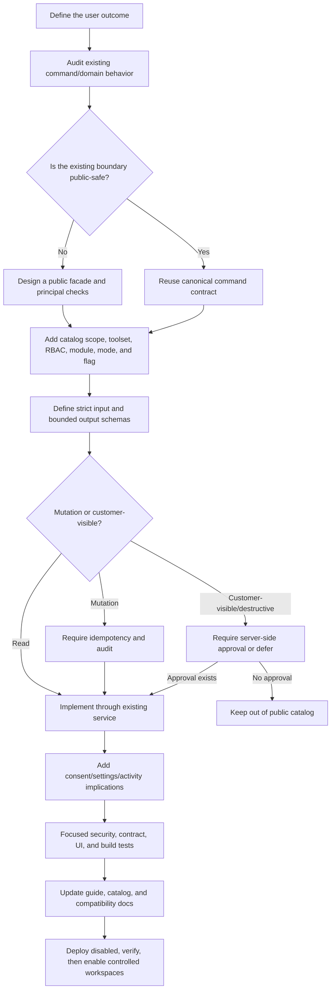

# Public MCP engineering notes

These notes explain the decisions behind the first public MCP implementation.
Use them when maintaining its authorization and transport boundaries; use the
[public MCP guide](public-mcp-server.md) for connection and configuration details.

**Original implementation:** 2026-07-10
**Source review:** 2026-09-18

Historical test results and rollout lessons below refer to the first implementation. The source review updated catalog, replay, and flag behavior; it did not rerun protocol tests or verify live clients.

**Purpose:** Preserve the architectural decisions, implementation lessons, validation approach, and rollout sequence from the first Helpin Public MCP implementation so future work starts from the correct boundary.

Related references:

- [Complete Helpin Public MCP Guide](public-mcp-server.md)
- [Public MCP Server PRD](prds/helpin-public-mcp-server.md)
- [Public MCP Implementation Plan](plans/2026-07-10-helpin-public-mcp-server-plan.md)
- [MCP UI PRD](prds/helpin-mcp-ui.md)

## 1. The most important lesson

The public MCP server and the internal Agent Runtime MCP bridge solve different problems.

The internal bridge is trusted infrastructure for an already-authorized `agent_run`. Its authority comes from the run, and it can safely assume run-owned workspace, actor, target, and tool policy metadata.

The public server starts with an untrusted external client. It must establish and continuously enforce:

- who the principal is
- which workspace the principal may access
- which client received the grant
- which scopes and toolsets were approved
- whether the workspace is read-only
- what the user's current Helpin role allows
- which Helpin modules are currently accessible
- whether the connection or service identity is still active

Therefore:

> Reuse domain behavior, schemas, and durable run infrastructure. Do not reuse the internal run token as the public trust boundary.

This distinction should be the first architecture check for every future MCP feature.

## 2. The correct ownership model

Helpin remains the source of truth for product authorization and business behavior. The Agent Runtime executes work but does not decide whether an external MCP client may access Helpin.

| Concern | Owner |
| --- | --- |
| External client identity and connection | Public MCP service |
| Workspace binding | OAuth consent or service-principal creation |
| User membership, role, and permissions | Helpin authorization service |
| Module access | Helpin authorization service |
| Tool exposure policy | Public MCP catalog and workspace policy |
| Product validation and side effects | Existing Helpin command/domain services |
| Durable agent state | Helpin `agent_run` |
| Agent execution adapter | Agent Runtime or the agent's configured runtime |
| External completion contract | MCP polling through `get_agent_run` |
| Audit and credential lifecycle | Public MCP service/repository |

When this ownership is unclear, stop and resolve it before adding code.

## 3. Reuse the middle, replace the boundary

The most effective implementation pattern was:

1. Keep the existing command and domain service behavior.
2. Introduce a separate public `MCPPrincipal`.
3. Resolve that principal before constructing trusted internal command metadata.
4. Add a curated public catalog around only public-safe commands.
5. Add new facades where internal commands assume an agent-run target or return an unsafe shape.

This avoided creating a second PM, Docs, CRM, Support, or agent implementation while still giving the public endpoint a separate security boundary.

Do not create separate public business logic when an existing Helpin service already owns the behavior. Do not directly expose an existing command merely because its name looks useful; inspect its assumptions, defaulting, inputs, output size, and side effects first.

## 4. Authorization must be an intersection

No single scope, role, flag, or consent decision is sufficient.

The effective tool set is:

```text
platform enabled
AND domain feature enabled
AND workspace MCP enabled
AND workspace policy allows toolset/scope
AND credential was granted toolset/scope
AND credential/read-only policy allows the mode
AND actor is still a workspace member
AND actor's current RBAC permits the operation
AND actor can access the product module
```

The same decision must be applied twice:

- during `tools/list`, so clients do not discover unusable tools
- during `tools/call`, so stale discovery results never become authorization

Future resources and prompts must follow the same rule: register them only when their backing tool is currently available.

## 5. Bind the workspace at consent time

One connection should represent one client, one actor, and one workspace.

Do not accept `workspace_id` as a tool argument. That creates an unnecessary confused-deputy and cross-workspace risk. A user who needs two workspaces should create two clearly labeled client connections.

The workspace binding must be present in:

- the connection or service-principal record
- access-token claims
- the token audience/resource validation
- repository queries
- direct entity ownership checks
- audit records
- run attribution

Strict schemas should reject unknown fields, including attempts to add a workspace override.

## 6. Curate the catalog; never expose commands mechanically

The first implementation initially surfaced a few commands that were technically reusable but outside the accepted beta risk boundary. Reviewing the catalog against the PRD caught this before handoff.

Examples:

- `write_document_content` broadly replaces document content and was removed.
- run-scoped `draft_support_reply` does not persist the public reviewable draft required by the PRD and was not exposed.
- the original beta omitted batch/dependency operations; the current catalog includes a bounded, idempotency-keyed `create_task_batch` with dependency references.
- public support reads exclude internal notes even though an internal command can read them.

The current [catalog regression test](../server/internal/service/mcp_oauth_test.go) expects 49 tools. The catalog has grown since the original 30-tool handoff; inspect [the catalog](../server/internal/service/mcp_catalog.go) when changing exposure. Bounded task batches and additional Docs/PM mutations are now included.

For every future tool, answer all of these before adding it:

| Question | Required answer |
| --- | --- |
| Is this a stable user outcome rather than a generic API escape hatch? | Yes |
| Is workspace identity implicit from the principal rather than caller-provided? | Yes |
| Are existing RBAC and module checks known? | Yes |
| Is the output bounded and minimized? | Yes |
| Are internal notes, credentials, and provider/runtime configuration excluded? | Yes |
| If mutating, is the operation safely retryable with an idempotency key? | Yes |
| If destructive or customer-visible, is server-side approval implemented? | Required before exposure |
| Does the tool have a platform/domain rollout flag when risk warrants it? | Yes |
| Is the tool represented in the capability guide and catalog regression test? | Yes |

## 7. Public contracts must be stricter than internal contracts

Internal tools may rely on trusted run metadata, target defaults, or orchestration context. Public tools cannot.

Public-safe contracts should have:

- explicit identifiers
- strict JSON Schema validation
- `additionalProperties: false` for public facades
- bounded strings and list sizes
- no implicit workspace switching
- no credential-bearing outputs
- structured results with a text fallback
- stable Helpin links where useful
- a synchronous size and duration limit

The normalized result envelope made different clients easier to support:

```json
{
  "summary": "Human-readable result",
  "data": {},
  "links": {}
}
```

Tool annotations are useful client hints. They are not an authorization mechanism.

## 8. Idempotency is part of the tool contract

Retries are normal for remote AI clients. Every mutation must require a stable `idempotency_key`.

The intended replay behavior is:

- scope the key to the connection or service principal
- hash the effective request with the tool name
- save the bounded successful result
- return the saved result for an identical retry
- reject reuse with a different tool or payload
- expire replay records after a documented period

[The current executor](../server/internal/service/mcp_tools.go) saves successful results for 24 hours **after** domain execution. Concurrent identical requests or a crash between the domain mutation and replay-record persistence can therefore execute the domain operation more than once unless that operation supplies its own protection. A replay record is not an atomic reservation or an exactly-once guarantee. Adding idempotency later is a breaking contract change; review the transaction boundary before publishing a mutation.

## 9. Durable work should remain a normal Helpin run

`start_agent_run` should not create a second MCP-specific job system.

The correct sequence is:

1. Resolve the current Helpin actor.
2. Verify that the actor may use the selected agent and target.
3. Apply hourly and concurrent safety limits.
4. Create a normal `agent_run` through `AgentService`.
5. Persist MCP client/service attribution separately.
6. Let the agent's configured runtime adapter execute it.
7. Return the run handle immediately.
8. Poll `get_agent_run` for status and artifacts.

Benefits:

- Helpin keeps one durable execution primitive.
- Existing approvals, interactions, artifacts, billing, notifications, and observability continue to work.
- Agent Runtime remains replaceable behind the saved agent/runtime configuration.
- The UI can show MCP origin without changing core run semantics.

V1 polling was the right portable choice. Do not add external webhooks or MCP Tasks until the portable path is stable across clients.

## 10. OAuth and credential lessons

The public server needed a complete connection lifecycle, not only bearer-token verification.

Required pieces were:

- authorization-server discovery
- protected-resource discovery
- dynamic public-client registration
- exact redirect URI matching
- HTTPS except loopback clients
- `state`
- PKCE S256
- short-lived, single-use authorization codes
- short-lived, issuer/audience-bound access tokens
- rotating hashed refresh tokens
- refresh-family reuse detection
- token and connection revocation
- restricted service principals with one-time secrets

Important design decisions:

- Clients request scopes; users may only narrow them.
- Toolsets are also narrowable at consent.
- Expansion requires reauthorization.
- Service principals use a named current Helpin user as the actor and do not bypass RBAC.
- Revocation must be checked against persisted connection state, not only JWT expiry.
- Store hashes, not raw codes, refresh tokens, service tokens, or tool payloads.

Before GA, run formal OAuth conformance and external security testing. Unit tests and code review are necessary but not equivalent to conformance.

## 11. The UI is part of the security model

MCP is incomplete if administrators need SQL to understand or stop access.

The essential UI surfaces are:

- server setup instructions and copyable configuration
- OAuth consent with one workspace and authority narrowing
- personal/workspace connection inventory
- immediate individual revocation
- workspace-wide emergency revocation
- service-principal creation, rotation, and revocation
- workspace toolset/scope/read-only policy
- sanitized activity history
- visible platform-disabled state
- MCP attribution on normal Agent Runs

Design lesson: show effective authority, not only requested authority. Users need to understand the effect of read-only mode, workspace policy, current RBAC, modules, and rollout switches.

## 12. Rollout flags must exist before launch

The implementation now has:

- `MCP_SERVER_ENABLED`
- `MCP_OAUTH_ENABLED`
- `MCP_SERVICE_TOKENS_ENABLED`
- `MCP_PM_WRITE_ENABLED`
- `MCP_DOCS_WRITE_ENABLED`
- `MCP_AGENT_RUN_ENABLED`
- `MCP_CRM_ENABLED`
- `MCP_SUPPORT_ENABLED`

The checked-in staging and production manifests currently set `MCP_SERVER_ENABLED` to `"true"`, and configuration defaults it to enabled when absent. This is source configuration, not verification of live rollout or client compatibility.

Operational lesson: explicit Kubernetes `env` values override `envFrom` values supplied by Doppler. An explicit manifest value takes precedence over a conflicting Doppler value, for example:

```yaml
- name: MCP_SERVER_ENABLED
  value: "true"
```

For rollout, update the explicit deployment value through review after migrations, DNS/TLS, compatibility, and security gates pass.

The global switch should stop new OAuth issuance and tool execution while leaving authenticated settings and revocation available.

## 13. Rate limits need two layers

Transport limits protect the public endpoint from bursts:

- general requests per connection/service identity
- general requests per workspace
- search calls per principal
- mutations per principal

Durable-work limits need persisted checks because the same user can have multiple connections and traffic can reach multiple instances:

- agent starts per user/hour
- active MCP-started runs per user
- active MCP-started runs per workspace

Current general/search/write counters are process-local. Before traffic requires multi-instance precision, move those counters to a distributed limiter. Keep persisted agent safety limits even after a distributed transport limiter exists.

## 14. Audit raw facts, not sensitive payloads

Useful MCP audit records include:

- workspace and principal references
- client name
- event type and tool name
- outcome and reason code
- duration
- request and result hashes
- timestamps

Do not store raw credentials, tool inputs, tool outputs, email bodies, conversation bodies, or unrestricted document content in MCP audit events.

Different retention windows for success and security/error events were useful:

- shorter success retention for volume/privacy
- longer denied/error retention for investigations
- short-lived replay results

Every future credential lifecycle event and security denial should produce a sanitized audit event.

## 15. Documentation lessons

The PRD review exposed several documentation problems before code was circulated:

- a linked implementation plan did not initially exist
- permission names needed to use real Go constants rather than invented labels
- timeline, ownership, and phase dependencies were missing
- absolute goals such as "zero disclosures" were not measurable metrics
- OAuth/SDK decisions were blockers but were presented as optional open questions
- consent narrowing semantics were ambiguous
- retention, polling, and starting rate limits needed explicit contracts
- a substantive PRD revision still said `v1.0`

Next time:

1. Verify every repository link before review.
2. Check every named constant against source.
3. Separate measurable metrics from release invariants.
4. Turn implementation-gating decisions into named, dated gates.
5. Include retention, revocation, async completion, and rollout behavior in the first draft.
6. Add a revision history as soon as reviewers receive a document.
7. Keep the capability guide aligned to code; PRDs describe intent and may include deferred work.

## 16. SDK and dependency lessons

The official MCP SDK was the right choice, but SDK compatibility must be decided before protocol code begins.

Check:

- repository Go version
- SDK minimum Go version
- Streamable HTTP support
- stateless server support
- per-request authentication hooks
- structured output schemas
- resources and prompts
- client compatibility

Pin a known-compatible SDK release rather than silently upgrading the repository toolchain or maintaining an ad hoc public protocol implementation.

After adding the SDK:

- run `go mod tidy`
- inspect all direct and transitive version changes
- build the API and migration binaries
- run focused protocol tests
- review dependency advisories before release

## 17. Test strategy that worked

Focused tests provided fast, attributable feedback for the new boundary:

- MCP access-token audience/use validation
- single-use authorization codes
- atomic refresh rotation
- strict schema rejection
- PKCE verification
- grant narrowing and read-only behavior
- platform tool flags
- exact catalog size and excluded actions
- persisted run-limit counts
- tool annotations and rate-limit behavior
- settings navigation and permissions
- Skill package validation

Build-level validation covered:

- Go API and migration binaries
- migration package tests
- TypeScript project build
- focused ESLint on new UI files
- production frontend bundle
- Kubernetes and Skill YAML parsing
- local Markdown links and source/catalog consistency

The full backend suite also exposed unrelated existing failures and sandbox restrictions, including legacy SQLite schemas and tests that open local listeners. The lesson is not to ignore the full suite. The correct approach is:

1. Run it.
2. Record exact unrelated failures.
3. Run focused tests that prove the new work independently.
4. Do not "fix" unrelated dirty work without authorization.
5. Keep a clear distinction between implementation failures, pre-existing failures, and sandbox/environment failures.

## 18. Repository and Git hygiene

The workspace already contained unrelated modified and untracked files. Preserving them required explicit file staging.

Rules for the next session:

- Check the current branch and worktree before editing.
- Create or switch to the intended feature branch before the first shareable commit.
- Never use `git add -A` in a dirty shared workspace.
- Stage explicit files and inspect `git diff --cached --name-only`.
- Run `git diff --cached --check` before committing.
- Verify `HEAD` equals the upstream commit after pushing.
- Do not delete, restore, reformat, or commit unrelated user changes.
- Treat generated route-tree changes as implementation-owned only when caused by the new routes.

The MCP work was split into understandable commits:

- product PRD and implementation plan
- complete implementation
- complete capability/operations guide
- this reusable learnings playbook

## 19. Repeatable workflow for future MCP work



### Phase 1: Baseline

- Read the capability guide, PRD, plan, and this document.
- Inspect current branch, dirty files, migrations, flags, and deployment state.
- Confirm whether staging/production are still globally disabled.
- Reconcile the requested feature against the actual catalog and source.

### Phase 2: Contract and risk review

- Identify the user outcome and owning Helpin domain service.
- Inspect internal defaults and trusted metadata assumptions.
- Write the scope/toolset/RBAC/module/mode/flag matrix.
- Classify the operation as read, bounded write, destructive, customer-visible, or async.
- Defer anything requiring an approval mechanism that does not exist.

### Phase 3: Implementation

- Reuse the canonical service or create a public facade.
- Keep the workspace implicit from `MCPPrincipal`.
- Add strict schemas, bounded outputs, and safe links.
- Add idempotency before publishing mutations.
- Add sanitized audit and rate-limit behavior.
- For durable work, create a normal `agent_run` and record attribution.

### Phase 4: Product surface

- Update consent implications.
- Update workspace settings and activity if the policy/credential surface changes.
- Update client prompts and Skills only when they can complete the workflow safely.
- Do not let prompt wording imply an unavailable tool or approval path.

### Phase 5: Verification and rollout

- Add focused unit/contract tests.
- Build backend and frontend production targets.
- Validate migration and Kubernetes YAML.
- Validate all Skill packages.
- Update the exact catalog test and complete guide.
- Deploy with the global switch off.
- Verify DNS, TLS, metadata, OAuth, revocation, audit, and supported clients.
- Enable selected workspace policies before expanding rollout.

## 20. Quick-start checklist for the next session

Before making changes:

- [ ] Read `docs/public-mcp-server.md`.
- [ ] Read this learnings document.
- [ ] Check `git status -sb` and current upstream.
- [ ] Confirm current migration status.
- [ ] Check `MCP_SERVER_ENABLED` in the deployment manifest, not only Doppler.
- [ ] Inspect the actual tool catalog and current count.
- [ ] Identify existing commands/services that own the desired behavior.
- [ ] Verify real authorization constants in source.

Before exposing a tool:

- [ ] One workspace is derived from the principal.
- [ ] Scope, toolset, RBAC, module, mode, and platform flag are declared.
- [ ] Inputs are strict and bounded.
- [ ] Outputs are minimized and below the size limit.
- [ ] Mutations require idempotency.
- [ ] Destructive/customer-visible behavior has server-side approval or is deferred.
- [ ] Audit and rate-limit behavior are defined.
- [ ] `tools/list` and `tools/call` both enforce current policy.
- [ ] The capability guide and catalog regression test are updated.

Before rollout:

- [ ] Migration applied and validated.
- [ ] API/migration binaries and production frontend build pass.
- [ ] OAuth discovery, PKCE, refresh, and revocation tested in real clients.
- [ ] Cross-workspace and IDOR matrix passes.
- [ ] DNS and TLS verified for the MCP hostname.
- [ ] Audit contains no raw credentials or payloads.
- [ ] Emergency global and workspace revocation drills pass.
- [ ] Client compatibility limitations are documented.
- [ ] The global switch is enabled only through reviewed deployment configuration.

## 21. Useful validation commands

Run from the repository root unless a command changes directory explicitly.

```bash
cd server
GOCACHE=/tmp/go-build-helpin-mcp go test ./internal/auth ./internal/repository ./internal/service ./internal/mcpserver -run 'MCP|RequestLimiter|ProtocolTool' -count=1
GOCACHE=/tmp/go-build-helpin-mcp go test -run '^$' ./internal/handler ./internal/router ./internal/config ./cmd/api
GOCACHE=/tmp/go-build-helpin-mcp go test ./internal/dbmigrate
GOCACHE=/tmp/go-build-helpin-mcp go build ./cmd/api ./cmd/migrate
```

```bash
cd frontend
npx tsc -b
npx vitest run src/lib/__tests__/settingsSections.test.ts
npm run build
```

```bash
# Set this to the validator supplied by your installed skill-creator skill.
SKILL_VALIDATOR=/absolute/path/to/skill-creator/scripts/quick_validate.py
for file in integrations/helpin-mcp/skills/*/SKILL.md; do
  python3 "$SKILL_VALIDATOR" "$(dirname "$file")"
done
```

Before committing in a dirty workspace:

```bash
git status --short
git diff --check
git diff --cached --name-only
git diff --cached --check
```

## 22. Remaining beta and GA work

The original handoff targeted a controlled beta. Repository configuration now enables the endpoint in the checked-in deployment manifests, but that does not establish completion of the following environment and release checks:

- apply and verify the MCP migration in the target environment
- verify production/staging DNS and certificates
- execute the real-client compatibility matrix
- run OAuth conformance and an external security review
- complete cross-workspace, IDOR, revocation-latency, and prompt-injection testing
- move process-local transport limits to a distributed limiter when scaling requires it
- add client denylist, percentage rollout, and per-plan/operator limit controls
- add dedicated MCP operational dashboards and alerting
- complete incident drills and support documentation
- decide whether to introduce native MCP Tasks after polling is proven
- add customer-visible or destructive tools only after durable server-side approvals exist
- add uniform cursor pagination where reused command contracts currently provide bounded first-page projections
- complete marketplace and one-click installation work for supported clients

## 23. Decision summary

Keep these rules stable unless a reviewed architecture decision replaces them:

1. Helpin authorizes; Agent Runtime executes.
2. One MCP connection equals one workspace.
3. Reuse domain behavior, not the internal run-token trust boundary.
4. Effective authority is always an intersection of current policy and current RBAC.
5. Public tools are curated and strict, never a generic API passthrough.
6. Every public mutation requires an idempotency key; domain transactions must supply any stronger duplicate-execution guarantee.
7. Review destructive and customer-visible actions explicitly. The catalog already includes `cancel_agent_run`; it calls the authorized cancellation service without a separate public-MCP approval workflow. Do not infer that its annotation provides an approval gate.
8. Durable MCP work is a normal Helpin `agent_run` with attribution.
9. UI revocation, audit, and policy are part of the security implementation.
10. Deploy disabled, verify the environment, then enable through reviewed configuration.
