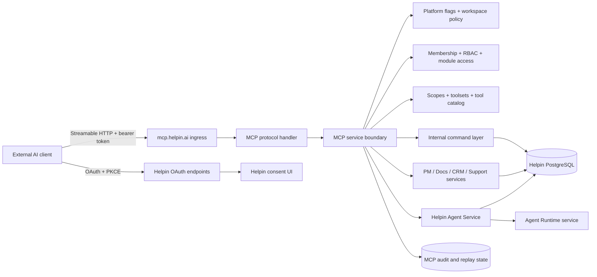
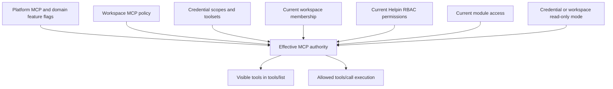
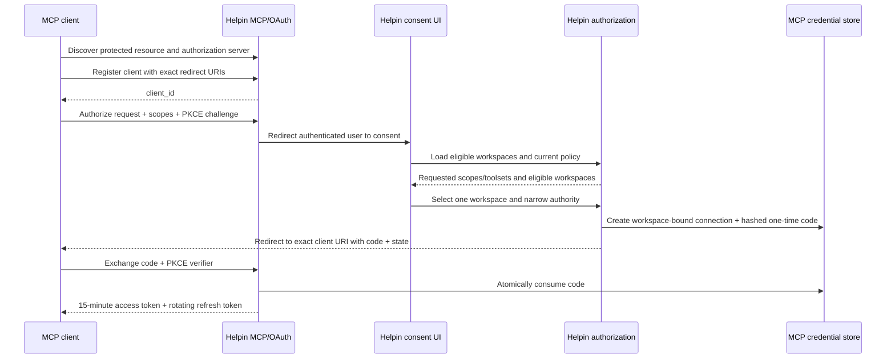
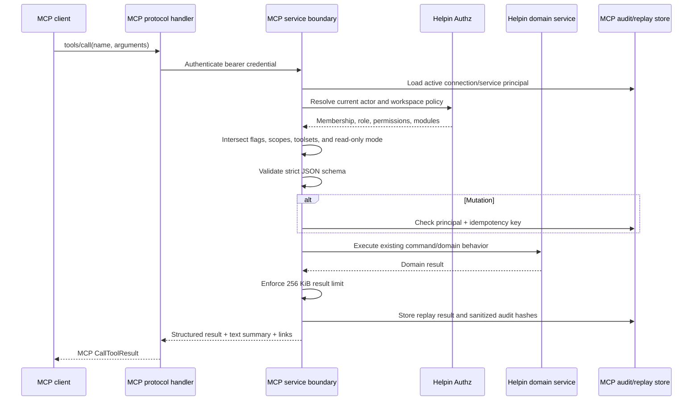
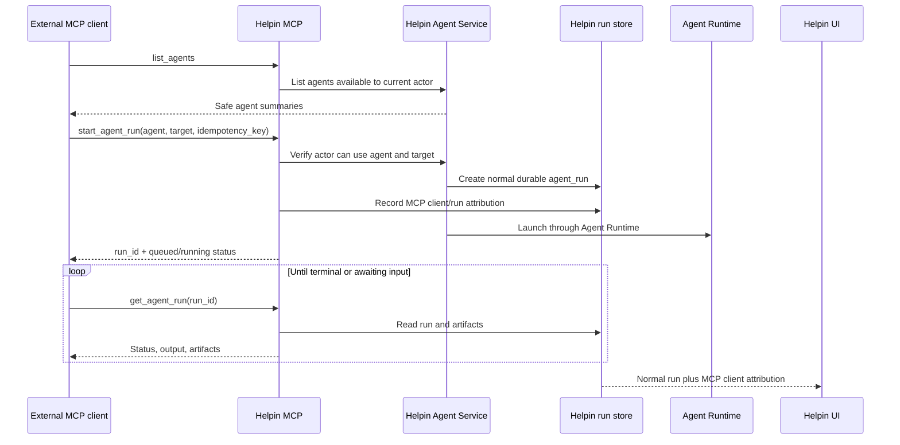
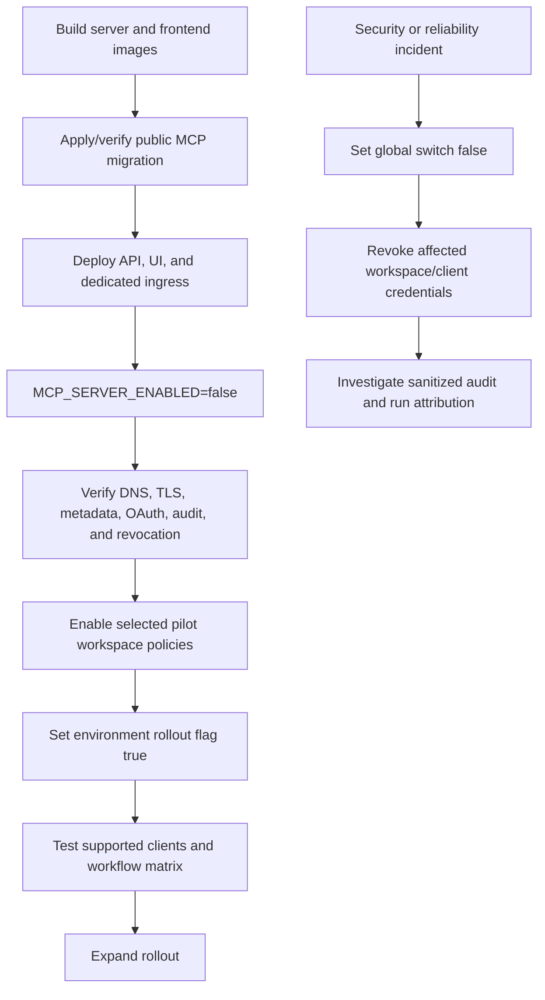

# Connect external clients to Helpin MCP

This guide is for developers connecting external clients to Helpin through the
Model Context Protocol (MCP). It covers authentication, workspace access, tools,
and deployment configuration. Beta availability and enablement are stated below.

**Status:** Implemented for controlled beta. Live enablement on any environment is an operational decision separate from source defaults.

**Helpin Cloud endpoint:** `https://mcp.helpin.ai/mcp`

**Self-hosted installations:** the MCP endpoint is the value of `MCP_PUBLIC_BASE_URL` followed by `/mcp`.

**Protocol transport:** Stateless MCP Streamable HTTP with JSON responses

**Authentication:** OAuth 2.1-style authorization code flow with PKCE, or a restricted Helpin service token

Related documents:

- [Public MCP Server PRD](prds/helpin-public-mcp-server.md)
- [Public MCP Server Implementation Plan](plans/2026-07-10-helpin-public-mcp-server-plan.md)
- [MCP UI PRD](prds/helpin-mcp-ui.md)
- [Public MCP engineering notes](public-mcp-engineering-notes.md)

## 1. What Helpin MCP is

Helpin MCP lets external AI clients work with Helpin through a public, workspace-bound Model Context Protocol server. A user can connect clients such as Codex, Claude, Cursor, VS Code, or another remote MCP client and let them safely read or perform bounded actions in Helpin.

The server exposes Helpin capabilities across:

- workspace context and search
- projects and tasks
- documents
- CRM contacts, deals, and CRM signals
- support conversations and public messages
- Helpin agents and durable agent runs

The MCP server is an authorization and product-execution boundary. It is not a public wrapper around the internal Agent Runtime bridge. Public clients receive their own workspace-scoped identity, scopes, toolsets, policy checks, audit history, and revocation controls.

PM and CRM toolsets require those modules to be enabled; Community enables every module by default.

## 2. What users can accomplish

Typical outcomes include:

- research existing tasks and documents before planning a feature
- create a task, add a comment, or move work through a workflow
- create a document or update a specific document block
- inspect CRM pipeline context and make bounded deal updates
- investigate a support issue without exposing internal notes or sending a reply
- discover Helpin agents such as system and custom agents
- delegate durable work to a Helpin agent and poll its status and artifacts
- review which AI clients have access and revoke them immediately
- create narrowly scoped service credentials for approved headless automation

The server intentionally does not expose broad administrative or customer-visible actions. See [Deliberately excluded capabilities](#16-deliberately-excluded-capabilities).

## 3. Architecture

The hosted MCP transport runs in the Helpin API service, while execution continues to use Helpin's existing domain services, repositories, authorization engine, and durable agent-run system.



### 3.1 Responsibility split

| Component | Responsibility |
| --- | --- |
| Public MCP handler | MCP transport, bearer authentication, Origin checks, request size limits, protocol adaptation, and transport rate limits |
| MCP service boundary | Principal resolution, scopes, toolsets, platform flags, workspace policy, RBAC, module checks, argument validation, idempotency, audit, and bounded outputs |
| Existing command/domain services | Canonical Helpin business behavior and validation |
| Helpin Agent Service | Agent discovery, normal durable run creation, polling, cancellation, artifacts, and MCP attribution |
| Agent Runtime | Executes a run according to the selected agent's configured runtime; it does not authorize the public MCP client |
| MCP settings UI | Setup, policy, connection management, service accounts, activity, and emergency workspace revocation |

## 4. Identity and authorization model

Every MCP credential is bound to exactly one Helpin workspace. A tool call cannot provide or switch `workspace_id`.

Effective authority is the intersection of all of the following:



Authorization is checked when tools are discovered and again immediately before every tool call. Changing a user's role, module access, workspace policy, or connection status affects the next call even if the access token has not expired.

### 4.1 User connections

User connections use OAuth and retain the current Helpin user as the actor. Helpin activity, notifications, validations, and domain permissions therefore behave like other user-driven product actions.

### 4.2 Service accounts

Workspace managers can create a named service principal for approved headless workflows. A service principal has:

- one workspace
- a named owner/actor user
- explicit scopes and toolsets
- read-only or bounded-write mode
- optional expiration
- one or more independently revocable tokens

The raw service token is shown once. Helpin stores only its hash and a safe prefix.

Service principals do not bypass RBAC. The actor user's current workspace membership, permissions, module access, and the current workspace MCP policy are still checked on every call.

## 5. OAuth connection flow

The implementation supports dynamic public-client registration, exact redirect URI matching, authorization code exchange, PKCE S256, rotating refresh tokens, token revocation, and OAuth discovery metadata.



### 5.1 Consent behavior

- The client requests scopes.
- Helpin derives proposed toolsets from those scopes.
- The user selects exactly one eligible workspace.
- The user may remove scopes or toolsets, but cannot add authority that the client did not request.
- Read-only mode is recommended and enabled by default.
- Workspace policy may narrow the grant further or force read-only mode.
- Expanding an existing connection requires a new authorization flow.

### 5.2 Token behavior

| Credential | Lifetime/behavior |
| --- | --- |
| Authorization code | Five minutes, stored hashed, single use, bound to client, exact redirect URI, and PKCE challenge |
| Access token | Signed Helpin JWT, 15 minutes, issuer- and audience-bound, connection and token-version bound |
| Refresh token | Opaque, stored hashed, 30 days, rotated on every use |
| Service token | Opaque `hmp_` credential, stored hashed, optionally expires, independently revocable |

Refresh-token reuse revokes the token family and records a denied security event. Revoking a connection increments its token version, so already-issued access tokens stop working immediately on the next validation.

## 6. Toolsets and scopes

Toolsets control which product-area tools are visible. Scopes control the authority available inside those toolsets.

| Toolset | Read scope | Write/run scope |
| --- | --- | --- |
| `context` | `helpin.context.read` | — |
| `pm` | `helpin.pm.read` | `helpin.pm.write` |
| `docs` | `helpin.docs.read` | `helpin.docs.write`; `helpin.docs.publish` for Help Center publishing |
| `crm` | `helpin.crm.read` | `helpin.crm.write` |
| `support` | `helpin.support.read` | `helpin.support.write` organizes conversations; replies are never sent through MCP |
| `agents` | `helpin.agents.read` | `helpin.agents.run` |

The recommended default grant includes:

- toolsets: `context`, `pm`, `docs`, and `agents`
- scopes: context read, PM read, Docs read, and agent read
- read-only mode

CRM and Support must be explicitly allowed by workspace policy and requested during consent.

`helpin.docs.publish` is a separate, explicit write scope. Enabling Docs writes never adds it automatically, read-only connections never receive it, and a publish tool also requires the member's `docs.publish` permission.

## 7. Complete v1 tool catalog

The fully enabled catalog contains 49 tools; the catalog regression test asserts that count. The tables below list the primary tools by toolset. `tools/list` returns only the subset currently allowed for the principal.

### 7.1 Workspace context and search

| Tool | Mode | What it does | Helpin check |
| --- | --- | --- | --- |
| `get_current_context` | Read | Returns the connected principal, workspace, role, scopes, toolsets, accessible modules, read-only state, and canonical Helpin URL | `PermWorkspaceRead` |
| `search_workspace` | Read | Searches tasks and documents using a bounded query | `PermSearchRead` |
| `list_workspace_teams` | Read | Lists teams available in the connected workspace | `PermWorkspaceRead` |
| `list_repositories` | Read | Lists connected repository metadata without credentials | `PermIntegrationsEnumerate` |

### 7.2 Projects and tasks

| Tool | Mode | What it does | Helpin check |
| --- | --- | --- | --- |
| `list_tasks` | Read | Lists bounded task records | `PermPMRead` + PM module |
| `get_task` | Read | Loads one task by ID and verifies workspace ownership | `PermPMRead` + PM module |
| `get_task_context` | Read | Loads bounded task context; linked Docs/content additionally require Docs read, and Git links require context/integration read | `PermPMRead` + PM module |
| `list_task_checklist` | Read | Lists checklist items for an accessible task | `PermPMRead` + PM module |
| `create_task` | Write | Creates a task through the canonical Helpin command layer | `PermPMEdit` + PM module |
| `create_task_batch` | Write | Creates up to 50 implementation-ready tasks in one accessible epic | `PermPMEdit` + PM module |
| `update_task` | Write | Updates bounded editable task fields without deleting or archiving the task | `PermPMEdit` + PM module |
| `add_task_comment` | Write | Adds a task comment with normal Helpin activity behavior | `PermPMEdit` + PM module |
| `update_task_state` | Write | Moves a task through an allowed workflow transition | `PermPMEdit` + PM module |
| `set_task_dependencies` | Write | Creates validated, cycle-free dependency links between accessible tasks | `PermPMEdit` + PM module |
| `create_task_checklist_item` | Write | Adds a checklist item to an accessible task | `PermPMEdit` + PM module |
| `update_task_checklist_item` | Write | Updates checklist text, completion, or position without deleting the item | `PermPMEdit` + PM module |

### 7.3 Documents

| Tool | Mode | What it does | Helpin check |
| --- | --- | --- | --- |
| `list_spaces` | Read | Lists Docs spaces visible to the connected actor | `PermDocsRead` + Docs module |
| `list_collections` | Read | Lists visible Docs collections, optionally within one space | `PermDocsRead` + Docs module |
| `search_documents` | Read | Searches documents using the existing Helpin document search | `PermDocsRead` + Docs module |
| `list_documents` | Read | Lists bounded document metadata | `PermDocsRead` + Docs module |
| `read_document` | Read | Reads document content through the canonical command contract | `PermDocsRead` + Docs module |
| `get_document_blocks` | Read | Returns addressable document blocks for precise updates | `PermDocsRead` + Docs module |
| `get_document` | Read | Loads one document record and verifies workspace ownership | `PermDocsRead` + Docs module |
| `read_documents` | Read | Summarizes up to 50 documents in one call: status, word count, empty body, Help Center live state, and unpublished changes; inaccessible IDs are returned in `not_found` | `PermDocsRead` + Docs module |
| `create_space` | Write | Creates an internal or external-capable Docs space without publishing content | `PermDocsEdit` + Docs module |
| `create_collection` | Write | Creates a top-level or nested collection in an accessible space | `PermDocsEdit` + Docs module |
| `update_space` | Write | Updates bounded metadata for an accessible Docs space | `PermDocsEdit` + Docs module |
| `update_collection` | Write | Updates or reparents an accessible Docs collection | `PermDocsEdit` + Docs module |
| `create_document` | Write | Creates a document through the existing Helpin domain behavior | `PermDocsEdit` + Docs module |
| `move_document` | Write | Moves an accessible document to a validated space or collection | `PermDocsEdit` + Docs module |
| `link_document_to_object` | Write | Links an accessible document to an accessible Helpin object | `PermDocsEdit` + Docs module |
| `update_document_block` | Write | Updates a specific block using the addressable block contract | `PermDocsEdit` + Docs module |
| `edit_document` | Write | Atomically applies up to 20 edits (replace text, replace or delete a block range, insert before/after) against the version from a read; nothing is applied on conflict | `PermDocsEdit` + Docs module |
| `update_document` | Write | Renames a document or updates its excerpt and tags | `PermDocsEdit` + Docs module |
| `prepare_document_image_upload` | Write | Returns a presigned PUT URL for a PNG, JPEG, WebP, or GIF image (up to 20 MB) attached privately to a document | `PermDocsEdit` + Docs module |
| `complete_document_image_upload` | Write | Confirms the upload only after storage reports an object of the declared size, then returns markdown to insert | `PermDocsEdit` + Docs module |
| `upload_document_image_from_url` | Write | Copies a public HTTPS image (up to 10 MB) into Helpin through the SSRF-safe media client and returns markdown to insert | `PermDocsEdit` + Docs module |

Uploaded images stay private while the document is a draft. Publishing to the Help Center copies referenced images into the public snapshot. Image URLs must be HTTPS. Private, loopback, link-local, and metadata addresses are refused when the address is resolved, and again on each redirect (at most three). File contents must match the declared image type. Upload errors use `UPLOAD_NOT_FOUND`, `UPLOAD_SIZE_MISMATCH`, `UNSUPPORTED_CONTENT_TYPE`, `URL_NOT_PUBLIC`, and `URL_FETCH_FAILED`.
| `archive_document` | Write, destructive | Archives a document; refuses a live Help Center article with `DOC_IS_PUBLISHED` | `PermDocsEdit` + Docs module |
| `restore_document` | Write | Restores an archived document to draft | `PermDocsEdit` + Docs module |
| `publish_document` | Publish | Publishes a document; in an external-capable space it also becomes a live Help Center article using the existing snapshot, slug, and redirect behavior | `helpin.docs.publish` + `PermDocsPublish` + Docs module |
| `unpublish_document` | Publish, destructive | Removes a live Help Center article and returns the document to draft | `helpin.docs.publish` + `PermDocsPublish` + Docs module |

Every document tool that takes a `document_id` also enforces Docs space access, so documents in team-only spaces the member cannot open are reported as not found.

Document lifecycle tools return typed error codes that clients can act on: `DOCUMENT_LOCKED`, `DOCUMENT_ARCHIVED`, `DOCUMENT_NOT_ARCHIVED`, `DOCUMENT_NOT_PUBLISHED`, and `DOC_IS_PUBLISHED`. Errors are returned as `CODE: message`.

### 7.4 CRM

| Tool | Mode | What it does | Helpin check |
| --- | --- | --- | --- |
| `list_contacts` | Read | Lists a bounded, minimized set of CRM contacts | `PermCRMRead` + CRM module |
| `get_crm_contact` | Read | Loads one CRM contact and verifies workspace ownership | `PermCRMRead` + CRM module |
| `list_deals` | Read | Lists a bounded set of deals with core pipeline context | `PermCRMRead` + CRM module |
| `get_crm_deal` | Read | Loads one CRM deal and verifies workspace ownership | `PermCRMRead` + CRM module |
| `list_crm_signals` | Read | Lists CRM signals with their existing Helpin provenance | `PermCRMRead` + CRM module |
| `add_deal_note` | Write | Adds a note to a deal through the canonical CRM command | `PermCRMEdit` + CRM module |
| `update_deal_stage` | Write | Updates a deal stage using existing pipeline validation | `PermCRMEdit` + CRM module |

### 7.5 Support

| Tool | Mode | What it does | Helpin check |
| --- | --- | --- | --- |
| `list_support_conversations` | Read | Lists conversations with optional status and text filters | `PermSupportRead` + Support module |
| `get_support_conversation` | Read | Loads one conversation inside the connected workspace | `PermSupportRead` + Support module |
| `list_conversation_messages` | Read | Lists public conversation messages; internal notes are excluded | `PermSupportRead` + Support module |

### 7.6 Agents and durable work

| Tool | Mode | What it does | Helpin check |
| --- | --- | --- | --- |
| `list_agents` | Read | Lists system and custom agents the actor may use, without provider credentials or private runtime configuration | `PermPMRead` |
| `start_agent_run` | Async write | Starts one normal durable Helpin agent run for an explicit target. It never attaches to another user's private dock chat run; if one would be reused it returns `RUN_NOT_OWNED` | `PermPMEdit` |
| `get_agent_run` | Read | Polls status, output summary, artifacts, and run information. Other users' dock chat runs are reported as not found | `PermPMRead` |
| `cancel_agent_run` | Destructive write | Requests cancellation of an active run | `PermPMEdit` |

Allowed run targets are:

- `workspace`
- `task`
- `epic`
- `document`
- `crm_deal`
- `crm_contact`
- `support_conversation`

### 7.7 Parity tools (Linear and Plane)

These tools expose existing Helpin commands that in-app agents already use, with the same toolset, scope, RBAC, and module checks as every other public tool.

| Area | Read tools | Write tools |
| --- | --- | --- |
| Tasks | `list_task_comments` (authors by ID and name only) | `archive_task`, `restore_task` |
| Epics | `list_epics`, `get_epic` | `update_epic` |
| Sprints | `list_sprints`, `get_sprint`, `list_sprint_tasks` | `create_sprint`, `update_sprint` |
| Objectives | `list_objectives`, `get_objective` | `create_objective`, `update_objective`, `update_key_result` |
| Labels and workflows | `list_pm_labels`, `list_team_workflows_with_stages` | `ensure_task_label` |
| Members | `list_workspace_members` (`workspace.members.read`) | — |
| CRM | `get_crm_company`, `list_crm_companies`, `list_crm_pipelines`, `list_crm_associations` | `add_crm_activity`, `update_crm_contact`, `update_crm_company`, `update_crm_deal`, `link_crm_objects`, `unlink_crm_association`, `set_primary_contact_company` |
| Support | `list_support_inboxes`, `list_support_tags`, `list_support_assignees` | `assign_support_conversation`, `move_support_conversation`, `add_support_conversation_tag`, `remove_support_conversation_tag`, `link_support_conversation_task`, `link_support_conversation_contact`, `update_support_conversation_subject` (`helpin.support.write` + `support.edit`) |

Not exposed: sending support replies, CRM enrichment, and deleting records.

### 7.8 Help Center operations

| Tool | Mode | What it does | Helpin check |
| --- | --- | --- | --- |
| `get_help_center_article` | Read | Live state, live slug, unpublished changes, social preview metadata, and reader feedback (helpful, not helpful, views) | `PermDocsRead` + Docs module |
| `update_help_center_article_metadata` | Publish | Sets social preview title, description, HTTPS image, and alt text; omitted fields are kept and `null` clears | `helpin.docs.publish` + `PermDocsEdit` |
| `list_help_center_redirects` | Read | Lists redirects with search and pagination | `PermDocsAdmin` |
| `create_help_center_redirect` | Publish | Redirects an old public path to a collection or article after merges or archives | `helpin.docs.publish` + `PermDocsAdmin` |

## 8. Tool-call execution flow

Every call repeats the full authorization decision. Tool annotations such as read-only, destructive, or idempotent are client hints and are never treated as authorization.



### 8.1 Strict inputs

- Every tool publishes a JSON Schema.
- Unknown properties are rejected for the new public facades.
- The client cannot pass a workspace override.
- String lengths and list limits are bounded where applicable.
- Tool execution has a 30-second synchronous deadline.

### 8.2 Structured outputs

Every successful result uses a stable envelope:

```json
{
  "summary": "Human-readable result",
  "data": {},
  "links": {
    "workspace": "https://app.helpin.ai/..."
  }
}
```

The MCP response provides both structured content and a text summary for clients with different rendering capabilities.

### 8.3 Idempotent mutations

Every public tool mutation requires an `idempotency_key` between 8 and 128 characters. The key is scoped to the connection or service principal.

Helpin stores:

- the principal key
- the idempotency key
- the tool name
- a request hash
- the bounded result
- a 24-hour expiration

Retrying the same mutation with the same key and request returns the stored result. Reusing the key with a different tool or request returns a conflict instead of performing another write.

## 9. Agent Runtime delegation

MCP does not create a parallel agent system. `start_agent_run` creates a normal Helpin `agent_run`. The selected agent's saved configuration is applied; the run is executed by Agent Runtime.



MCP-started runs appear in the existing Agent Runs UI with an `MCP · <client>` badge. They retain normal Helpin run state, artifacts, approvals, interactions, billing checks, and runtime behavior.

V1 completion is polling-based. External completion webhooks and persistent MCP notifications are not required or implemented. Clients poll `get_agent_run` and receive normal Helpin run links for inspection.

## 10. MCP resources

Resources provide addressable read access using the same tool authorization and execution boundary.

| Resource | Backing behavior |
| --- | --- |
| `helpin://workspace/current-context` | Current connected Helpin context |
| `helpin://tasks/{task_id}` | `get_task` |
| `helpin://documents/{document_id}` | `get_document` |
| `helpin://crm/deals/{deal_id}` | `get_crm_deal` |
| `helpin://support/conversations/{conversation_id}` | `get_support_conversation` |
| `helpin://agent-runs/{run_id}` | `get_agent_run` |

A resource or resource template is registered only when its backing tool is visible to the current principal.

## 11. MCP prompts and client Skills

The server exposes six workflow prompts:

| Prompt | Outcome |
| --- | --- |
| `plan_feature` | Research related Helpin work, draft a feature plan, and create approved documents/tasks |
| `prepare_release` | Review release evidence, blockers, docs gaps, and durable agent work without deploying |
| `delegate_to_helpin_agent` | Select an agent, start one durable run, poll it, and report artifacts |
| `triage_customer_issue` | Investigate a support issue and prepare product follow-up without sending a reply |
| `docs_maintenance` | Find stale documentation and make narrow, safe block-level updates; publish or archive only on explicit request |
| `review_pipeline` | Review CRM pipeline evidence and make only explicitly confirmed bounded writes |

Prompts are registered only when the required underlying tool is visible.

The repository also includes a portable client package at `integrations/helpin-mcp/`:

- six Markdown workflow prompt sources
- six Codex-compatible Skills
- per-Skill `agents/openai.yaml` metadata declaring the Helpin MCP dependency
- a manifest describing transport, authentication, prompts, Skills, and excluded actions
- no embedded credentials

The bundled Skills are:

- `helpin-feature-to-delivery`
- `helpin-release-readiness`
- `helpin-delegate-agent`
- `helpin-support-to-product`
- `helpin-docs-maintenance`
- `helpin-crm-pipeline-review`

## 12. Helpin UI

Workspace members with `workspace.read` can open **Settings → AI Clients**.

### 12.1 Setup

- shows the hosted MCP URL
- provides copyable JSON client configuration
- explains the OAuth connection steps
- shows effective workspace status, default mode, and allowed toolsets
- distinguishes workspace enablement from the platform rollout switch

### 12.2 Connections

- lists the user's connections, or all workspace connections for managers
- shows client name, connected time, toolsets, read-only/write mode, last use, and status
- allows immediate revocation
- provides a manager-only **Revoke all** action

The workspace-wide action revokes:

- all active user connections
- all refresh-token families
- all active service principals
- all service tokens

### 12.3 Service accounts

Managers can:

- create a named, scoped service principal
- choose scopes, toolsets, and read-only mode
- set an optional expiration
- rotate tokens
- revoke a token or the complete service principal
- copy a new secret from a one-time display

### 12.4 Activity

Authorized settings readers can review recent sanitized activity, including:

- connection authorization and revocation
- token issuance, refresh, reuse denial, and revocation
- successful, denied, and failed tool calls
- rate-limit denials
- policy changes
- service-principal creation
- workspace-wide revocation

### 12.5 Workspace policy

Managers can configure:

- whether MCP is enabled for the workspace
- whether all connections are forced read-only
- whether service accounts are allowed
- allowed toolsets
- allowed scopes

## 13. Security and privacy controls

### 13.1 Workspace isolation

- Workspace identity is established at consent or service-principal creation.
- Tool inputs do not accept `workspace_id`.
- Direct entity reads verify workspace ownership.
- Existing repositories and domain services continue to apply their normal isolation and validation.
- Authorization is re-evaluated for both tool discovery and execution.

### 13.2 Credential security

- OAuth codes, refresh tokens, and service tokens are stored hashed.
- Access tokens are issuer- and resource-audience-bound.
- Redirect URIs must match a registered URI exactly.
- HTTPS is required except for OAuth loopback clients.
- PKCE S256 and state are required.
- Refresh tokens rotate and reuse revokes the family.
- Connection revocation invalidates current access tokens through token-version checks.
- Raw credentials are never returned by list APIs or written to audit events.

### 13.3 Data minimization

- Support message reads exclude internal notes.
- Agent discovery omits provider credentials and private runtime configuration.
- Repository discovery returns metadata, not repository credentials.
- Audit events store request/result hashes rather than raw tool inputs and outputs.
- Results are capped at 256 KiB and list endpoints are bounded.

### 13.4 Request protection

- Request bodies are capped at 1 MiB.
- Browser Origin values must match the Helpin app, issuer, or MCP resource origin.
- Tools use strict schemas.
- Tool calls have a 30-second synchronous timeout.
- Mutations require replay protection.
- Tool annotations never grant access.

## 14. Rate and concurrency limits

The beta implementation applies the following starting limits:

| Limit | Default |
| --- | --- |
| General requests per connection/service principal | 60 per minute |
| General requests per workspace | 180 per minute |
| Workspace searches per connection/service principal | 20 per minute |
| Mutating calls per connection/service principal | 20 per minute |
| Agent-run starts per user | 10 per hour |
| Concurrent MCP-started runs per user | 3 |
| Concurrent MCP-started runs per workspace | 10 |
| Synchronous tool deadline | 30 seconds |
| Maximum structured result | 256 KiB |
| Maximum HTTP request body | 1 MiB |

General and tool-class limits are enforced at the MCP transport. Hourly and active agent-run safety limits are also checked against persisted Helpin audit/run data so they apply across connections and instances.

## 15. Audit, retention, and deletion

MCP audit records contain security metadata rather than raw business payloads:

- workspace and principal references
- client name
- event and tool name
- outcome and reason code
- request and result hashes
- duration
- timestamp

Retention defaults are:

- successful audit events: 90 days
- denied and error events: 365 days
- idempotency results: 24 hours
- expired authorization-code records: cleaned after expiration plus a short operational window
- expired refresh-token records: cleaned after the retention window

Workspace policies, connections, service principals, audit events, and run attribution use workspace foreign keys with deletion behavior defined in the migration. Authorization codes and refresh tokens cascade through their connection, and service tokens cascade through their service principal. Idempotency records are deliberately short-lived string-keyed replay records rather than workspace business data; they expire after 24 hours and are removed by cleanup.

## 16. Deliberately excluded capabilities

The public v1 server does not expose:

- deleting Helpin records
- sending customer support replies
- creating a public support reply draft through the run-scoped internal draft contract
- changing support conversation status (assignment, inbox moves, tags, links, and subject are available with `helpin.support.write`)
- deleting documentation (archive and restore are available)
- publishing without the explicit `helpin.docs.publish` scope and `docs.publish` permission
- broad document-content replacement through `write_document_content` (use version-checked `edit_document` instead)
- applying unapproved document change proposals
- sending CRM email
- CRM enrichment, merge, or bulk mutation
- member, role, workspace-security, or billing administration
- integration installation or credential management
- raw Git, GitHub, storage, OAuth, or provider credentials
- local shell, filesystem, or unrestricted repository tools
- deployment actions
- external completion webhooks

These exclusions are server-enforced by the curated catalog. They are not prompt-only instructions.

## 17. Client setup

Use the hosted URL in a remote MCP client:

```json
{
  "mcpServers": {
    "helpin": {
      "url": "https://mcp.helpin.ai/mcp"
    }
  }
}
```

For an individual user:

1. Add the Helpin MCP URL to the client.
2. Start the client's OAuth connection flow.
3. Sign in to Helpin.
4. Select one workspace.
5. Remove scopes/toolsets the client does not need.
6. Keep read-only mode unless bounded writes or agent runs are required.
7. Approve the connection.

For headless automation:

1. A workspace manager enables service accounts in MCP policy.
2. Create a named service principal in **Settings → AI Clients → Service accounts**.
3. Select the smallest required scopes and toolsets.
4. Set an expiration when practical.
5. Copy the token from the one-time secret dialog.
6. Store it in the automation's secret manager.
7. Revoke or rotate it from Helpin when ownership or use changes.

## 18. Public endpoints

| Endpoint | Purpose |
| --- | --- |
| `GET /.well-known/oauth-authorization-server` | OAuth authorization-server metadata |
| `GET /.well-known/oauth-protected-resource` | MCP protected-resource metadata |
| `/mcp` | Authenticated Streamable HTTP MCP endpoint |
| `POST /api/mcp/oauth/register` | Dynamic public-client registration |
| `GET /api/mcp/oauth/authorize` | Redirect into the authenticated Helpin consent UI |
| `POST /api/mcp/oauth/token` | Authorization-code and refresh-token grants |
| `POST /api/mcp/oauth/revoke` | OAuth token revocation |

The normal authenticated Helpin API also provides consent-model and workspace-management routes for the UI. Those routes use Helpin session authentication, workspace middleware, and settings permissions rather than MCP bearer credentials.

## 19. Platform configuration and rollout gates

| Environment variable | Purpose |
| --- | --- |
| `MCP_PUBLIC_BASE_URL` | Public origin used for MCP and OAuth metadata |
| `MCP_SERVER_ENABLED` | Global emergency and rollout switch |
| `MCP_OAUTH_ENABLED` | Enables OAuth registration, consent, code exchange, and refresh |
| `MCP_SERVICE_TOKENS_ENABLED` | Enables restricted service-principal credentials |
| `MCP_PM_WRITE_ENABLED` | Enables public PM mutations |
| `MCP_DOCS_WRITE_ENABLED` | Enables public Docs mutations |
| `MCP_AGENT_RUN_ENABLED` | Enables starting and cancelling agent runs |
| `MCP_CRM_ENABLED` | Enables CRM discovery and execution |
| `MCP_SUPPORT_ENABLED` | Enables Support discovery and execution |

Deployment manifests for Helpin Cloud set `MCP_SERVER_ENABLED` explicitly. The public MCP flags also default to true when unset in [configuration](../server/internal/config/config.go). Explicit Kubernetes environment values take precedence over `envFrom`/Doppler values. These are source defaults and desired configuration, not evidence of live deployment state.

The global switch stops OAuth issuance and MCP execution while leaving authenticated Helpin settings and revocation controls available.

## 20. Deployment flow

The following is a controlled-rollout procedure for a new environment, not a
record of the current staging or production rollout.



Before enabling an environment:

- apply and validate `202607100003_public_mcp.sql`
- verify `mcp.<environment>` DNS and TLS
- verify OAuth metadata uses the public MCP origin
- confirm the global and domain feature flags
- exercise cross-workspace and IDOR tests
- verify revoke latency with already-issued access and refresh tokens
- test tools, resources, prompts, and polling in supported clients
- confirm audit cleanup and incident procedures
- enable only approved pilot workspaces

## 21. Implementation map

| Area | Primary implementation |
| --- | --- |
| Protocol server, resources, prompts, and transport limits | `server/internal/mcpserver/server.go` |
| Public catalog, scopes, toolsets, and annotations | `server/internal/service/mcp_catalog.go` |
| OAuth, PKCE, refresh rotation, discovery, and revocation | `server/internal/service/mcp_oauth.go` |
| Principal, policy, service-account, and authorization boundary | `server/internal/service/mcp_service.go` |
| Tool execution, schemas, idempotency, results, and agent delegation | `server/internal/service/mcp_tools.go` |
| Persistent policy, tokens, audit, replay, limits, and attribution | `server/internal/repository/mcp.go` |
| HTTP OAuth and management adapters | `server/internal/handler/mcp.go` |
| Routes and dependency wiring | `server/internal/router/router.go`, `server/cmd/api/main.go` |
| Database schema | `server/internal/dbmigrate/sql/202607100003_public_mcp.sql` |
| Settings UI | `frontend/src/pages/settings/MCPSettingsPage.tsx` |
| OAuth consent UI | `frontend/src/pages/oauth/MCPAuthorizePage.tsx` |
| Client workflow package | `integrations/helpin-mcp/` |

## 22. Validation coverage

The implementation includes automated checks for:

- issuer- and audience-bound MCP access tokens
- single-use authorization codes
- atomic refresh-token rotation
- PKCE S256 verification
- strict tool schemas and rejection of workspace-override properties
- workspace-policy scope/toolset narrowing and forced read-only behavior
- platform domain flags
- the 104-tool catalog, including parity tools for epics, sprints, objectives, labels, workflows, members, CRM, and support organization
- document image uploads: presigned upload with storage verification, and SSRF-safe copy from a public URL
- document lifecycle tools: publish, unpublish, archive, restore, and rename, including typed error codes
- exclusion of deferred destructive, support-draft, and customer-send actions
- agent-run privacy: runs started outside a dock chat never reuse a chat's run, and `get_agent_run` / `cancel_agent_run` hide other users' dock chat runs
- persisted agent-start and active-run safety counts
- MCP tool annotations and structured output schemas
- general and tool-class rate limits
- settings navigation visibility and permissions
- Go API and migration builds
- TypeScript and production frontend builds
- client Skill package validation

Client interoperability, OAuth conformance, penetration testing, DNS/TLS validation, and failure drills remain environment release checks rather than claims made by unit tests.

## 23. Current beta constraints

- General/search/write transport rate counters are process-local; persisted hourly and concurrent checks protect agent starts across instances. A distributed limiter is a future scale hardening step.
- V1 uses polling for durable run completion and does not provide external webhooks, persistent MCP notifications, or native MCP Tasks.
- Some reused command-backed list tools provide bounded projections rather than a uniform cursor contract across every product area.
- The MCP service shares the Helpin API process, although its dedicated hostname and ingress provide a separate public routing and operational boundary.
- Marketplace submission, one-click client installation, percentage rollouts, client denylists, and dedicated operational dashboards remain rollout/GA work.

## 24. Current completion boundary

The repository contains the complete controlled-beta implementation:

- protocol transport and discovery
- user OAuth and service credentials
- workspace-bound authorization
- 49-tool curated catalog
- resources and prompts
- six client Skills
- safe mutation replay
- rate and concurrency controls
- audit and retention
- Agent Runtime delegation through normal Helpin runs
- setup, consent, policy, activity, credential, and revocation UI
- migration and dedicated ingress configuration

The service is not live merely because the code is deployed. Environment enablement, DNS/TLS verification, migration application, client compatibility testing, security review, and workspace rollout approval remain operational release gates.
