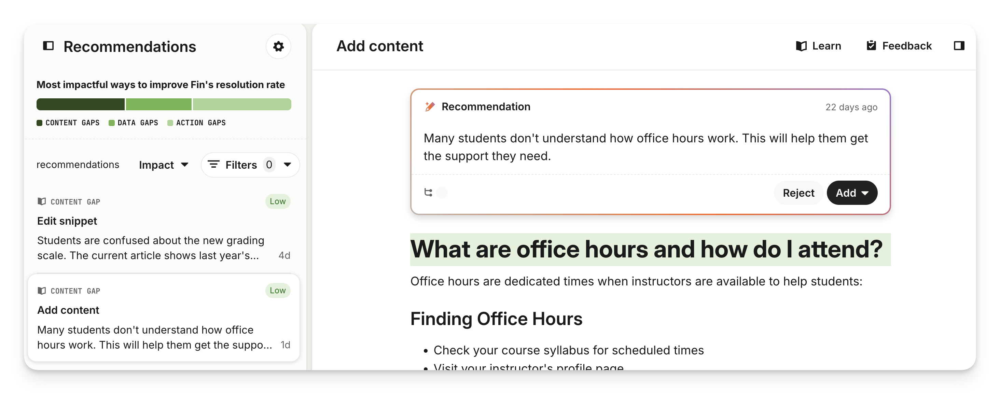
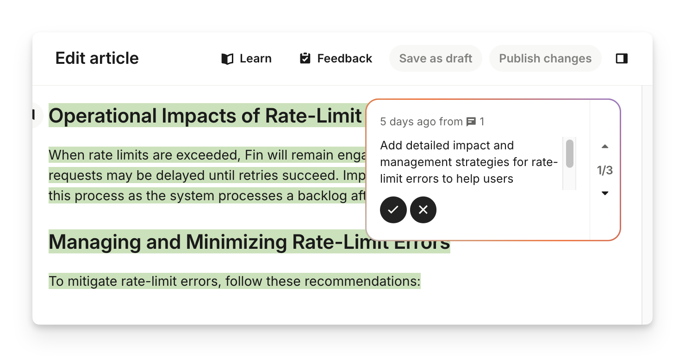
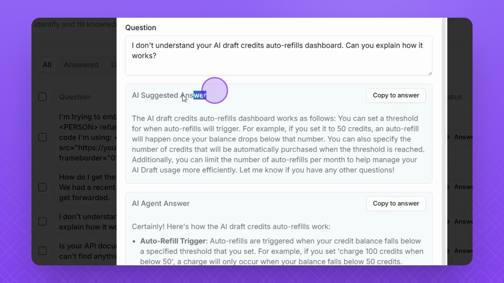
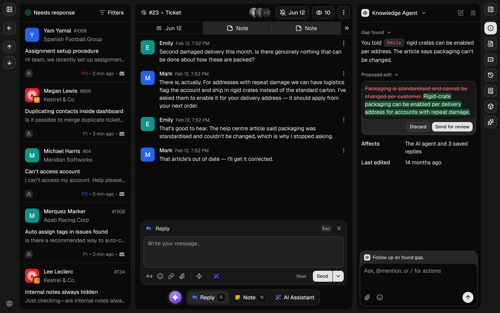
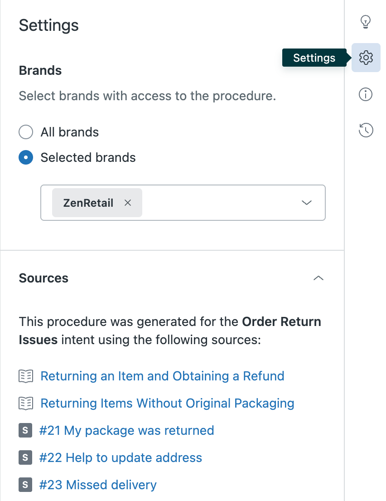

# Coverage gaps: screenshot research and conversational UX

This note helps Helpin product and engineering simplify coverage-gap resolution. It records observations from competitor screenshots, explains the original Helpin friction, and documents the implemented flow: an assistant explains a gap, asks only for missing information, and prepares a fix for review.

**Reviewed:** September 30, 2026, against `waqar-fixes` at `43f18da46`.
**Status:** Implemented in the existing `waqar-fixes` worktree on October 1, 2026; not deployed. Waqar approved the guided assistant direction and implementation. The design discussion records the research; the implementation section below identifies delivered behavior and validation limits.

## Main finding

An opened gap should immediately answer three questions: **What is missing? Why does it matter? What should I do next?** The useful unit of work is a specific customer need and a proposed resolution. Classification, generation methods, and record administration should support that work without becoming the opening experience.

The strongest observed pattern is a short explanation next to a reviewable change, with sources accessible on demand. Our recommendation is to combine that clarity with genuine conversation: let the assistant investigate, ask a focused question when necessary, and bring the user back to a concrete proposal.

## What was actually inspected

The images below were downloaded from the vendors' public documentation or product pages and visually inspected. They are reference images, not screenshots of sessions in authenticated competitor accounts. Documentation screenshots can depict earlier product versions. The Helply Knowledge Agent image is a **marketing UI illustration**, so it demonstrates a layout idea without establishing that the depicted behavior has shipped. Zendesk's procedure workflow is adjacent to coverage-gap resolution rather than an equivalent gap product.

Helpin's original interaction was reviewed in source code at the commit above. The improved interaction was subsequently run and visually inspected with realistic browser fixtures. Those screenshots verify the rendered interface, not production data or a live model session.

### Intercom: recommendation, edit review, and placement

Source: [Intercom content recommendations](https://www.intercom.com/help/en/articles/11394959-use-ai-powered-content-recommendations-to-improve-fin).

| Inspected screenshot | What is visible | Implication for Helpin — our design judgment |
| --- | --- | --- |
| [Recommendation and preview](assets/coverage-gaps-ux/intercom-recommendation.png) | The queue stays visible beside a brief rationale, a dominant action, and the proposed content. | Give the opened gap one leading action and let users inspect its output without losing their place. |
| [Review edits in context](assets/coverage-gaps-ux/intercom-edit-review.png) | Additions are highlighted within the article; a nearby review control steps through individual suggestions. | Show the changed passage and its reason together. Reviewing a small edit should not require rereading the whole article. |
| [Choose content placement](assets/coverage-gaps-ux/intercom-placement.png) | Creation and insertion destinations sit under the main action's dropdown. | Recommend the destination first; expose alternatives when users review where the change belongs. |

The documented workflow also exposes contributing conversations in a separate drawer. It distinguishes content, customer data, and action problems. Intercom explicitly says it removed vague investigation recommendations because they were hard to act on. [Intercom's recommendations overview](https://www.intercom.com/help/en/articles/11390088-optimize-fin-instantly-with-the-help-of-ai).

**Takeaway:** Adopt the relationship between reason, proposed change, and source. Use Helpin's quieter typography and dividers for the presentation. The screenshots alone do not establish keyboard behavior, mobile quality, or a conversational resolution flow.





### Helply: questions and reusable answers

Source: [Helply Gap Finder guide](https://help.helply.com/doc/830-gapfinder).

| Inspected screenshot | What is visible | Implication for Helpin — our design judgment |
| --- | --- | --- |
| [Answer comparison](assets/coverage-gaps-ux/helply-answer-comparison.jpg) | A customer question anchors the drawer. Two lengthy candidate answers follow, each with a copy control. | Customer language makes the need recognizable. Stacking full alternative answers creates comparison work; present one recommended answer first. |
| [Answer editor](assets/coverage-gaps-ux/helply-answer-editor.jpg) | A candidate response appears above the editable answer, creating an explicit copy-and-edit step. | Make the proposed change editable in its review surface. Keep useful comparisons available without requiring manual copying. |

The guide describes reviewing answers learned from help-desk history, editing them, and saving training material. Its completion percentage counts answered gaps; this does not itself demonstrate improved future customer outcomes.



### Helply Knowledge Agent: compact discrepancy and proposal

Source: [Helply Knowledge Agent product page](https://helply.com/agents/knowledge). **Marketing illustration, not verified shipped UI.**

The illustration places the support conversation beside a concise discrepancy, a proposed text replacement, and a review action. A follow-up composer stays in the same side panel. [Inspected illustration](assets/coverage-gaps-ux/helply-knowledge-agent-illustration.png).

**Takeaway:** This is the closest visual reference for the direction Waqar selected. A user can understand the disagreement, inspect the fix, and ask a follow-up in one context. Our adaptation should keep the gap's resolution prominent and reveal full customer conversations when requested.



### Zendesk: a clear review task with inspectable provenance

Source: [Zendesk AI-generated procedure review](https://support.zendesk.com/hc/en-us/articles/10140109521178-Reviewing-and-publishing-AI-generated-procedures-for-auto-assist).

| Inspected screenshot | What is visible | Implication for Helpin — our design judgment |
| --- | --- | --- |
| [Procedure recommendation](assets/coverage-gaps-ux/zendesk-procedure-recommendation.png) | A side drawer offers named drafts to review, a related-ticket count, and the sample's date range. | Name the deliverable and make the impact's scope explicit. |
| [Procedure editor](assets/coverage-gaps-ux/zendesk-procedure-editor.png) | The draft is editable and visibly identified as AI-generated. | Keep human correction direct; clearly distinguish a proposed change from approved content. |
| [Procedure sources](assets/coverage-gaps-ux/zendesk-procedure-sources.png) | A separate settings surface lists the knowledge articles and tickets behind the draft. | Keep sources inspectable without crowding the work. A direct source link in the gap should make them easier to discover. |

**Takeaway:** A concrete review task is easier to understand than a generic recommendation. Preserve provenance and a visible draft state. Our flow should also preserve continuity between the gap, its proposal, and the resulting document.



### Additional product lesson: separate fixable knowledge from other needs

Pylon describes categorizing escalations by cause, generating short articles from resolved work, and checking them on held-out issues. Its account also distinguishes feature requests and cases requiring privileged action from knowledge problems. These are vendor-reported practices and outcomes, not independently verified results. [Pylon's escalation analysis](https://www.usepylon.com/blog/categorize-what-your-ai-cant-do).

**Our implication:** The assistant needs to choose the right kind of intervention before drafting. A policy decision, integration, bug, and expected human handoff need different outcomes. Historical examples help check a proposal, but improvement should ultimately be assessed on subsequent eligible conversations.

## Why the original Helpin gap was difficult to use

The [gap detail component](../../frontend/src/components/support/coverage/GapDetailPane.tsx) exposes useful information, but combines understanding, investigation, document generation, evidence review, merge administration, and closure in one long surface.

| Current behavior in this branch | Friction | Proposed treatment |
| --- | --- | --- |
| Diagnosis, suggested action, resolution seed, explanation, and recommendations appear separately. | Users must reconcile several versions of the same story. | Synthesize one explanation of the specific missing capability and one recommended next step. |
| Quill and quick-draft paths are both offered. | Users must understand generation machinery before working on the gap. | Present an outcome such as preparing an update. Let the system choose the appropriate path; retain an alternative method under more options if still needed. |
| Starting Quill returns a success toast in the [coverage page](../../frontend/src/pages/support/coverage/SupportCoveragePage.tsx). | This handler supplies no gap-local conversation or progress surface. | Bind a resumable assistant session and its proposal to the gap. Show progress and results where the user started. |
| Similar-gap merge controls interrupt the resolution content. | Housekeeping competes with fixing the customer problem. | Reveal grouping controls separately unless a mixed cluster prevents a reliable fix. |
| Evidence and draft previews have their own bounded scroll regions inside a scrolling sheet. | Users must manage several reading contexts. | Use one main reading area; open detailed evidence intentionally. |
| Generic labels include Review Add and Mark Done. | The effect and meaning of completion are unclear. | Name the outcome: Review changes, Save draft, Publish update, or Close gap. |
| Confidence, impact, customer totals, evidence totals, and dates are shown together. | Metadata obscures the need and decision. | Show a compact count and period; surface uncertainty as a concrete missing fact. Put supporting metadata behind details. |

There is a data-label issue to address alongside the UX. In the [repository](../../server/internal/repository/support_coverage.go), `evidence_all` counts evidence records, while `evidence_30d` counts distinct conversations plus non-conversation evidence identities. The drawer labels the all-time record total as conversations, and the list labels the mixed recent total as records. These units are not interchangeable. Customer-count fallbacks can also mix periods. Define explicit conversation, customer, and signal counts before using them in explanatory copy.

The [diagnosis helper](../../frontend/src/components/support/coverage/coverageUi.ts) also maps policy gaps to inability to perform an action. Unclear policy needs its own explanation and a specific decision request.

Current code already includes durable documentation-agent outcome handling and recurrence flags. This proposal should build on those capabilities; the historical June strategy document is not an accurate inventory of today's missing functionality. [Current outcome handling](../../server/internal/service/support_coverage.go).

## Approaches considered

| Approach | Benefit | Tradeoff |
| --- | --- | --- |
| **Guided assistant with reviewable proposals — recommended and selected direction** | Explains the need, investigates with context, asks focused questions, and prepares a concrete result. | Requires persistent conversation, proposal, and run states to work as one experience. |
| Compact summary with optional chat | Faster to deliver; supports users who only want to review an already-prepared change. | Resolution can remain fragmented if the chat becomes an extra destination. |
| Free-form chat as the whole gap | Flexible exploration. | Users must invent prompts, important decisions can disappear in the history, and progress is hard to scan. |

The recommended assistant should retain direct review and editing. Users can review a ready proposal immediately and can type a correction at any point. Conversation is useful when it removes uncertainty or helps refine the result; it should not impose extra turns on an obvious fix.

## Proposed opened-gap experience

### The opening screen

Keep the current gap opening behavior and list context. On desktop, use a quiet detail sheet with readable content width; on narrow screens, use the available width and a clear return action. Show the specific customer need as the title, one state, and a compact impact line with an explicit period. Avoid a row of decorative badges.

The assistant's first message supplies the missing story in roughly three short sentences:

1. What customers needed and what stopped a reliable answer.
2. What the available source evidence establishes, including uncertainty.
3. What the assistant recommends changing and where it belongs.

Show a direct source link and one relevant next action. Do not repeat this explanation in a separate summary, recommendation card, and opening chat message. If an existing proposal is ready, the action should lead directly to review. Merely opening a gap should not start a new investigation or regenerate a completed proposal.

**Fictional example for copy and layout discussion; counts and policy are illustrative:**

```text
Switching from annual to monthly billing                         Open
12 conversations · 8 customers · last 30 days

Quill
Customers asked when a switch to monthly billing takes effect.
Your billing article does not explain the timing. Three resolved
conversations say it begins at renewal.

I suggest adding a short explanation to Changing your billing plan.

View sources                                      Prepare update

Tell Quill what to change…
```

This makes the initial task specific. A real opening message must be grounded in the actual sources and their customer or plan scope; it cannot promote an isolated human reply into universal policy.

### The conversation

The assistant knows the selected gap, its evidence, nearby knowledge, recommendations, and existing work. It should not ask users to restate that context or begin with a generic offer of help.

When information is missing, ask one question that changes the proposed fix. For example: “The replies disagree on whether the change starts immediately or at renewal. Which rule applies to annual customers?” Offer succinct choices when the decision has clear alternatives, with free text always available. Explain disagreement visibly; a confidence badge cannot substitute for the question.

Use a preparation action to begin new work and outcome-oriented progress such as checking the billing article or preparing a proposed paragraph. Keep tool calls and execution logs behind activity disclosure. Users can leave and return to the same session, pending question, and proposal. A run already in progress should show its current state rather than offer another start button.

When ready, the assistant presents a proposal with the target, scope, and review action. Refinements update that proposal in place. Older versions remain inspectable but do not create a growing stack of competing drafts.

### The review

Existing content changes need an editable comparison of the affected passage, with enough surrounding text to understand placement. New content needs a concise editable draft. Handoffs need a concrete brief with the required data or action, impacted customer need, proposed owner, and evidence.

Before applying a change, show where it will go, who can see it, and whether the action saves a draft or publishes. Destination changes belong here, with a useful default. If the user returns from the document editor, preserve the gap and proposal context. A source document edited since proposal creation requires an updated comparison before applying the stale proposal.

Keep consequential controls explicit. An approval in chat should resolve to the particular visible proposal and version. Publishing, creating a draft, and accepting a recommendation are distinct effects.

### Different gaps require different next steps

| Finding | Assistant prepares | Main action once ready |
| --- | --- | --- |
| Missing reusable answer | A short answer or article in a recommended destination | Review draft |
| Incomplete existing article | A focused addition to the relevant passage | Review changes |
| Contradictory or outdated guidance | An identified discrepancy and replacement, after needed facts are confirmed | Confirm rule or review changes |
| Relevant content exists but was not retrieved | A specific source-availability, audience, or retrieval diagnosis and proposed adjustment | Review the proposed adjustment |
| Customer or account data is unavailable | A data-access brief describing the lookup needed and temporary handoff | Review data requirement |
| AI cannot perform the required action | An action/workflow requirement with dependencies and appropriate owner | Review action requirement |
| Policy is unclear | A precise decision question followed by reusable guidance | Confirm policy |
| Expected escalation, bug, or feature request | A reasoned disposition and appropriate linked work when needed | Review disposition or handoff |

Preserve existing choices for draft method, placement, document editing, merges, rejection, and reopening under the appropriate step or menu. This is a reorganization of access. Removing capabilities would need an explicit product decision.

## Completion and trust

Use a small number of meaningful work states: needs attention, preparing a fix, waiting for an answer, ready for review, and closed. Derive preparation and review states from the existing durable work where possible; this note does not prescribe a new backend status enum. Keep closure reason and follow-up evidence separate from work progress.

Creating an unpublished draft means the work is ready for review; it does not establish that the AI can now answer the question. A completed handoff also does not establish that an integration or bug was fixed. After an approved change becomes usable, show what changed and link to it. Track subsequent eligible conversations separately; insufficient new traffic means there is no outcome evidence yet.

Treat repeated post-fix failures as a reason to inspect the same gap and prior work. Existing recurrence handling can supply the signal, but new UI must explain what recurred rather than starting the user from scratch. Do not promise a numerical improvement in resolution rate without measured evidence and an appropriate denominator.

## Details to keep out of the opening experience

Full transcripts, secondary recommendations, merge scores, classification metadata, generation method, first-seen timestamps, and raw run activity should be available when useful. Essential scope, contradictory evidence, missing permissions, and publication effects remain visible.

Tooltips suit short definitions and metric methodology. Decision-critical evidence and reviewable changes need an expandable surface, not a hover-only tooltip. Use genuine turn-taking for chat bubbles; present long proposals in a document-like review area. Follow the [Helpin Quiet Hairline reference](../../.agents/skills/helpin-design-system/references/quiet-hairline.md) and shared conversation components.

If assistant preparation fails, retain the brief, sources, user answers, and current draft; show an actionable retry and preserve access to manual editing. A read-only user can still understand the gap, with the needed permission or owner visible at the relevant action. Loading should not hide already-known context.

## How to evaluate the proposed UX

Test populated examples for missing content, an existing-article update, conflicting policy, unavailable data/action, and expected escalation. Include a ready proposal, an ongoing run, no human resolution, a changed source document, and a reopened gap.

For each example, ask a participant to explain the problem and intended next step before interacting. Then observe whether they can reach a correct, reviewed result without reconstructing the story from several sections. Proposed usability targets are understanding within ten seconds and no unnecessary clarification turn for an already-supported fix; these are design targets, not measured results.

Check keyboard access, source inspection, direct editing, close/reopen continuity, narrow widths, long titles, light/dark appearance, permissions, and recoverable errors. Evaluate changes on subsequent eligible conversations and, where available, held-out examples. Keep expected escalations separate from avoidable failures.

## First design slice

Start with the opened gap: one grounded assistant explanation, one relevant next action, direct sources, persistent progress, and an editable proposal. This targets the friction Waqar identified. Keep list prioritization and broader reporting as supporting work, and correct the displayed count units before using them in impact copy.

This research note is the single working document for the task. The implemented interface and checks are recorded below. Measured usability and post-fix outcome analysis remain evaluation work.

## Implementation checklist

Approved direction: an assistant explains the gap, asks only for missing information, and prepares a fix for review.

- [x] Correct impact metrics: evidence records, distinct conversations, and known customers with explicit 30-day scope; identical list/detail results.
- [x] Keep gaps open after draft creation; reject stale proposals and empty generated content.
- [x] Simplify the opening to the customer need, failure, recent impact, and one next step.
- [x] Resume the existing target conversation, with progress, focused questions, permission checks, and billing errors.
- [x] Make proposals editable and show destination and draft-only save effects before applying.
- [x] Keep evidence, recommendation details, merge decisions, quick drafts, editor handoff, refresh, rejection, completion, and reopen available through progressive disclosure.
- [x] Verify backend behavior, frontend interactions, and rendered desktop/mobile/light/dark states.

Capability audit: retain current filters and insights, source conversation/article links, space/collection selection, append/create routes, discard, editor handoff, merges/keep separate, permissions, generation errors, and manual lifecycle controls. Saving a proposal deliberately stops marking a gap done: a saved draft is work awaiting review.


## Implemented behavior

An opened gap uses the same embedded Ask Agent dock as Support. Its first message contains saved findings: the customer need, what is missing, the team’s confirmed answer when available, the recommended next step, recent impact, and descriptive links to conversations and documents. Opening only reads data; it does not start an AI run. Contextual suggestions prefill the normal composer, which also accepts any free-form request. Suggestions switch to draft review and verification once a prepared fix exists, avoiding duplicate preparation. Source excerpts and detailed analysis expand inside this opening message, with no duplicate sections beneath the conversation. The title appears once in the top bar, truncates with its full text available on focus or hover, and is followed by a status pill and right-aligned lifecycle actions.

Each gap has one active Support-scoped chat. The server saves its initial findings, source excerpts, and analysis snapshot on first send, pins the gap to every turn, and supplies current gap evidence for follow-up work. Reopening reuses the durable chat and message history. Once discussion exists, the findings are available through a compact disclosure. Failed history loading offers retry rather than starting duplicate work. Pending questions use the existing dock interaction UI; subsequent turns and delegated documentation work use the existing runtime. Prepared fixes are linked in the conversation for review.

The gap context cannot be removed. The coverage surface hides the unrelated code-execution selector and uses a short context chip instead of repeating the gap title. The dock retains its normal behavior on other surfaces. Authorized Support teammates can read the same work; conversation execution remains creator-owned under the existing dock contract. Teammates see a read-only explanation rather than a composer that would fail. Closed gaps require reopening before new work.

Quick proposals can be edited directly using the shared Docs editor. Review shows the destination and save effect: a new draft, or additions that preserve the existing article. **Save and open editor** saves the reviewed content through the same protected route, then opens the resulting document. It avoids the previous raw-content handoff that could overwrite an article and close a gap during editor saving. Draft creation or saving leaves the gap open for verification. Publication and manual resolution remain separate decisions.

List and detail share derived impact counts. Evidence records, distinct conversation references, and known customers are separate units. Unknown identity is not counted as another customer; customer joins stay within the workspace, and historical customer totals are not presented as recent impact. Full-dataset counts are independent of the latest 50 evidence records shown in the detail preview. These are derived response fields, so no schema migration is needed.

Proposal application rechecks the open gap and active draft under locks. Reviewed content, document writes, and the applied receipt commit together. Superseded, already applied, empty, malformed, or locked-target proposals are rejected. Updates check the document version, preserve the prior content, and emit update effects after commit. Space and collection ownership are validated. Coverage conversations are scoped to workspace and gap. Sending requires Support edit access; documentation tools and saving proposals retain their Docs edit checks. A versioned SQL migration adds the gap association and findings snapshot, enforces one active thread per gap, keeps sharing within Support, and prevents cross-workspace associations. Billing errors retain the shared upgrade flow.

## Final interface screenshots

These are screenshots of the actual Helpin interface with mocked API fixtures. They contain illustrative invoice-correction data, not customer records or evidence of live model behavior.

| Screenshot | What it verifies |
| --- | --- |
| [Desktop gap brief](assets/coverage-gaps-ux/helpin-desktop.png) | Saved findings with linked sources, scoped impact, contextual suggestions, and the shared Ask Agent composer. |
| [Sources and analysis](assets/coverage-gaps-ux/helpin-sources.png) | Sources and analysis each span the available width in stacked sections; source type, date, excerpt, and navigation are distinct. |
| [Editable proposal](assets/coverage-gaps-ux/helpin-review.png) | Direct content editing, destination selection, and explicit draft-save effects. |
| [Focused assistant question](assets/coverage-gaps-ux/helpin-question.png) | One missing decision answered inside the same gap. |
| [Mobile dark view](assets/coverage-gaps-ux/helpin-mobile-dark.png) | Expanded source and analysis sections stack in a read-only thread, without horizontal overflow at 390px. |

## Verification and limits

Backend regression checks cover impact counts and list/detail agreement, draft review, creation and rollback, duplicate application, stale/closed/locked targets, gap chat persistence, permissions, pinned context, and continuation of completed coverage work. Frontend tests cover the coverage helpers, shared conversation behavior, and editor. Browser checks exercise preparation, close/reopen continuity, proposal editing, read-only mobile dark mode, recovery, focused questions, exact proposal links, and saving before full-editor navigation.

Live provider execution, production PostgreSQL contention, publishing, and measured improvements in support resolution were not exercised. Assistant instructions request focused, source-grounded questions and proposals; deterministic fixtures cannot establish the quality of a real model's investigation. Existing broad reporting and recurrence logic are retained. Numerical outcome improvement and usability timing targets in the research are not claimed as delivered measurements.


First iteration verification (before the shared dock replacement):

- Backend: `go test ./internal/service ./internal/repository ./internal/handler ./internal/router -run 'TestCoverageDraft|TestSupportCoverage|TestCoverageConversation|TestCompletedCoverageRun|Test.*Coverage.*Outcome|TestRunAllowedToolsForCoverage|Test.*BillingAware' -count=1` passed. `go vet` passed for these packages. Router compilation was checked; the targeted pattern selected no router tests.
- Frontend: 42 tests passed across coverage helpers, `DockRunView`, and `DocsEditor`; TypeScript application checking and the production `pnpm build` passed.
- Browser: all 7 coverage scenarios passed in Chromium. The screenshots above were captured from the final passing run and visually inspected.
- Lint: all coverage files and the changed conversation, service, and page files passed. The shared `DocsEditor` reports 35 existing errors; linting its `HEAD` contents and the changed version produced matching rule/message signatures and counts. Its change only makes the Import/Export menu optional.
- Documentation: naming checks, maintained-page links, links in this note/index, and 11 documentation tests passed. `git diff --check` passed.

The production build emits the repository's large-chunk advisory; build output completed successfully. The checks above are focused verification, not a claim that every repository test or lint rule passes.


## Private screenshot preview

[Open the mock-data preview](https://helpin-coverage-gaps-mock-preview.gmsniperx.chatgpt.site). The preview tabs show the actual rendered gap, assistant question, draft review, and mobile dark view. This separately published preview contains screenshots; the application controls inside each screenshot are not interactive, and the feature changes themselves have not been deployed. Access is private to the owner through ChatGPT sign-in.


## Approved shared Ask Agent dock implementation (2026-10-01)

Goal: use the existing Support Ask Agent dock as the gap’s main workspace, with saved findings, source links, contextual suggestions, and normal free-form conversation.

Architecture: extend the existing dock association to coverage gaps. Store one active Support-scoped chat per workspace/gap, plus an immutable findings snapshot on first send. Opening a gap only reads saved findings; existing chat/runtime, billing, permissions, interactions, and delegation handle subsequent work. Keep explicit draft review and manual resolution.

- [x] Add failing tests for durable gap association, shared visibility, workspace isolation, immutable findings, pinned context, and permission/state checks.
- [x] Add a versioned SQL migration and extend `model/dock_chat.go`, `repository/dock_chat.go`, `service/dock_chat.go` with a focused `dock_chat_coverage.go`, and the existing dock handler/router.
- [x] Extend `AskAgentsDock.tsx` and `dock/ChatView.tsx` with generic saved context content and read-only support. Use the same association flow for Support conversations and gaps.
- [x] Replace `GapAssistantConversation.tsx` with a small shared-dock wrapper; remove duplicated diagnosis/next-step sections and obsolete task-created runtime paths. Keep proposal review, sources, quick drafts, merges, and lifecycle controls.
- [x] Test opening without execution, first message, continuation, reopen, source links, permission restrictions, draft review, and existing Support dock behavior. Inspect desktop/mobile/dark screenshots.
- [x] Run relevant Go tests/vet, frontend tests/typecheck/scoped lint/build, migration/documentation checks. Refresh the existing private mock preview and record final results here.


The superseded coverage-specific transcript transport and run HTTP routes were removed. `GapAskAgentDock` is a small wrapper around `AskAgentsDock`; `DockContextMessage` renders the brief using the shared Markdown renderer. The existing Support chat association remains compatible. SQLite fixtures that insert full DockChat models include the new nullable columns; isolated minimal-schema fixtures remain unchanged.

Shared dock verification (October 1, 2026):

- 139 frontend tests passed across the shared dock, coverage helpers, starter suggestions, and Docs editor; the application TypeScript check and production build passed.
- The seven mocked Chromium scenarios pass, including first message, thread reuse and free-form follow-up, questions, exact proposal links, editing and safe saving, retry, and 390px dark mode. Screenshots above reflect this iteration.
- Go regressions passed for Dock chat, coverage association/permissions/pinned context, gap data and outcomes, draft review, and migration loading. Another 309 shared-runtime/history/permission regressions pass. New context tests verify that Ask Agent delegates the gap completion contract to Quill and saved findings point to existing prepared work. `go vet` passed for service, repository, handler, router, and migrations.
- Scope-specific lint passes. Shared AskAgentsDock, DockInput, and DocsEditor retain respectively 3, 5, and 35 pre-existing lint errors, verified against HEAD with identical rule/message signatures.
- Documentation naming/link checks and 11 documentation tests pass.

No PostgreSQL server or disposable migration test database is available here; the new migration is versioned and checked by the migration loader, but production PostgreSQL application and contention remain unverified. Live model quality and production deployment remain outside these deterministic checks.

The existing owner-private screenshot preview was refreshed successfully with the final shared-dock screens on October 1, 2026. Published preview source: `9bb843fa4061da3246c74a5df4d7128f9e418902`; deployment: `appgdep_6abe2c4f8ef881919285d05564fd455d`. The application changes remain in the existing `waqar-fixes` worktree and have not been deployed.


## Opening message and header refinement (2026-10-01)

The gap title, status pill, resolution or reopen action, options, and close control share one sticky top bar. The title truncates at narrow widths and exposes its complete text through an accessible tooltip. The composer uses the remaining viewport height.

The first findings message uses four brief labels: **Customer need**, **What’s missing**, **What worked** (only when the analysis contains a confirmed team resolution), and **Next step**. Impact appears once. Visible source citations use the excerpt or document title instead of repeated generic “Conversation” links. Source links use the application’s canonical conversation and document routes.

**Sources** and **Analysis details** are quiet disclosure sections inside the opening message. Rotating chevrons distinguish these controls from source links. Each section spans the full available message width, stacked at every screen size. The right side within a source row holds its date; analysis stays in one readable column. Sources retain all records from the bounded evidence preview, source dates and sender roles, all linked articles, and the “latest N of total” explanation. Analysis retains confidence, dates, rationale, alternative recommendations, implementation notes, and target links. The primary next step is not repeated in analysis. These details are persisted with the initial brief so reopening does not replace the evidence behind a saved finding. No additional database columns are needed beyond the existing JSON snapshot migration.

The separate bottom source and analysis sections were removed. Draft review, quick drafting, merge review, and explicit lifecycle actions remain available.

Refinement verification: 141 frontend tests passed across eight suites; all seven Chromium scenarios passed. An additional focused browser run verified keyboard expansion of Sources and captured the expanded analysis. Source snapshot persistence, immutable reopen behavior, sender roles, permissions, and the shared coverage/dock backend regressions passed. Application TypeScript checking, scoped lint, Go vet, and the production build passed. The build retains the existing large-chunk advisory. Documentation naming and links, 11 documentation tests, and whitespace checks pass.

The existing owner-private screenshot preview was refreshed successfully with five screens. Published source: `d3aaee1f4527b82192ba60c755a0ecf46073b446`; deployment: `appgdep_6abe573ccbe08191a0f37ff1c79b56e4`. The application changes remain local to `waqar-fixes`; live AI execution and PostgreSQL migration application retain the verification limits described above.


Source styling was reviewed against the supplied `gap.png`. The updated sections use disclosure chevrons and hairline separators; source rows distinguish conversations from documents and place dates on the right. The initial style revision tried two columns above 600px; Waqar clarified that available space should be used within each section, and requested full-width sections. The layout now stacks Sources and Analysis details at every width. Verification of the initial style revision included seven browser scenarios, the focused shared-dock regression, TypeScript checking, scoped lint, and the production build, with settled desktop/mobile captures visually inspected.

The existing owner-private screenshot preview was refreshed with these views. Published source: `7336a5e1a307e7a601fff669613a9607b5928c5b`; deployment: `appgdep_6abe6072af4481919cfc44f066774cc5`. This publishes the screenshot gallery; application changes remain in `waqar-fixes` and have not been deployed.

Full-width follow-up: Sources and Analysis details now stack across the complete available thread width on desktop and mobile. Source dates use the right side within their rows. The desktop and mobile dark-mode screenshots were refreshed and visually inspected. All seven browser scenarios passed across the initial run and a focused rerun of the final two scenarios after the local preview server stopped. TypeScript checking, scoped lint, documentation naming and links, and whitespace checks passed. No backend logic changed for this layout adjustment.

The owner-private [screenshot preview](https://helpin-coverage-gaps-mock-preview.gmsniperx.chatgpt.site/#sources) was successfully refreshed from source `57f8e0357596762947d73181f89a9b39ac1bcf6c`; deployment: `appgdep_6abe653e1c90819187c3d1b7024dfc3a`. All five preview screens use fresh captures. The application changes remain local to `waqar-fixes`.
