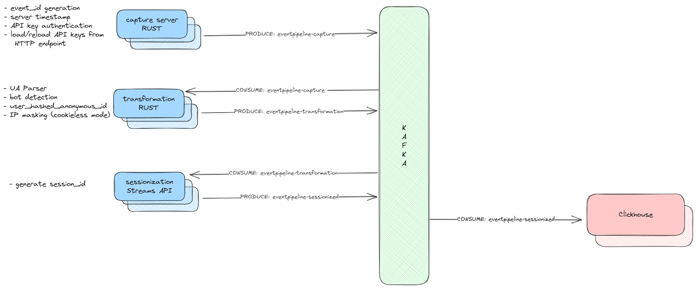

import Image from 'next/image'

# Events Pipeline Overview

The Events Pipeline is a self-contained application that exclusively depends on Kafka for ingesting and processing incoming events specific to Usermaven. The pipeline is divided into two primary components:

- Rust-Capture
- Kafka-Streams

Below is a high-level architectural diagram that illustrates the overall functionality of the pipeline:

## Capture server RUST

The Rust-Capture server features an HTTP endpoint that facilitates the receipt of events from the Javascript pixel, SDKs, and HTTP events. Events can be transmitted either individually or in bulk as part of a single JSON payload.

### API keys validation

Upon receipt, incoming events need to be validated by the Rust-Capture server. We employ a distinct microservice, termed jitsu-http-tokens, which includes the workspace ID, API key, and server secret.

- The workspace ID/API key acts as an identifier, utilized when dispatching events from resources like the JS SDK.
- TThe server secret token is leveraged for event dispatch from Backend SDKs. This token is a composite of `API_KEY.SERVER_SECRET`.

API keys are refreshed every 10 seconds to accommodate any changes. If modifications are detected, the API keys' state is promptly updated. In situations where the service experiences downtime, the last recorded state is utilized for the API tokens. Upon successful validation of an event, we proceed to the next stage where an event ID is generated and a `received_at` attribute is added, reflecting the current server timestamp.

### Extracting IP address and User-agent

The IP address is extracted from the `source_ip` field of the event. In cases where this field is absent, the `X-Forwarded-For` header is employed to ascertain the client's IP address. Similarly, for the User Agent, we first check for the `user_agent` field within the event. If it exists, it's used; if not, the `user-agent` header is utilized instead.

After this, the event is routed to the KAFKA topic named `eventpipeline-capture`.

## Context Enrichment

During the context enrichment phase, we draw messages from the Kafka topic eventpipeline-capture using a simple_consumer. This consumer is tasked with ingesting messages from the Kafka topic. The steps performed during this phase include:

- **User Agent Parsing:** This step enriches the user agent information by providing details like device, browser, browser version, operating system, and operating system version.
- **Bot Detection:** We analyze the User Agent data to identify bots. This is achieved by checking the incoming User Agent against a list of patterns using regular expressions.
- **IP Masking:** in Rust that enhances event data by adding geographic information and enforcing privacy regulations based on the event's IP address and cookie policy.
  
  The service supports three levels of cookie and IP policies: **"comply", "keep",** and **"strict"**.
  
  - In "comply" mode, the service checks if the event's country is part of the EU and then modifies the event data accordingly.
  - If the policy is "keep", the original data is preserved, while "strict" policy applies certain restrictions to the event data. The service also includes a method to create a hashed anonymous id from the user's IP and user agent.
- Based on the above rules, the hashed_anonymous id is used.
- **Validation of User Identification:** For `user_identify` events, we validate the presence of the user.id attribute. Similarly, for company information, the company.id attribute is mandatory. If either attribute is missing, an error is raised.

### Event Forwarding to Kafka

After undergoing transformation, events are then dispatched to the Kafka topics `eventpipeline-transformation` and `eventpipeline-transformation-error`. The latter topic is specifically for events where validation has failed.

## Sessionization Streams API

The sessionization process is executed using the Java Kafka Streams function.

Events directed to the `eventpipeline-transformation` topic undergo a sessionization process with a window of 30 minutes. Each event is augmented with a session ID, which is a SHA-256 hash derived from the amalgamation of project_id and user_anonymous_id. Events are collated according to this combination and subsequently divided into sessions dictated by a predefined inactivity gap of 30 minutes. If a session window is extended due to a new event, the pre-existing session ID is repurposed. These sessionized events are then transmitted to a designated Kafka topic `eventpipeline-sessionized`.

## Kafka Partitions

- The partition key is derived from the event API key by computing a modulus across 18 partitions. All of our Kafka topics are distributed across these 18 partitions.
- The scalability of Kafka Streams can be enhanced by increasing the number of Kafka Streams server pods.
- Preliminary stress testing has revealed that our pipeline can comfortably handle a throughput of 15,000 events per second without any noticeable lag or latency.

## Metrics API

The Rust-Capture API reveals metrics relating to incoming request statuses via port 3001.