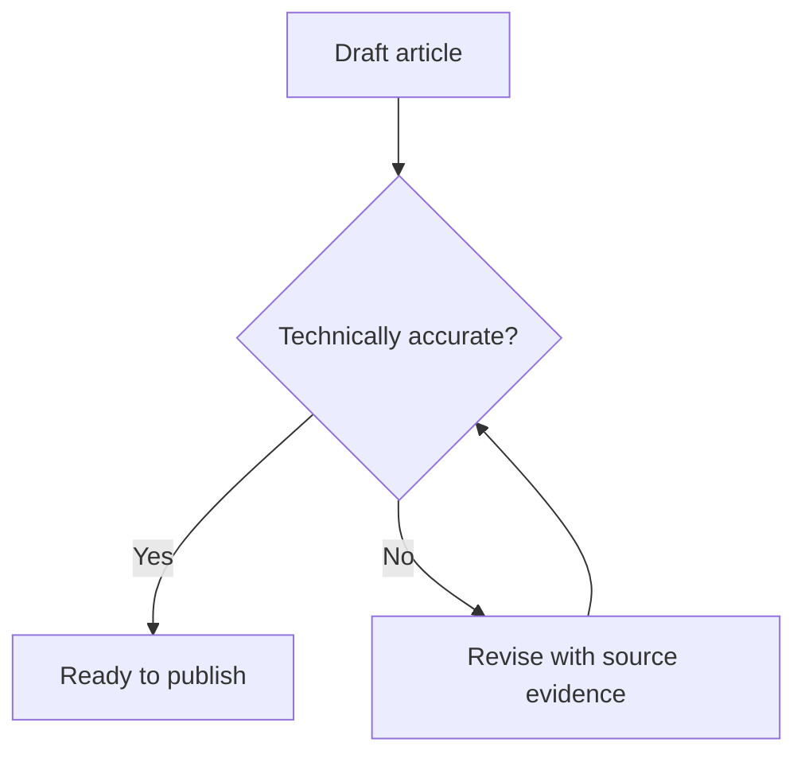

# Mermaid diagrams

Use a diagram when it helps answer the request or explain a relationship. Preserve the user's requested diagram type. For physical or logical network segments with hosts and subnet addresses, consider SimpleDiag's `nwdiag` format instead.

## Choose the diagram type

| Question | Mermaid type |
| --- | --- |
| What happens next, and where does the process branch? | `flowchart TD` or `flowchart LR` |
| Who calls whom, in what order? | `sequenceDiagram` |
| Which tables relate, and with what cardinality? | `erDiagram` |
| Which classes own, inherit, or depend on others? | `classDiagram` |
| Which states and transitions are possible? | `stateDiagram-v2` |
| When does work happen, and what depends on it? | `gantt` |

Keep one diagram focused on one question. Ground labels, relationships, cardinality, and dates in supplied facts or inspected sources. Clearly label illustrative examples or proposed designs.

## Output in Helpin

- Embed editable source in a fenced `mermaid` block. Helpin renders the block in supported Markdown and document surfaces; installing a CLI or exporting an image is unnecessary for inline diagrams.
- For document tools accepting TipTap JSON, use a `codeBlock` with `attrs.language` set to `mermaid` and a text node containing the source. Follow the tool's actual payload schema.
- Helpin configures the theme and strict rendering. Keep default colors, avoid HTML labels and click callbacks, and do not assume external icons or optional layout engines are registered.
- Accompany the diagram with enough prose to explain its conclusion and any uncertainty. Do not claim a document was saved just because source was returned in chat.

## Quick example

Illustrative documentation review flow:

Read [references/examples.md](references/examples.md) for API sequences with error branches, ER cardinality, class relationships, lifecycle states, and dependent timeline tasks.

## Syntax and repair

- Start with the diagram type. Use `%%` for comments, and put statements on separate lines.
- Separate stable identifiers from display labels: `api["API (v2)"]`. Quote flowchart labels containing punctuation. Avoid using lowercase `end` as a node identifier; it is also a block terminator. Keep spaces around connectors to avoid accidental circle/cross edges from identifiers starting with `o` or `x`.
- Use `-->` for flowchart direction. In sequences, `->>` is a message and `-->>` a reply; close `alt`, `opt`, `loop`, and other blocks with `end`.
- In ER diagrams, distinguish exactly one (`||`), zero or one (`o|` / `|o`), zero or many (`o{` / `}o`), and one or many (`|{` / `}|`). Do not infer mandatory relationships from an entity's name.
- In state diagrams, `[*]` represents the initial or terminal pseudostate. Use explicit state aliases when labels contain spaces.
- In Gantt diagrams, declare `dateFormat`, use stable task IDs, and reference those IDs after `after`. Do not substitute invented dates for missing scheduling decisions.
- If a preview reports an error, repair the source and preview again. When the installed Mermaid parser is available, `await mermaid.parse(source)` can check syntax; parsing alone does not verify layout. Do not claim a rendered check unless one was performed.

Diagram selection and example patterns are adapted from [softaworks/agent-toolkit](https://github.com/softaworks/agent-toolkit/tree/3027f20f3181758385a1bb8c022d4041dfb4de84/skills/mermaid-diagrams), under the included [MIT license](LICENSE). This Helpin adaptation replaces generic installation/export instructions and broad automatic triggers with inline rendering guidance. For additional syntax, use the [official Mermaid documentation](https://mermaid.js.org/intro/syntax-reference.html).
