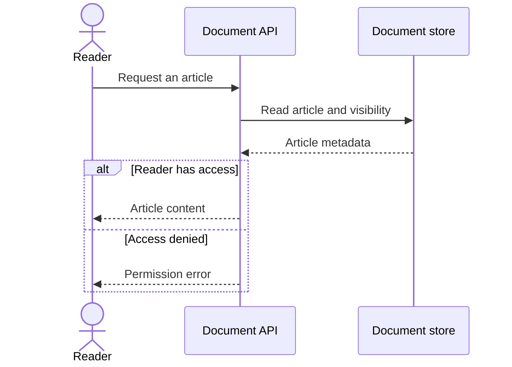
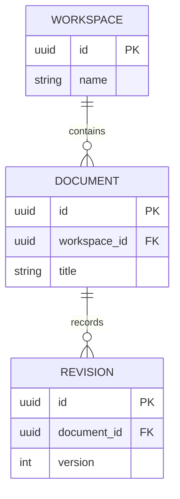
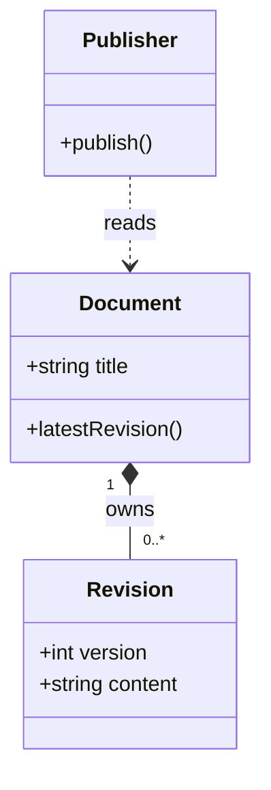
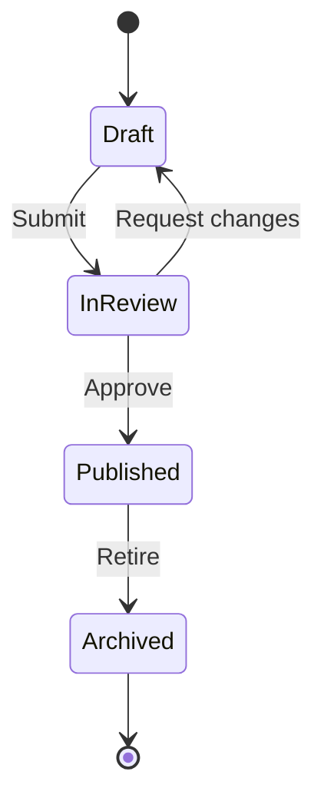
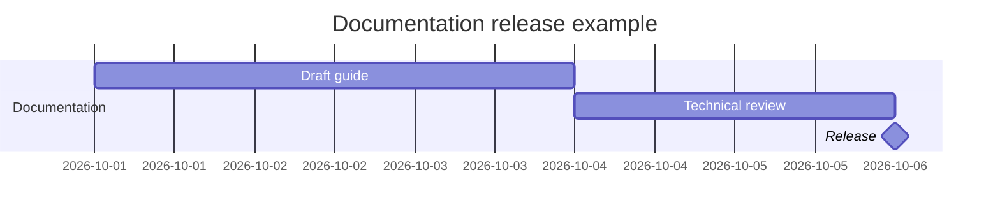

# Mermaid example patterns

Adapt these illustrative examples to verified facts. Preserve the `mermaid` fence when embedding in Helpin Markdown.

## API sequence with success and failure

Participant aliases keep identifiers stable. Each branch returns a result to the caller; use `loop` or `opt` only if the actual behavior requires it.

## Entity relationships

Here a workspace contains zero or more documents, while each document belongs to exactly one workspace. A document has zero or more revisions. Use these cardinalities only when the real schema supports them.

## Class structure

Composition (`*--`) means ownership of the part's lifetime; dependency (`..>`) means use without ownership. Use inheritance (`<|--`) only for a real subtype relationship.

## Lifecycle states

Transitions are events, not a list of tasks. This example permits a review to return to draft before publication.

## Timeline dependencies

These dates and durations are illustrative. `review` begins after `draft` finishes, and the release milestone follows `review`.

